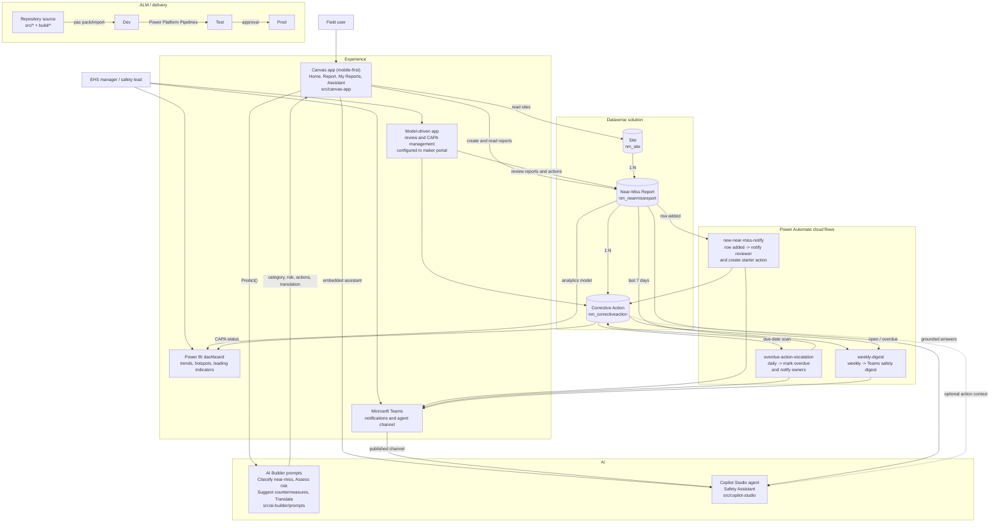

# Near-Miss Safety Reporting App (modernised)

A modernised rebuild of the Microsoft Japanese sample
[`009_AIHiyarihatApp`](https://github.com/microsoft/PowerApps-Sample-Apps-Japan/tree/main/009_AIHiyarihatApp)
("AI ヒヤリハット報告アプリ" / *AI near-miss reporting app*), rebuilt on the **2026 Power Platform stack**
and documented in **English** (the original ships Japanese-only).

> **What "near-miss" means:** a *near-miss* (Korean 아차사고, Japanese ヒヤリハット / *hiyari-hatto*) is a close call —
> an unplanned event that **could** have caused injury or damage but didn't. Capturing them is a leading
> safety indicator: you act *before* someone is hurt.

---

## What this repository is (and is not)

This is a **Power Platform solution *source* project** — the same shape a real ALM repository has: unpacked
solution XML you pack with the Power Platform CLI (`pac`), plus canvas Power Fx source, flow definitions and
AI prompt text. It is **not** a pre-packed `.msapp`/managed `.zip`, because a working canvas app and a Copilot
Studio agent are finalised in **Power Apps Studio / Copilot Studio** against a live Dataverse environment —
they can't be compiled in a generic container.

| Asset | Status | How you use it |
|-------|--------|----------------|
| `src/ai-builder/prompts/*` | **Copy‑paste ready** | Paste into AI Builder → Prompts (Prompt builder) |
| `src/canvas-app/**` (Power Fx) | **Copy‑paste ready** | Paste formulas into the matching controls in Studio |
| `src/solution/**` (Dataverse XML) | **Source scaffold** | `pac solution pack` → import to a **Dev** env, then finish forms/views in Studio |
| `src/flows/**` | **Reference/import** | Recreate or import as a solution cloud flow |
| `src/copilot-studio/**` | **Config steps** | Build the agent in Copilot Studio (config, not a file import) |
| `build/*` | Scripts | `pac`-based export/import helpers |

> **Expectation setting:** hand-authored Dataverse solution XML almost always needs **one round-trip through
> the maker portal** (import → open in Studio → publish) to become fully valid. That is normal Power Platform
> ALM, not a defect. Validate everything in a throwaway Dev environment first.

The full design rationale, licensing and deployment walkthrough live in the companion document
**`Modernised-Near-Miss-App-Guide.docx`** (in the same delivery).

---

## Architecture (2026 stack)



**Old → new in one line:** Azure OpenAI-over-HTTP → **AI Builder Prompts**; custom chatbot →
**Copilot Studio agent**; manual zip import → **Pipelines/`pac`**; Japanese-only → **Korean/English/Japanese**;
no analytics/tracking → **Power BI + corrective-action (CAPA) tracking**.

---

## Repository layout

```
near-miss-app/
├─ README.md                         ← you are here
├─ CHANGELOG.md
├─ .gitignore
├─ build/
│  ├─ deploy.ps1                     ← pac export/pack/import (Windows)
│  └─ deploy.sh                      ← pac export/pack/import (bash)
└─ src/
   ├─ ai-builder/prompts/            ← 4 prompt definitions (paste into Prompt builder)
   ├─ canvas-app/                    ← App.OnStart + 4 screens (Power Fx source)
   ├─ solution/src/                  ← unpacked Dataverse solution (tables, columns, choices)
   ├─ flows/                         ← Power Automate cloud flow definition(s)
   └─ copilot-studio/                ← agent build steps
```

---

## Prerequisites

- Power Platform environments: **Dev / Test / Prod**, each with a Dataverse database (Managed Environments recommended).
- Licensing (confirm current SKUs with your licensing desk): **Power Apps Premium**, **AI Builder** capacity,
  **Copilot Studio** capacity, Dataverse storage, optional **Power BI Pro/PPU**.
- Tooling: **Power Platform CLI** (`pac`) — `dotnet tool install --global Microsoft.PowerApps.CLI.Tool`.
- Roles: **System Customizer/Administrator** in Dev.

## Quick start

```bash
# 1. Authenticate to your DEV environment
pac auth create --environment "https://<your-dev>.crm.dynamics.com"

# 2. Pack + import the solution source (data model)
pac solution pack --zipfile out/NearMissSafety.zip --folder src/solution/src --packagetype Unmanaged
pac solution import --path out/NearMissSafety.zip --activate-plugins

# 3. In the maker portal: open the app in Studio, paste the Power Fx from src/canvas-app,
#    create the 4 AI Builder prompts from src/ai-builder/prompts, build the Copilot Studio
#    agent per src/copilot-studio, and add the flow(s) from src/flows.
# 4. Publish all customizations, then promote Dev → Test → Prod (build/deploy.* or Pipelines).
```

See `build/deploy.ps1` / `deploy.sh` for the scripted export/pack/import loop, and the companion
`.docx` for the full narrative.

---

## Attribution & disclaimer

Based on Microsoft's free sample `009_AIHiyarihatApp` (Microsoft Japan, Nov 2023), provided "as is" with no
warranty or support. This modernised rebuild is likewise provided as a starting point — **test and validate
in your own environment before any production or customer use.**
