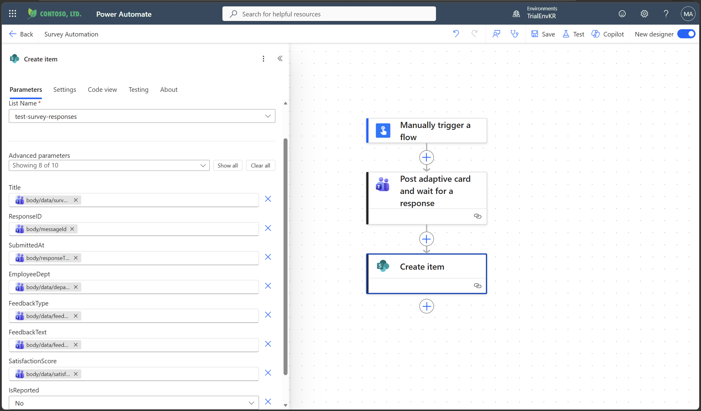

# Hands-On Resources

## 사전 준비 사항

### Power Platform Environment
- [Power Platform Admin Center (PPAC)](https://admin.powerplatform.microsoft.com/home)


- 이 핸즈온 세션에서는 한국 리전의 Trial Env를 사용했습니다.
    - 기본(Default, Contoso) 환경은 공유되어 있고, 제한이 없으며, 거버넌스 적용이 어렵기 때문에 프로덕션 또는 민감한 Power Platform 솔루션에는 절대 사용하면 안 됩니다.
    - [Power Platform Environment 공식 가이드](https://learn.microsoft.com/en-us/power-platform/guidance/adoption/manage-default-environment)

### Power Automate
- [Power Automate Web](https://make.powerautomate.com/): 사용 중인 환경으로 이동합니다.


### Setup
- SharePoint Team Site를 생성한 뒤, Document Library를 생성합니다. (이 핸즈온에서는 `test-library` 사용)


- [Sample Excel file](./resources/Work_Approval_Sample.xlsx)을 SharePoint Document Library에 업로드합니다.

    - Microsoft tenant 설정에 맞게 `Requestor Email` 및 `Approver Email`을 수정합니다.

- Team을 생성합니다.

    - 팀 이름: `Test Department`
    - 첫 번째 채널 이름: `Test Channel`

- SharePoint List를 생성한 뒤 CSV에서 가져오기(import from CSV)를 선택하고, [Sample CSV file](./resources/test-survey-responses.csv)을 사용합니다.
- 리스트 이름: `test-survey-responses`


    - 아래와 같이 컬럼 타입을 사용자 지정합니다:
    - Title: `Title`
    - ResponseID: `Single line of text`
    - SubmittedAt: `Date and time`
    - EmployeeDept: `Single line of text`
    - FeedbackType: `Single line of text`
    - FeedbackText: `Multiple lines of text`
    - SatisfactionScore: `Single line of text`
    - IsReported: `Yes/No`

## 01. Excel 기반 업무 요청 일괄 승인
### 1.1. Cloud Flow 생성: instant cloud flow, manual trigger


### 1.2. Excel Online (Business): List rows present in a table


- Filter Query: `Status eq 'New'`
- 이름 변경: `List rows present in a table - Filter New`

### 1.3. Control: Apply to Each

- 이전 단계의 출력값 선택: `body/value`
    - 필터링된 각 행에 대해 반복 실행

### 1.4. Excel Online (Business): Update a Row

- Submitted At: `utcNow()` (표현식 삽입)
- Status: `Submitted`
- Last Updated At: `utcNow()` (표현식 삽입)
- 이름 변경: `Update a row - Idempotency`

### 1.5. Standard Approvals: Start and wait for an approval

- Details:
    ```
    # ✅ New Work Request Approval

    ## Summary

    * **Request ID:** @{outputs('Update_a_row_-_Idempotency')?['body/Request ID']}
    * **Type:** @{outputs('Update_a_row_-_Idempotency')?['body/Request Type']}
    * **Priority:** @{outputs('Update_a_row_-_Idempotency')?['body/Priority']}
    * **Due Date:** @{outputs('Update_a_row_-_Idempotency')?['body/Requested Due Date']}

    ## Request Details

    @{outputs('Update_a_row_-_Idempotency')?['body/Description']}

    ## Request from

    * **Name:** @{outputs('Update_a_row_-_Idempotency')?['body/Requester Name']}
    * **Email:** @{outputs('Update_a_row_-_Idempotency')?['body/Requester Email']}
    ```

### 1.6. Excel Online (Business): Update a Row


- Status: `In Progress`
- Approval Outcome: `Outcome` (동적 표현식)
- Approval Comment: `Responses Comments` (동적 표현식)
- Approved/Rejected At: `utcNow()` (표현식 삽입)
- Last Updated At: `utcNow()` (표현식 삽입)
- 이름 변경: `Update a row - Approval Result`

### 1.7. Control: Condition

- 이름 변경: `Condition - Approval`

### 1.8. Office 365 Outlook: Send an Email (V2)

- To: `@{outputs('Update_a_row_-_Idempotency')?['body/Requester Email']}`
- Subject: `[@{outputs('Update_a_row_-_Idempotency')?['body/Request ID']}] Approval Notification`
- Body:
    ```
    Your Request for @{outputs('Update_a_row_-_Idempotency')?['body/Request Type']} is Approved!

    Approver: @{outputs('Update_a_row_-_Idempotency')?['body/Approver Email']}
    ```
- 이름 변경: `Send an email (V2) - Approved`


- To: `@{outputs('Update_a_row_-_Idempotency')?['body/Requester Email']}`
- Subject: `[@{outputs('Update_a_row_-_Idempotency')?['body/Request ID']}] Rejection Notification`
- Body:
    ```
    Your Request for @{outputs('Update_a_row_-_Idempotency')?['body/Request Type']} is Rejected.
    Please check the comments below:
    @{items('For_each_1')?['comments']}

    Approver: @{outputs('Update_a_row_-_Idempotency')?['body/Approver Email']}
    ```
- 이름 변경: `Send an email (V2) - Rejected`

### 1.9. Excel Online (Business): Update a Row

- Last Updated At: `utcNow()` (표현식 삽입)
- 이름 변경: `Update a row - Completion`

### 테스트


## 02. 설문조사 구조화 데이터의 자동 보고

### 2A.1. Cloud Flow 생성: instant cloud flow, manual trigger


### 2A.2. Teams: Post adaptive card and wait for a response

- Post as: `Flow bot`
- Post in: `Channel`
- Message:
    ```
    {
    "$schema": "http://adaptivecards.io/schemas/adaptive-card.json",
    "type": "AdaptiveCard",
    "version": "1.5",
    "body": [
        {
        "type": "Input.Text",
        "id": "surveyName",
        "value": "Internal Feedback Survey",
        "isVisible": false
        },
        {
        "type": "TextBlock",
        "text": "📝 Feedback Survey",
        "weight": "Bolder",
        "size": "Medium"
        },
        {
        "type": "TextBlock",
        "text": "All questions are required. (Takes less than 1 minute)",
        "wrap": true,
        "spacing": "Small"
        },
        {
        "type": "Input.ChoiceSet",
        "id": "Department",
        "label": "1. Department *",
        "isRequired": true,
        "errorMessage": "Please select your Department.",
        "style": "expanded",
        "choices": [
            { "title": "Engineering", "value": "Engineering" },
            { "title": "Sales", "value": "Sales" },
            { "title": "Marketing", "value": "Marketing" },
            { "title": "Finance", "value": "Finance" },
            { "title": "HR", "value": "HR" },
            { "title": "Management", "value": "Management" },
            { "title": "Other", "value": "Other" }
        ]
        },
        {
        "type": "Input.ChoiceSet",
        "id": "FeedbackType",
        "label": "2. Feedback Type *",
        "isRequired": true,
        "errorMessage": "Please select a Feedback Type.",
        "style": "expanded",
        "choices": [
            { "title": "Process", "value": "Process" },
            { "title": "Tool", "value": "Tool" },
            { "title": "Culture", "value": "Culture" },
            { "title": "Other", "value": "Other" }
        ]
        },
        {
        "type": "Input.ChoiceSet",
        "id": "Satisfaction",
        "label": "3. Satisfaction (1–5) *",
        "isRequired": true,
        "errorMessage": "Please select a Satisfaction rating.",
        "style": "expanded",
        "choices": [
            { "title": "1", "value": "1" },
            { "title": "2", "value": "2" },
            { "title": "3", "value": "3" },
            { "title": "4", "value": "4" },
            { "title": "5", "value": "5" }
        ]
        },
        {
        "type": "Input.Text",
        "id": "Feedback",
        "label": "4. Feedback *",
        "isRequired": true,
        "errorMessage": "Please enter your Feedback.",
        "isMultiline": true,
        "placeholder": "Enter your answer"
        }
    ],
    "actions": [
        {
        "type": "Action.Submit",
        "title": "Submit",
        "associatedInputs": "auto"
        }
    ]
    }
    ```
- Team: `Test Department`
- Channel: `Test Channel`

### 2A.3. SharePoint: Create item

- Title: `@{outputs('Post_adaptive_card_and_wait_for_a_response')?['body/data/surveyName']}`
- ResponseID: `@{outputs('Post_adaptive_card_and_wait_for_a_response')?['body/messageId']}`
- SubmittedAt: `@{outputs('Post_adaptive_card_and_wait_for_a_response')?['body/responseTime']}`
- EmployeeDept: `@{outputs('Post_adaptive_card_and_wait_for_a_response')?['body/data/department']}`
- FeedbackType: `@{outputs('Post_adaptive_card_and_wait_for_a_response')?['body/data/feedbackType']}`
- FeedbackText: `@{outputs('Post_adaptive_card_and_wait_for_a_response')?['body/data/feedback']}`
- SatisfactionScore: `@{outputs('Post_adaptive_card_and_wait_for_a_response')?['body/data/satisfaction']}`
- IsReported: `No`

### 2B.1. Cloud Flow 생성: scheduled cloud flow, reccurence trigger


### 2B.2. SharePoint: Get items

- Filter Query: `field_7 eq false`
    - 대안: `IsReported eq 0`
- 이름 변경: `Get items - Filter Not Reported`

### 2B.3. Variable: Initialize variable

- Name: `ResponseArr`
- Type: `Array`
    - 숫자형 값을 추가하기 위한 용도
- 이름 변경: `Initialize variable - ResponseArr`


- Name: `FeedbackArr`
- Type: `Array`
    - 문자열(텍스트) 값을 추가하기 위한 용도
- 이름 변경: `Initialize variable - FeedbackArr`

### 2B.4. Control: Apply to each

- SharePoint List에서 아직 보고되지 않은 각 항목에 대해 반복 실행

### 2B.5. Variable: Append to array variable\

- Name: `ResponseArr`
- Value: 
    ```
    json(concat('{"Dept":"', items('Apply_to_each')?['field_3'], '","Type":"', items('Apply_to_each')?['field_4'], '","Score":"', items('Apply_to_each')?['field_6'], '"}'))
    ```
    - 대안:
        ```
        json(concat('{"Dept":"', item()?['EmployeeDept/Value'], '","Type":"', item()?['FeedbackType/Value'], '","Score":"', item()?['SatisfactionScore'], '"}'))
        ```
- 이름 변경: `Append to array variable - ResponseArr`


- Name: `FeedbackArr`
- Value: `@{items('Apply_to_each')?['field_5']}`
    - 대안: `@{items('Apply_to_each')?['FeedbackText']}`
`
- 이름 변경: `Append to array variable - FeedbackArr`

### 2B.6. Data Operation: Compose

- Inputs: `@{variables('FeedbackArr')}`
- 이름 변경: `Compose - Feedback`

### 2B.7. AI Builder: Run a prompt

- 이름 변경: `Run a prompt - Feedback Summary`


- 새 Custom Prompt: `Survey Result JSON`
- Instructions:
    ```
    You are tasked with analyzing an array of user feedback texts. Follow these instructions carefully:

    ### Instructions:
    1. **Input Processing:** Receive an array containing multiple feedback texts.
    2. **Summarization:** Generate a concise summary that captures the overall sentiment and main points from all the feedback combined.
    3. **Keyword Extraction:** Identify and list up to 10 key keywords or phrases that best represent the core themes or topics found in the feedback.
    4. **Insight Generation:** If possible, provide meaningful insights or observations derived from the summary and keywords. These insights should help understand user opinions, trends, or areas for improvement.

    ### Output Format:
    - **Summary:** A clear and brief paragraph summarizing the collective feedback.
    - **Keywords:** A one long string consisting of up to 10 keywords or key phrases.
    - **Insights:** One or more sentences offering actionable or thoughtful insights based on the summary.

    ### Input
    Array of feedback texts: /Feedback Array
    ```
- 입력 예시:
    ```
    [The new internal tool is generally helpful, but the performance is inconsistent during peak hours. Documentation could also be improved., Approval processes take too long and often block campaign launches. Automation here would save a lot of time., The ticketing system works well for simple cases, but complex issues are hard to track across teams.]
    ```


- Test > Save


- Feedback Array*: `@{outputs('Compose_-_Feedback')}`

### 2B.8. Data Operation: Create CSV table

- From: `@{variables('ResponseArr')}`
- 이름 변경: `Create CSV table - Response`

### 2B.9. AI Builder: Run a prompt
- 이름 변경: `Run a prompt - Survey Statistics`


- 새 Custom Prompt: `Survey Result Statistics`
- Instructions:
    ```
    You are tasked with analyzing an internal employee survey dataset provided as a CSV file. The CSV contains three columns: Dept (department of the respondent), Type (category of feedback), and Score (satisfaction rating from 1 to 5 stars).

    ### Instructions:
    1. Load and parse the CSV file to extract the data.
    2. Aggregate and summarize the data to reveal meaningful insights, such as average scores by department and feedback type.

    ### Guidelines:
    - STRICT RULE: provide analysis results in HTML text format. (highest level h3)
    - Focus only on the data provided in the CSV format text.
    - Choose visualization types that best communicate the survey insights.
    - Keep the output concise and easy to interpret.

    Provide the CSV file containing the survey data here: Survey CSV
    ```
- 입력 예시:
    ```
    Dept,Type,Score,
    Engineering,Tool,4,
    Marketing,Culture,5,
    Sales,Tool,3
    ```
- Test > Save


- Survey CSV: `@{body('Create_CSV_table_-_Response')}`

### 2B.10. Office 365 Outlook: Send an Email (V2)

- To: `YOUR EMAIL`
- Subject: `Weekly Internal Survey Summary`
- Body:
    ```html
    <h2 class="editor-heading-h2">📊 Weekly Survey Summary<br></h2><h4 class="editor-heading-h4">Summary</h4><p class="editor-paragraph">@{outputs('Run_a_prompt_-_Feedback_Summary')?['body/responsev2/predictionOutput/structuredOutput/Summary']}</p><br><p class="editor-paragraph">Keywords: @{outputs('Run_a_prompt_-_Feedback_Summary')?['body/responsev2/predictionOutput/structuredOutput/Keywords']}</p><br><h4 class="editor-heading-h4">Insight</h4><p class="editor-paragraph">@{outputs('Run_a_prompt_-_Feedback_Summary')?['body/responsev2/predictionOutput/structuredOutput/Insights']}<br><br>---</p><h4 class="editor-heading-h4">Statistics</h4><p class="editor-paragraph">@{outputs('Run_a_prompt_-_Survey_Statistics')?['body/responsev2/predictionOutput/text']}</p><p class="editor-paragraph"><br>---<br>Automated by Power Automate</p>
    ```

### 2B.11. SharePoint: Update item

- 이름 변경: `Update item - IsReported`

### 테스트


