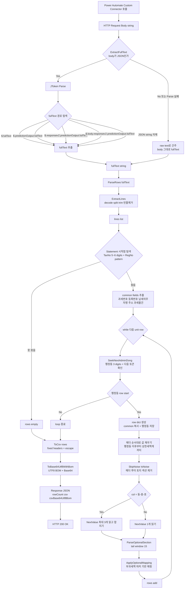

# Create Custom Connector

## 1. General

## 2. Security

## 3. Definition

### 3.1. Swagger Editor

## 4. Code

### 4.1. `ParseTaxStatementCsv.cs` Code Flow

```mermaid
flowchart TD
  A[Power Automate Custom Connector 호출] --> B[HTTP Request Body string]

  B --> C{ExtractFullText<br/>body가 JSON인가}
  C -->|Yes| D[JToken Parse]
  D --> E{fullText 경로 탐색}
  E -->|$.fullText| F1[fullText 추출]
  E -->|$.predictionOutput.fullText| F1
  E -->|$.responsev2.predictionOutput.fullText| F1
  E -->|$.body.responsev2.predictionOutput.fullText| F1
  E -->|JSON string 자체| F1

  C -->|No 또는 Parse 실패| F2[raw text로 간주<br/>body 그대로 fullText]
  F1 --> G[fullText string]
  F2 --> G

  G --> H[ParseRows fullText]
  H --> I[ExtractLines<br/>decode split trim 빈줄제거]
  I --> J[lines list]

  J --> K{Statement 시작점 탐색<br/>TaxNo 5~6 digits + RegNo pattern}
  K -->|못 찾음| Z0[rows empty]
  K -->|찾음| L[common fields 추출<br/>과세번호 등록번호 납세의무자명 주소 과세물건]

  L --> M{while 다음 unit row}
  M --> N[SeekNextAdminDong<br/>행정동 3 digits + 다음 토큰 확인]
  N --> O{행정동 row start}
  O -->|No| P[loop 종료]
  O -->|Yes| Q[row dict 생성<br/>common 복사 + 행정동 저장]

  Q --> R[헤더 순서대로 값 채우기<br/>행정동 이후부터 상한세액계까지]
  R --> S[SkipNoise IsNoise<br/>헤더 푸터 토지 섹션 제거]
  S --> T{col = 동-층-호}
  T -->|Yes| U[NextValue 최대 3개 읽고 합치기]
  T -->|No| V[NextValue 1개 읽기]

  U --> W[ParseOptionalSection<br/>tail window 15]
  V --> W

  W --> X[ApplyOptionalMapping<br/>부과세액 마커 기반 매핑]
  X --> Y[rows add]
  Y --> M

  P --> AA[ToCsv rows<br/>fixed headers + escape]
  Z0 --> AA

  AA --> AB[ToBase64Utf8WithBom<br/>UTF8 BOM + Base64]
  AB --> AC[Response JSON<br/>rowCount csv csvBase64Utf8Bom]
  AC --> AD[HTTP 200 OK]
```

## 5. Test

