# Create Custom Connector

## 1. General
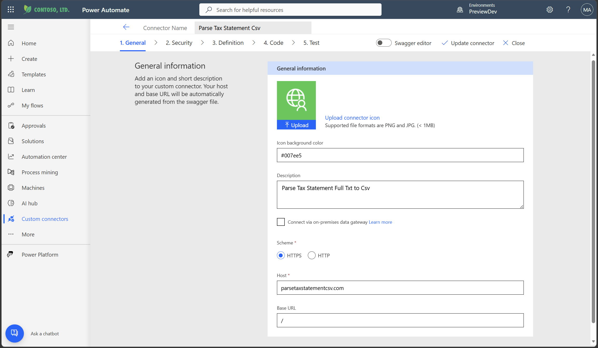

## 2. Security
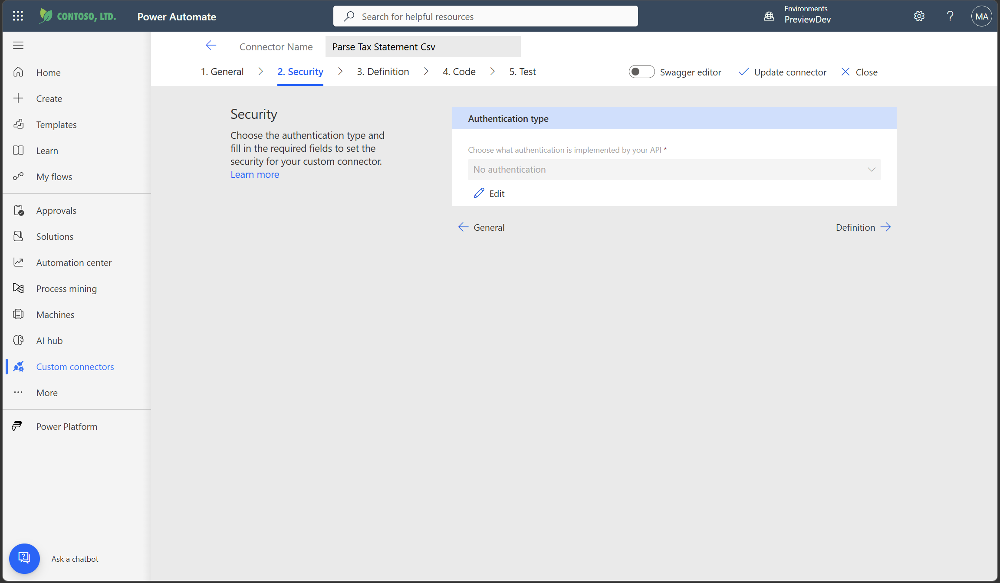

## 3. Definition
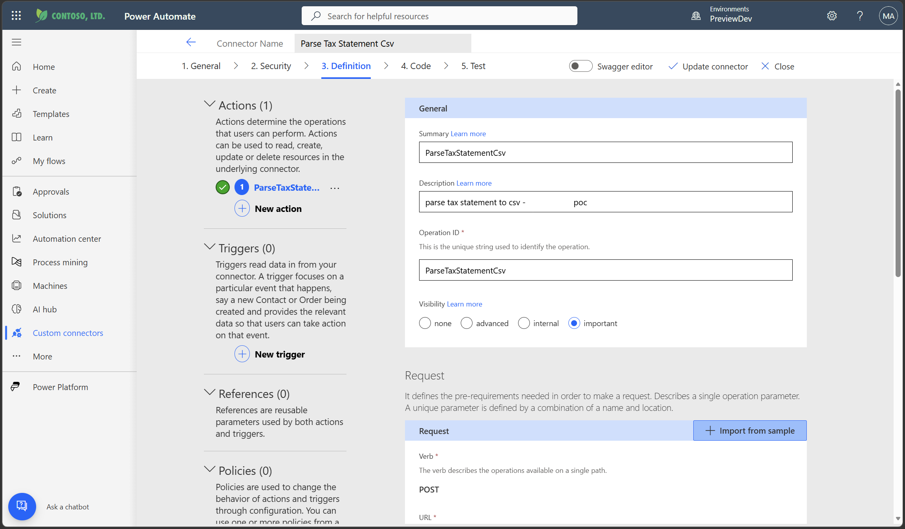
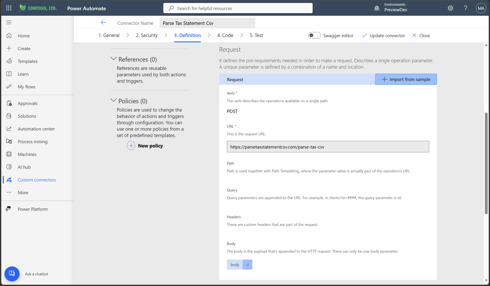
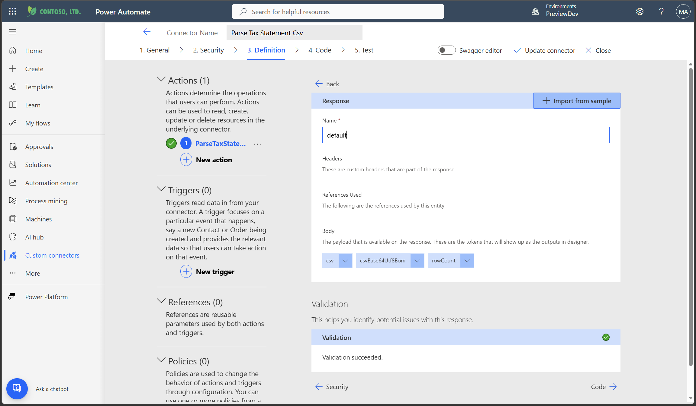
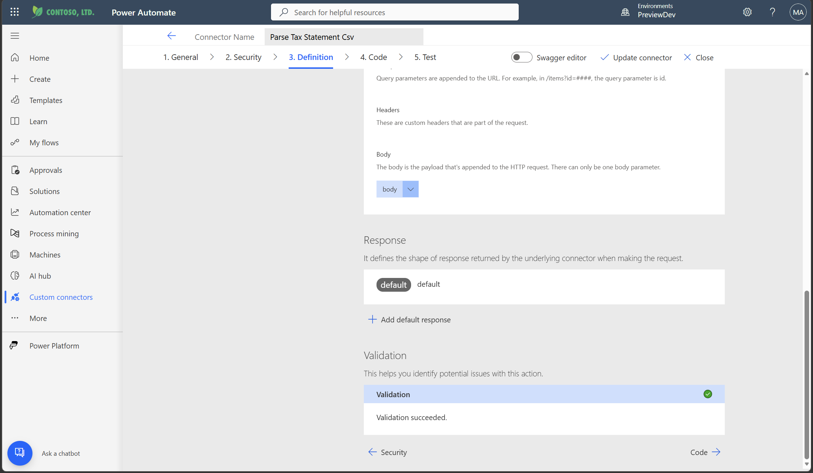

### 3.1. Swagger Editor
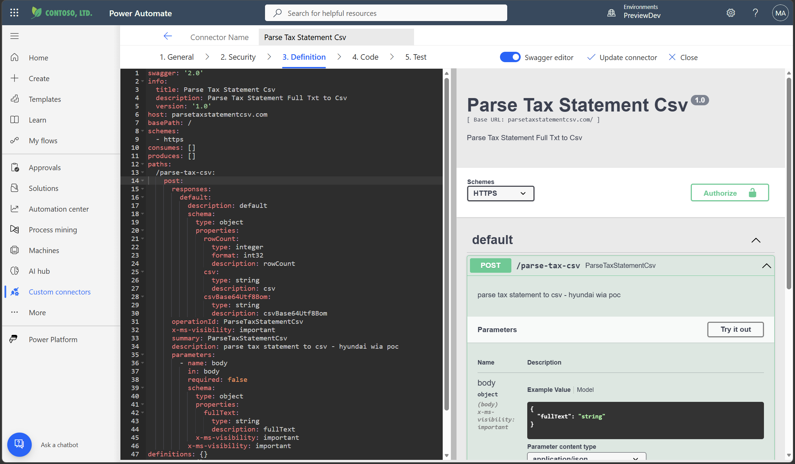
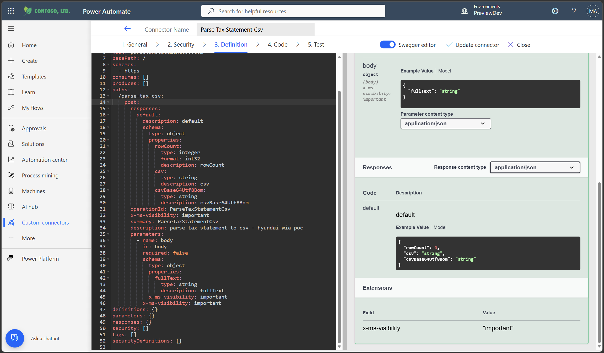

## 4. Code
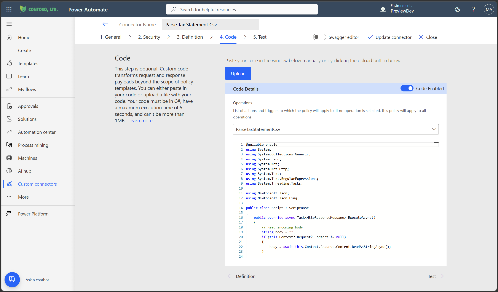

### 4.1. `ParseTaxStatementCsv.cs` Code Flow

```mermaid
flowchart TD
  %% =========================
  %% TaxStatementParser C# 흐름도 (Input -> Output)
  %% =========================

  A[Power Automate / Custom Connector 호출] --> B[HTTP Request Body (string)]

  %% ---- ExtractFullText ----
  B --> C{ExtractFullText: body가 JSON인가?}
  C -->|Yes| D[JSON Parse (JToken.Parse)]
  D --> E{fullText 경로 탐색}
  E -->|$.fullText| F1[fullText 추출]
  E -->|$.predictionOutput.fullText| F1
  E -->|$.responsev2.predictionOutput.fullText| F1
  E -->|$.body.responsev2.predictionOutput.fullText| F1
  E -->|JSON string 자체| F1

  C -->|No / Parse 실패| F2[raw text로 간주: body 그대로 fullText]
  F1 --> G[fullText (string)]
  F2 --> G

  %% ---- ParseRows ----
  G --> H[ParseRows(fullText)]
  H --> I[ExtractLines: escape/HTML decode + split/trim + 빈줄 제거]
  I --> J[List<string> lines]

  J --> K{Statement 시작점 탐색\nTaxNo(5~6 digits) + RegNo(######-#######)}
  K -->|못 찾음| Z0[rows = empty list]
  K -->|찾음| L[common fields 추출\n과세번호/등록번호/납세의무자명/주소/과세물건]

  %% ---- Row loop ----
  L --> M{while: 다음 유닛 row 찾기}
  M --> N[SeekNextAdminDong:\n행정동(3 digits) + 다음 토큰이 RegNo인지 확인]
  N --> O{행정동 row start 발견?}
  O -->|No| P[loop 종료]
  O -->|Yes| Q[row dict 생성\n+ common 복사\n+ 행정동 저장]

  Q --> R[for: Headers 순서대로 값 채우기\n(행정동 이후 ~ 상한세액계)]
  R --> S[SkipNoise/IsNoise:\n헤더/푸터/토지섹션 등 제거]
  S --> T{col == '동 - 층 - 호'?}
  T -->|Yes| U[NextValue 3개까지 읽어\n가능하면 합쳐 저장]
  T -->|No| V[NextValue 1개 읽어 저장]

  U --> W[ParseOptionalSection (tail window <= 15)]
  V --> W

  W --> X[ApplyOptionalMapping:\n'부과세액' 마커 찾기\n- 앞 숫자 -> 주택가격\n- 마커 -> 상당 정보\n- 뒤 숫자 -> 전년주택가격]
  X --> Y[rows.Add(row)]
  Y --> M

  %% ---- CSV + Base64 ----
  P --> AA[ToCsv(rows):\nHeaders 고정 순서로 CSV 생성\nCsvEscape 적용]
  Z0 --> AA

  AA --> AB[ToBase64Utf8WithBom(csv):\nUTF-8 BOM + bytes -> Base64]
  AB --> AC[Response Payload (JSON):\nrowCount, csv, csvBase64Utf8Bom]
  AC --> AD[HTTP 200 OK 반환]
```

## 5. Test
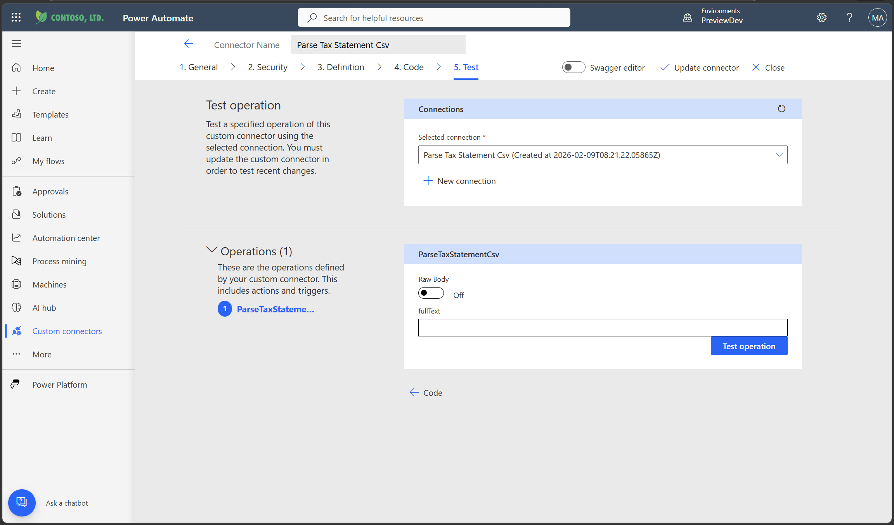
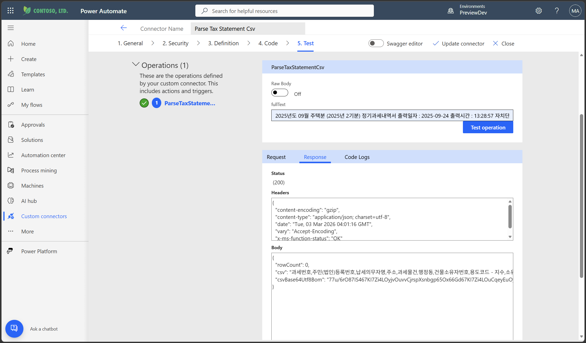