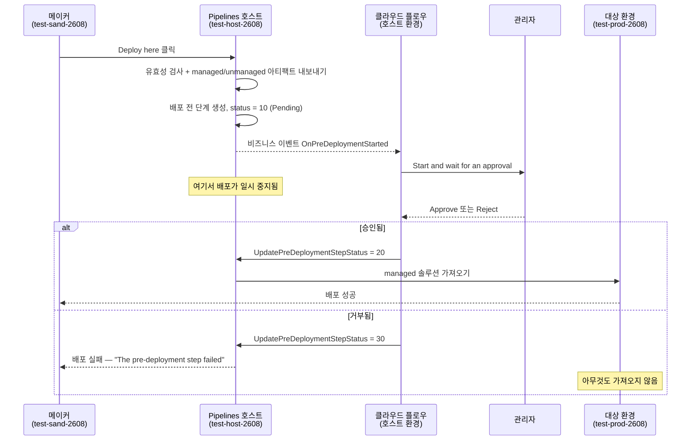
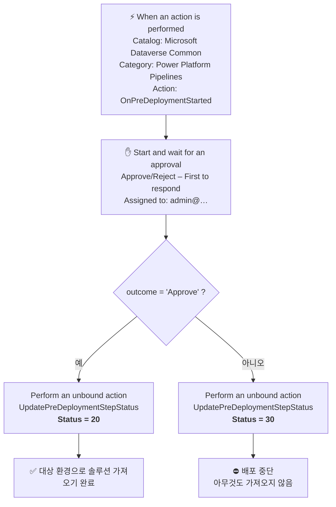

# Power Platform Pipelines — 배포 전 승인(Pre‑Deployment Approval) 플로우

### 완전하고 재현 가능한 핸즈온 랩

**무엇을 만드나요:** 개발 환경의 솔루션을 프로덕션 환경으로 옮기는 Power Platform 파이프라인 — 단, **관리자가 Power Automate에서 승인한 경우에만** 배포됩니다. 관리자가 거부하면 배포는 중단되고 프로덕션에는 절대 도달하지 않습니다.

---

## 목차

1. [여기서 말하는 "Approval"이란](#1-여기서-말하는-approval이란)
2. [승인 게이트의 실제 동작 방식](#2-승인-게이트의-실제-동작-방식)
3. [사전 준비 사항](#3-사전-준비-사항)
4. [랩 구성 정보 (이 랩에서 사용한 값)](#4-랩-구성-정보-이-랩에서-사용한-값)
5. [Step 1 — 세 개의 환경 만들기](#step-1--세-개의-환경-만들기)
6. [Step 2 — 호스트에 Pipelines 앱 설치](#step-2--호스트에-pipelines-앱-설치)
7. [Step 3 — 파이프라인 구성](#step-3--파이프라인-구성)
8. [Step 4 — 승인 게이트 켜기](#step-4--승인-게이트-켜기)
9. [Step 5 — 배포할 솔루션 만들기](#step-5--배포할-솔루션-만들기)
10. [Step 6 — 승인 플로우 만들기](#step-6--승인-플로우-만들기)
11. [Step 7 — APPROVE 경로 테스트](#step-7--approve-경로-테스트)
12. [Step 8 — REJECT 경로 테스트](#step-8--reject-경로-테스트)
13. [Step 9 — 플로우를 솔루션으로 내보내기](#step-9--플로우를-솔루션으로-내보내기)
14. [지름길 — 미리 만든 솔루션 가져오기](#지름길--미리-만든-솔루션-가져오기)
15. [참조 표](#참조-표)
16. [문제 해결](#문제-해결)

---

## 1. 여기서 말하는 "Approval"이란

"승인(approval)"이라는 단어를 쓰는 두 가지 서로 다른 것이 있습니다. 절대 혼동하지 마세요.

| | Power Automate **Approvals** | Power Platform Pipelines **승인 게이트** |
|---|---|---|
| 정체 | 사람에게 Approve/Reject 요청을 보내고 답변을 기다리는 커넥터 | 배포를 일시 중지시키는 파이프라인 스테이지의 구성 체크박스 |
| 보이는 위치 | Power Automate → **Approvals**, Teams, Outlook | **Deployment Pipeline Configuration** 앱 |
| 단독으로 쓰면 | 사람에게 질문만 함 | 신호를 기다리며 영원히 멈춰 있기만 함 |

**이 랩은 이 둘을 서로 연결합니다.** 파이프라인이 멈춤 → 플로우가 관리자에게 질문 → 관리자가 답변 → 플로우가 파이프라인에게 계속할지 중단할지 알려줌.

[Microsoft Learn — Get started with approvals](https://learn.microsoft.com/en-us/power-automate/get-started-approvals) 문서에 따르면, **Start and wait for an approval** 작업은 승인자가 응답할 때까지 플로우를 일시 중지합니다. 승인 유형은 다음과 같습니다:

| 승인 유형 | 동작 |
|---|---|
| Approve/Reject – First to respond | 승인자 중 한 명의 답변으로 요청이 완료됩니다. **← 이 랩에서 사용** |
| Approve/Reject – Everyone must approve | 모든 승인자가 답변해야 합니다 |
| Custom Responses – Wait for one response | 버튼을 직접 정의하고, 한 명의 답변으로 완료됩니다 |
| Custom Responses – Wait for all responses | 버튼을 직접 정의하고, 모두가 답변해야 합니다 |
| Sequential approval | 승인자에게 정해진 순서대로 한 명씩 요청합니다 |

> **Approvals 사전 조건:** 승인 데이터는 Dataverse에 저장됩니다. 기본(default) 환경이 아닌 곳에서는 승인 플로우를 *처음* 실행하는 사용자가 데이터베이스 프로비저닝을 위해 **해당 환경의 관리자 역할**을 가지고 있어야 합니다. 이후 사용자에게는 상승된 권한이 필요 없습니다.

---

## 2. 승인 게이트의 실제 동작 방식

Pipelines는 **게이트 확장(gated extensions)** 을 제공합니다. 각 확장은 배포 과정에 사용자 지정 일시 중지 지점을 삽입하고, Dataverse **비즈니스 이벤트**(클라우드 플로우를 트리거함)를 발생시킨 뒤, 플로우가 **바인딩되지 않은 작업(unbound action)** 으로 신호를 보낼 때까지 대기합니다.

| 게이트 확장 | 트리거 (비즈니스 이벤트) | 회신에 사용할 unbound action |
|---|---|---|
| Pre‑export step required | `OnDeploymentRequested` | `UpdatePreExportStepStatus` |
| Is delegated deployment | `OnApprovalStarted` | `UpdateApprovalStatus` |
| **Pre‑deployment step required** | **`OnPreDeploymentStarted`** | **`UpdatePreDeploymentStepStatus`** ← **이 랩** |

### 상태 코드 — 이 세 가지는 외우세요

| 값 | 의미 | 배포에 미치는 영향 |
|---|---|---|
| `10` | Pending | 시스템이 설정합니다. 배포가 일시 중지되어 사용자를 기다립니다. |
| `20` | Completed | **배포가 계속됩니다.** 솔루션이 대상 환경으로 가져오기 됩니다. |
| `30` | Failed | **배포가 중단됩니다.** 솔루션은 가져오기 되지 **않습니다**. 실행은 실패로 표시됩니다. |

### 전체 흐름 시퀀스



> **중요:** 아티팩트는 승인 **이전에** 내보내지고, 그 후 호스트에 의해 **잠깁니다**. 동일한 managed 아티팩트가 이후의 모든 스테이지에 배포됩니다. 승인 후에 솔루션을 바꿔치기하는 것은 누구도 불가능합니다.

---

## 3. 사전 준비 사항

| 요구 사항 | 상세 |
|---|---|
| 계정 | **Power Platform 관리자** 또는 **Dataverse 시스템 관리자**. 이 가이드에서는 해당 계정을 `<ADMIN-UPN>` 으로 표기합니다. |
| 환경 | Dataverse 데이터베이스를 가진 **3개**: **호스트**, **개발/원본**, **대상**. |
| 지역 | 호스트와 연결된 모든 환경은 **동일한 지리적 지역(region)** 에 있어야 합니다 (교차 지역 배포를 명시적으로 활성화한 경우 제외). |
| 라이선스 | Power Automate 클라우드 플로우와 프리미엄 **Microsoft Dataverse** 커넥터를 사용할 수 있는 라이선스. |

> **왜 환경이 3개인가요?** 파이프라인 정의와 승인 플로우는 **호스트**에 존재합니다. 호스트는 원본 및 대상과는 별개의 환경입니다. `make.powerapps.com` 에서 만든 개인 파이프라인은 테넌트의 *플랫폼 호스트*에 저장되는데, **플랫폼 호스트 파이프라인은 확장할 수 없습니다** — 그래서 이 랩에서는 승인에 반드시 필요한 **사용자 지정 호스트(custom host)** 를 사용합니다.

---

## 4. 랩 구성 정보 (이 랩에서 사용한 값)

아래 내용은 모두 **처음부터 끝까지 실제로 구축하고 검증**했습니다. 해당하는 부분은 여러분의 ID로 바꿔 넣으세요.

### 환경

| 역할 | 표시 이름 | 환경 ID | Dataverse URL |
|---|---|---|---|
| **Pipelines 호스트** | `test-host-2608` | `<HOST-ENV-ID>` | `https://<HOST-ORG>.crm.dynamics.com` |
| **원본 / 개발** | `test-sand-2608` | `<DEV-ENV-ID>` | `https://<DEV-ORG>.crm.dynamics.com` |
| **대상 / 프로덕션** | `test-prod-2608` | `<TARGET-ENV-ID>` | `https://<TARGET-ORG>.crm.dynamics.com` |

### 생성한 객체

| 객체 | 이름 / 값 | 위치 |
|---|---|---|
| 파이프라인 | `Sand to Prod Pipeline` | 호스트 |
| 스테이지 | `Deploy to Production` (Pre‑Deployment Step Required = **Yes**) | 호스트 |
| 클라우드 플로우 | `Pipeline Deployment Approval` | 호스트 |
| 승인 솔루션 | `PipelineApprovalDemo` v1.0.0.0 | 호스트 |
| 게시자 | `Contoso Lab` / 접두사 `clab` | 호스트 + 개발 |
| 데모 솔루션 | `PipelineDemoSolution` (테이블 `clab_demoitem` 포함) | 개발 |
| 승인자 | `<ADMIN-UPN>` | — |

### 검증된 결과

| 테스트 | 배포 전 단계 상태 | 결과 |
|---|---|---|
| **승인(Approve)** | `20` | `PipelineDemoSolution` **v1.0.0.1** 이 `test-prod-2608` 에 **managed** 로 가져오기 됨; 테이블 `clab_demoitem` 존재 확인 |
| **거부(Reject)** | `30` | `test-prod-2608` 은 **v1.0.0.1 에 그대로 유지** — v1.0.2.1 은 전혀 가져오기 되지 않음. 스테이지 실행 오류: *"The pre‑deployment step failed"*. 관리자의 사유가 메이커에게 표시됨. |

---

## Step 1 — 세 개의 환경 만들기

이미 가지고 있는 환경은 건너뛰세요. 각 환경에는 **반드시** Dataverse 데이터베이스가 있어야 합니다.

1. [Power Platform 관리 센터](https://admin.powerplatform.microsoft.com)로 이동합니다.
2. **Manage** → **Environments** → **+ New** 를 선택합니다.
3. 다음 설정으로 각 환경을 만듭니다:

   | 항목 | 호스트 | 원본 | 대상 |
   |---|---|---|---|
   | 이름 | `test-host-2608` | `test-sand-2608` | `test-prod-2608` |
   | 유형 | Production | Sandbox | Production |
   | 지역 | *세 개 모두 동일* | *동일* | *동일* |
   | **Add a Dataverse data store** | **Yes** | **Yes** | **Yes** |

4. 세 환경 모두 **Ready** 상태가 될 때까지 기다립니다.

> ✅ **체크포인트:** 동일 지역에 Dataverse를 가진 환경 3개가 모두 Ready 상태입니다.

---

## Step 2 — 호스트에 Pipelines 앱 설치

1. [Power Platform 관리 센터](https://admin.powerplatform.microsoft.com)에서 **Manage** → **Environments** 로 이동해 **`test-host-2608`** 을 선택합니다.
2. 환경 페이지에서 **Resources** 영역을 열고 **Dynamics 365 apps** 를 선택합니다.
3. **+ Install app** 을 선택합니다.
4. 목록에서 **Power Platform Pipelines** 를 선택한 뒤 **Next** → 약관 동의 → **Install** 을 진행합니다.
5. 상태가 *Installing* 에서 **Installed** 로 바뀔 때까지 기다립니다. 보통 **10~20분** 정도 걸립니다.

> ⚠️ 이 앱은 **호스트에만** 설치하세요. 원본이나 대상 환경에는 설치하면 **안 됩니다**.

> ✅ **체크포인트:** `test-host-2608` 에서 **Power Platform Pipelines** 가 **Installed** 로 표시됩니다. 해당 환경에 **Deployment Pipeline Configuration** 이라는 모델 기반 앱이 생성되었습니다.

---

## Step 3 — 파이프라인 구성

호스트에서 **Deployment Pipeline Configuration** 앱을 엽니다:

`https://make.powerapps.com/environments/<HOST-ENV-ID>/apps` → **Deployment Pipeline Configuration** 실행.

### 3a. 개발(원본) 환경 등록

1. 왼쪽 탐색에서 **Environments** 를 선택합니다.
2. **+ New** 를 선택합니다.
3. 다음을 입력합니다:

   | 항목 | 값 |
   |---|---|
   | **Name** | `test-sand-2608` |
   | **Environment Type** | **Development Environment** |
   | **Environment Id** | `<DEV-ENV-ID>` |

4. **Save**. 레코드가 자동으로 검증되고 상태가 **Active** 로 바뀝니다.

> 💡 **Environment Id 는 어디서 찾나요?** 관리 센터 → Environments → 해당 환경 선택. GUID가 URL과 환경 상세 패널에 표시됩니다.

### 3b. 대상 환경 등록

동일하게 다음 값으로 반복합니다:

| 항목 | 값 |
|---|---|
| **Name** | `test-prod-2608` |
| **Environment Type** | **Target Environment** |
| **Environment Id** | `<TARGET-ENV-ID>` |

> ⚠️ *"this environment is already associated with another pipelines host"* 오류가 나면, 해당 환경이 테넌트 플랫폼 호스트에 연결되어 있는 것입니다. 명령 모음에서 **Force Link** 를 선택해 사용자 지정 호스트로 옮기세요.

### 3c. 파이프라인 만들기

1. 왼쪽 탐색 → **Pipelines** → **+ New**.
2. **Name:** `Sand to Prod Pipeline`
3. **Deployment Type:** `Standard`
4. **Save**.
5. 같은 파이프라인 폼에서 **Development Environments** 하위 표를 찾아 **+ Add Existing Deployment Environment** 를 선택하고 **`test-sand-2608`** 을 고릅니다.

### 3d. 배포 스테이지 만들기

1. 같은 파이프라인 폼에서 **Deployment Stages** 하위 표를 찾아 **+ New Deployment Stage** 를 선택합니다.
2. 다음을 입력합니다:

   | 항목 | 값 |
   |---|---|
   | **Name** | `Deploy to Production` |
   | **Target Deployment Environment** | `test-prod-2608` |
   | **Previous Deployment Stage** | *(비워 둡니다 — 첫 번째 스테이지이므로)* |

3. **Save**.

> ✅ **체크포인트:** 파이프라인 1개, 개발 환경 1개, 대상을 가리키는 스테이지 1개.

---

## Step 4 — 승인 게이트 켜기

배포를 일시 중지시키는 것은 바로 이 체크박스 하나입니다.

1. **Deployment Pipeline Configuration** 앱에서 **`Deploy to Production`** 스테이지 레코드를 엽니다.
2. **Pre‑Deployment Step Required** 를 체크합니다.
3. **Save**.

> ⚠️ **이 랩에서 가장 중요한 단계입니다.** 이것이 없으면 `OnPreDeploymentStarted` 는 절대 발생하지 않고, 배포는 승인 없이 그대로 통과합니다.

### 세 가지 체크박스 — 혼동하지 마세요

| 체크박스 | 일시 중지 시점 | 용도 |
|---|---|---|
| Pre‑Export Step Required | 개발 환경에서 솔루션을 내보내기 전 | 사용자 지정 유효성 검사 / 코드 스캔 |
| Is Delegated Deployment | 메이커 대신 서비스 주체(service principal)로 배포 | 대상 환경 접근 권한이 없는 메이커 |
| **Pre‑Deployment Step Required** | **내보내기 후, 대상 환경으로 가져오기 직전** | **승인 ← 이 랩** |

> ✅ **체크포인트:** 나중에 솔루션의 Pipelines 탭을 열면 *"Deployments may be pending until an associated background process succeeds."* 라는 안내가 보입니다. 이 안내가 게이트가 작동 중이라는 증거입니다.

---

## Step 5 — 배포할 솔루션 만들기

아주 간단하게 만드세요 — 파이프라인이 옮길 대상이 있기만 하면 됩니다.

1. `https://make.powerapps.com` 으로 이동해 **`test-sand-2608`** 로 전환합니다.
2. **Solutions** → **+ New solution** 을 선택합니다.
3. 다음을 입력합니다:

   | 항목 | 값 |
   |---|---|
   | **Display name** | `Pipeline Demo Solution` |
   | **Name** | `PipelineDemoSolution` |
   | **Publisher** | **+ New publisher** → Display name `Contoso Lab`, Name `contosolab`, **Prefix `clab`** |

4. **Create**.
5. 솔루션을 열고 → **+ New** → **Table** → **Table (blank)**.
6. **Display name:** `Demo Item` → **Save**.

> ⚠️ 기본값인 `CDS Default Publisher` 가 아니라 **직접 만든 게시자**를 사용하세요. Pipelines는 솔루션을 **managed** 로 배포하므로, 적절한 게시자 접두사가 있어야 깔끔하게 관리됩니다.

> ✅ **체크포인트:** `test-sand-2608` 에 `Pipeline Demo Solution` 이 있고 테이블 하나를 포함합니다.

---

## Step 6 — 승인 플로우 만들기

> 📍 **플로우는 반드시 Pipelines 호스트 환경**(`test-host-2608`)**에서 만들어야 합니다** — 원본이나 대상이 **아닙니다**. 비즈니스 이벤트는 호스트의 Dataverse에서 발생하므로, 다른 곳에 있는 플로우는 절대 트리거되지 않습니다.

### 6a. 솔루션 안에 플로우 만들기

1. `https://make.powerautomate.com` 으로 이동해 **`test-host-2608`** 로 전환합니다.
2. **Solutions** → **+ New solution** 을 선택합니다:

   | 항목 | 값 |
   |---|---|
   | **Display name** | `Pipeline Deployment Approval` |
   | **Name** | `PipelineApprovalDemo` |
   | **Publisher** | `Contoso Lab` (접두사 `clab`) — 여기서도 만들어 줍니다 |

3. 새 솔루션을 열고 → **+ New** → **Automation** → **Cloud flow** → **Automated**.
4. **Flow name:** `Pipeline Deployment Approval`
5. 트리거 검색창에 **`When an action is performed`** 를 입력하고 **Microsoft Dataverse** 항목을 선택한 뒤 **Create** 를 누릅니다.

> 💡 **왜 솔루션 안에서 만드나요?** 솔루션 인식(solution‑aware) 플로우는 원시 연결 대신 **연결 참조(connection references)** 를 사용하며, 덕분에 플로우를 내보내고 이식할 수 있습니다 (Step 9).

### 6b. 트리거 구성

다음 네 항목을 **정확히** 설정합니다:

| 항목 | 값 |
|---|---|
| **Catalog** | `Microsoft Dataverse Common` |
| **Category** | `Power Platform Pipelines` |
| **Table name** | `(none)` |
| **Action name** | `OnPreDeploymentStarted` |

> ⚠️ **Catalog** 와 **Category** 를 먼저 설정하세요. 둘 다 선택하기 전까지 **Action name** 은 비어 있습니다.


<details>
<summary>내부 JSON (참고용)</summary>

```json
"inputs": {
  "host": {
    "connectionName": "shared_commondataserviceforapps",
    "operationId": "BusinessEventsTrigger",
    "apiId": "/providers/Microsoft.PowerApps/apis/shared_commondataserviceforapps"
  },
  "parameters": {
    "catalog": "commoncatalog",
    "category": "powerplatformpipelines",
    "subscriptionRequest/entityname": "none",
    "subscriptionRequest/sdkmessagename": "OnPreDeploymentStarted"
  }
}
```
</details>

### 6c. "Start and wait for an approval" 추가

**+ New step** → **`Start and wait for an approval`** 검색 (Approvals 커넥터).

| 항목 | 값 |
|---|---|
| **Approval type** | `Approve/Reject - First to respond` |
| **Title** | `Approve deployment of '<ArtifactName>' to <DeploymentStageName>` |
| **Assigned To** | `<ADMIN-UPN>` |
| **Details** | *(아래 참조)* |
| **Item Link** | `StageRunDetailsLink` |
| **Item Link Description** | `Open the pipeline stage run` |

**Details** 에는 다음을 붙여 넣습니다. `@{...}` 안의 내용은 모두 트리거에서 가져오는 동적 콘텐츠입니다:

```
Power Platform Pipelines 배포가 승인을 기다리고 있습니다.

| 항목 | 값 |
| --- | --- |
| **파이프라인** | @{triggerOutputs()?['body/OutputParameters/DeploymentPipelineName']} |
| **스테이지** | @{triggerOutputs()?['body/OutputParameters/DeploymentStageName']} |
| **솔루션** | @{triggerOutputs()?['body/OutputParameters/ArtifactName']} |
| **버전** | @{triggerOutputs()?['body/OutputParameters/SolutionArtifactVersion']} |
| **요청자** | @{triggerOutputs()?['body/OutputParameters/DeployAsUser']} |
| **예약 시각** | @{if(empty(triggerOutputs()?['body/OutputParameters/ScheduledTime']), '즉시', triggerOutputs()?['body/OutputParameters/ScheduledTime'])} |
| **배포 노트** | @{triggerOutputs()?['body/OutputParameters/DeploymentNotes']} |

배포를 계속하려면 **Approve**, 중단하려면 **Reject** 를 선택하세요. 댓글 상자에 입력한 내용은 파이프라인 실행 기록에서 메이커에게 그대로 표시됩니다.
```

> 💡 위 식들은 직접 입력하는 대신 **동적 콘텐츠(dynamic content)** 패널에서 모두 선택할 수도 있습니다.


### 6d. 조건 추가

**+ New step** → **Condition**.

| 왼쪽 | 연산자 | 오른쪽 |
|---|---|---|
| `outcome` *(Start and wait for an approval 출력)* | **is equal to** | `Approve` |

식으로 표현하면: `@outputs('Start_and_wait_for_a_deployment_approval')?['body/outcome']`

> ⚠️ 값은 리터럴 문자열 `Approve` 입니다 — 대문자 **A**, 끝에 "d" 없음.

### 6e. If yes → 배포 진행 허용

**If yes** 안에서: **Add an action** → **Microsoft Dataverse** → **Perform an unbound action**.

| 항목 | 값 |
|---|---|
| **Action Name** | `UpdatePreDeploymentStepStatus` |
| **StageRunId** | `@triggerOutputs()?['body/InputParameters/StageRunId']` |
| **PreDeploymentStepStatus** | `20` |
| **Comments** | `Approved by @{outputs('Start_and_wait_for_a_deployment_approval')?['body/responses'][0]?['responder']?['displayName']}. Comment: @{outputs('Start_and_wait_for_a_deployment_approval')?['body/responses'][0]?['comments']}` |

> 🔥 **가장 흔한 실수 1위:** `StageRunId` 는 **`InputParameters`** 에서 가져옵니다. `OutputParameters` 가 *아닙니다*. 이 트리거의 다른 모든 필드는 `OutputParameters` 에서 옵니다. 이걸 틀리면 매개변수 누락 오류로 작업이 실패합니다.

> 💡 **Action Name** 을 선택하면 `StageRunId`, `PreDeploymentStepStatus`, `Comments` 필드가 나타납니다. 보이지 않으면 **Show advanced options** 를 펼치세요.


### 6f. If no → 배포 차단

**If no** 안에서: **동일한** 작업을 추가하되 **한 곳만** 다릅니다:

| 항목 | 값 |
|---|---|
| **Action Name** | `UpdatePreDeploymentStepStatus` |
| **StageRunId** | `@triggerOutputs()?['body/InputParameters/StageRunId']` |
| **PreDeploymentStepStatus** | **`30`** |
| **Comments** | `Rejected by @{outputs('Start_and_wait_for_a_deployment_approval')?['body/responses'][0]?['responder']?['displayName']}. Reason: @{outputs('Start_and_wait_for_a_deployment_approval')?['body/responses'][0]?['comments']}` |

### 6g. 저장하고 플로우 켜기

1. **Save**.
2. 솔루션으로 돌아가 플로우가 **Status: On** 인지 확인합니다. 꺼져 있으면 열어서 **Turn on** 을 선택합니다.

완성된 플로우:




> ✅ **체크포인트:** 플로우가 **On** 상태이고, **호스트**에 있으며, 두 분기 모두 `UpdatePreDeploymentStepStatus` 를 호출합니다.

---

## Step 7 — APPROVE 경로 테스트

### 7a. 배포 요청 (메이커 역할)

1. `https://make.powerapps.com` 으로 이동 → **`test-sand-2608`** 로 전환합니다.
2. **Solutions** → **Pipeline Demo Solution** 을 엽니다.
3. 솔루션 왼쪽 메뉴에서 **Pipelines** 를 선택합니다.
4. **Sand to Prod Pipeline** 과 스테이지 **Deploy to Production**, 그리고 다음 안내가 보여야 합니다:

   > *Deployments may be pending until an associated background process succeeds. This process is managed by your admin.*

   이 안내는 승인 게이트가 활성화되어 있음을 확인해 줍니다.
5. **Deploy here** → **Next** 를 선택합니다.
6. 유효성 검사가 끝날 때까지 기다린 뒤 **Deploy** 를 선택합니다.


### 7b. 일시 중지 확인

스테이지 실행은 이제 **배포 전 단계 상태 `10` (Pending)** 이며 **아직 아무것도 가져오기 되지 않았습니다**. **View deployments** 를 선택하면 대기 중인 상태를 볼 수 있습니다.

### 7c. 승인 (관리자 역할)

1. `https://make.powerautomate.com` 으로 이동 → **`test-host-2608`** 로 전환합니다.
2. 왼쪽 탐색에서 **Approvals** → **Received** 탭을 선택합니다.
3. **`Approve deployment of 'PipelineDemoSolution' to Deploy to Production`** 제목의 요청을 엽니다.
4. 파이프라인, 스테이지, 솔루션, 버전, 요청자 정보가 표시되는지 확인합니다.
5. **Choose your response** 를 **Approve** 로 설정하고 다음과 같은 댓글을 입력합니다
   `Approved for production release. Verified solution version and components.`
6. **Confirm** 을 선택합니다.


> 💡 동일한 요청은 이메일과 Teams **Approvals** 앱으로도 전달됩니다 — 관리자는 그중 아무 곳에서나 승인할 수 있습니다.

### 7d. 검증

1~2분 이내에:

| 확인 위치 | 예상 결과 |
|---|---|
| Power Automate → 플로우 실행 기록 | **Succeeded** |
| 파이프라인 실행 기록 | 배포 **Succeeded** |
| `test-prod-2608` → Solutions | **`PipelineDemoSolution`** 존재, **Managed = Yes** |
| `test-prod-2608` → Tables | **`Demo Item`** (`clab_demoitem`) 존재 |

**이 랩에서 검증됨:** 배포 전 단계 상태가 `20` 이 되었고, `PipelineDemoSolution v1.0.0.1` 이 `test-prod-2608` 에 **managed** 솔루션으로 가져오기 되었습니다.

---

## Step 8 — REJECT 경로 테스트

### 8a. 배포할 새 버전 만들기

**`test-sand-2608`** → **Solutions** → **Pipeline Demo Solution** 선택 → **Edit** → **Version** 을 `1.0.2.0` 으로 설정 → **Save**.

> 💡 대상 환경에 이미 있는 버전은 파이프라인에서 재배포를 활성화하지 않는 한 다시 배포할 수 없기 때문에 필요합니다.

### 8b. 배포하고 거부하기

1. Step 7a 를 반복해 배포를 요청합니다.
2. 호스트 환경에서 **Approvals** → **Received** 로 이동합니다.
3. 새 요청을 열고 응답을 **Reject** 로 설정한 뒤 다음과 같은 사유를 입력합니다
   `Rejected - change window not approved. Please resubmit after the CAB review on Wednesday.`
4. **Confirm** 을 선택합니다.

### 8c. 배포가 차단되었는지 검증

| 확인 위치 | 예상 결과 |
|---|---|
| Power Automate → 플로우 실행 | **Succeeded** *(플로우는 정상 동작함 — 거부를 성공적으로 처리했음)* |
| 파이프라인 실행 기록 | **Failed** — *"The pre‑deployment step failed"* |
| `test-prod-2608` → Solutions | **여전히 이전 버전.** 새 버전은 전혀 가져오기 되지 않았습니다. |
| 스테이지 실행 → 배포 전 단계 노트 | 메이커에게 표시되는 거부 사유 |

**이 랩에서 검증됨:** 배포 전 단계 상태가 `30` 이 되었고, `test-prod-2608` 은 **v1.0.0.1 에 그대로 유지**되었으며, 메이커에게는 다음이 표시되었습니다:

> *Rejected by <APPROVER-NAME>. Reason: Rejected - change window not approved. Please resubmit after the CAB review on Wednesday.*

> ⚠️ 거부된 경우에도 플로우 실행은 **Succeeded** 로 표시된다는 점에 주의하세요. 이는 정상입니다 — 플로우의 역할은 결정을 *보고*하는 것이지 결정 *그 자체*가 아니기 때문입니다. 결과는 플로우 상태가 아니라 **파이프라인** 상태로 판단하세요.

---

## Step 9 — 플로우를 솔루션으로 내보내기

### 9a. Unmanaged 내보내기 (편집 가능한 원본)

1. `https://make.powerautomate.com` → **`test-host-2608`** → **Solutions**.
2. **Pipeline Deployment Approval** 을 선택(열지는 마세요)하고 명령 모음에서 **Export solution** 을 선택합니다.
3. **Next** → **Unmanaged** 선택 → **Export**.
4. `.zip` 파일이 다운로드됩니다.


### 9b. Managed 내보내기 (배포용 아티팩트)

동일하게 반복하되 버전 단계에서 **Managed** 를 선택합니다.

### 9c. 어떤 것을 써야 하나요?

| | Unmanaged | Managed |
|---|---|---|
| 목적 | 원본(source of truth); 소스 제어에 보관 | 다른 환경으로 배포 |
| 가져오기 후 편집 | ✅ 가능 | ❌ 불가 — 잠김 |
| 깔끔한 제거 | ❌ 불가 | ✅ 가능 |
| 사용처 | 개발/호스트 환경, 백업 | QA, 프로덕션 호스트 |

> ⚠️ **Unmanaged 솔루션을 프로덕션에 가져오지 마세요.** Unmanaged 구성 요소는 깔끔하게 제거할 수 없습니다.

**이 랩에서 생성된 두 파일:**

| 파일 | 크기 | Managed 플래그 |
|---|---|---|
| `PipelineApprovalDemo_1_0_0_0.zip` | 4,439 bytes | `0` (unmanaged) |
| `PipelineApprovalDemo_1_0_0_0_managed.zip` | 4,440 bytes | `1` (managed) |

각 파일의 내용:

```
solution.xml
customizations.xml          ← 연결 참조 2개 포함
[Content_Types].xml
Workflows/PipelineDeploymentApproval-FAD8D655-50B0-4338-BB9D-EA47044F0BC9.json
```

---

## 지름길 — 미리 만든 솔루션 가져오기

Step 6 을 통째로 건너뛰려면, 제공된 솔루션을 가져오면 됩니다.

1. `https://make.powerautomate.com` → **호스트** 환경으로 전환 → **Solutions** → **Import solution**.
2. **Browse** → `PipelineApprovalDemo_1_0_0_0.zip` (unmanaged) 또는 `..._managed.zip` 을 선택합니다.
3. **Next**. **연결 참조 2개**에 대한 연결을 지정하라는 요청을 받습니다:

   | 연결 참조 | 커넥터 |
   |---|---|
   | Microsoft Dataverse (Pipelines host) | Microsoft Dataverse |
   | Approvals | Approvals |

4. 각각에 대해 **+ New connection** 을 선택해 관리자로 로그인한 뒤, 돌아와서 해당 연결을 선택합니다.
5. **Import** 를 선택하고 완료될 때까지 기다립니다.
6. **⚠️ 가져오기 후 반드시 해야 할 두 가지:**
   - 플로우를 열어 승인 작업의 **Assigned To** 를 **여러분의** 승인자 이메일로 변경합니다 (`<ADMIN-UPN>` 으로 하드코딩되어 있습니다).
   - **플로우를 켜세요** — 가져온 플로우는 **꺼진** 상태로 들어옵니다.

> ✅ **체크포인트:** 플로우가 On 상태이고, 연결 참조 2개가 모두 바인딩되었으며, 승인자 이메일이 여러분의 것입니다.


---

## 참조 표

### `OnPreDeploymentStarted` 트리거 출력

| 출력 | 식(Expression) | 비고 |
|---|---|---|
| 스테이지 실행 ID | `triggerOutputs()?['body/InputParameters/StageRunId']` | ⚠️ **InputParameters** |
| 파이프라인 이름 | `triggerOutputs()?['body/OutputParameters/DeploymentPipelineName']` | 트리거 조건에 유용 |
| 스테이지 이름 | `triggerOutputs()?['body/OutputParameters/DeploymentStageName']` | 트리거 조건에 유용 |
| 솔루션 이름 | `triggerOutputs()?['body/OutputParameters/ArtifactName']` | |
| 솔루션 버전 | `triggerOutputs()?['body/OutputParameters/SolutionArtifactVersion']` | |
| 요청자 | `triggerOutputs()?['body/OutputParameters/DeployAsUser']` | |
| 예약 시각 | `triggerOutputs()?['body/OutputParameters/ScheduledTime']` | 비어 있으면 즉시 배포 |
| 배포 노트 | `triggerOutputs()?['body/OutputParameters/DeploymentNotes']` | AI 생성 요약 |
| 스테이지 실행 링크 | `triggerOutputs()?['body/OutputParameters/StageRunDetailsLink']` | |
| **Managed** 아티팩트 | `triggerOutputs()?['body/OutputParameters/ArtifactFileDownloadLink']` | |
| **Unmanaged** 아티팩트 | `replace(triggerOutputs()?['body/OutputParameters/ArtifactFileDownloadLink'], 'artifactfile', 'artifactfileunmanaged')` | |

### `UpdatePreDeploymentStepStatus` 매개변수

호스트 환경의 OData 메타데이터로 검증한 결과 — 매개변수는 **이 세 개뿐**입니다:

| 매개변수 | 형식 | 필수 | 비고 |
|---|---|---|---|
| `StageRunId` | `Edm.Guid` | ✅ | `InputParameters` 에서 가져옴 |
| `PreDeploymentStepStatus` | `Edm.Int32` | ✅ | `10` / `20` / `30` |
| `Comments` | `Edm.String` | ❌ | *배포 전 단계 노트* 로 메이커에게 표시됨 |

> ⚠️ `PreDeploymentProperties` 매개변수는 **없습니다**. (`UpdatePreExportStepStatus` 에는 `PreExportProperties` 가, `UpdateApprovalStatus` 에는 `ApprovalProperties`/`ApprovalComments` 가 있지만 배포 전 단계 작업에는 없습니다.)

### 승인 응답 필드

| 필드 | 식(Expression) |
|---|---|
| 전체 결과 | `outputs('Start_and_wait_for_a_deployment_approval')?['body/outcome']` |
| 개별 응답 | `...?['body/responses'][0]?['approverResponse']` |
| 댓글 | `...?['body/responses'][0]?['comments']` |
| 응답자 이름 | `...?['body/responses'][0]?['responder']?['displayName']` |
| 응답자 이메일 | `...?['body/responses'][0]?['responder']?['email']` |
| 응답 일시 | `...?['body/responses'][0]?['responseDate']` |

> ⚠️ 각 응답 안에서 사용할 수 있는 속성은 정확히 다음과 같습니다: `responder`, `requestDate`, `responseDate`, `approverResponse`, `comments`. **`approver` 속성은 존재하지 않습니다** — 문제 해결 섹션을 참고하세요.

### 선택적 강화 — 트리거 조건

호스트에 파이프라인이 여러 개 있을 때, 플로우가 올바른 파이프라인에서만 실행되도록 제한하세요. 플로우 → 트리거의 **⋯** → **Settings** → **Trigger Conditions**:

```
@equals(triggerOutputs()?['body/OutputParameters/DeploymentPipelineName'], 'Sand to Prod Pipeline')
```

| 목적 | 조건 |
|---|---|
| 특정 파이프라인 하나 | `@equals(triggerOutputs()?['body/OutputParameters/DeploymentPipelineName'], 'Sand to Prod Pipeline')` |
| 특정 스테이지 하나 | `@equals(triggerOutputs()?['body/OutputParameters/DeploymentStageName'], 'Deploy to Production')` |
| "Prod" 가 포함된 모든 스테이지 | `@contains(triggerOutputs()?['body/OutputParameters/DeploymentStageName'], 'Prod')` |

---

## 문제 해결

### 배포가 전혀 멈추지 않고 그냥 배포됨

| 확인 | 조치 |
|---|---|
| 스테이지에 **Pre‑Deployment Step Required** 가 체크되어 있나요? | 체크하고 **Save** 하세요 (Step 4) |
| `make.powerapps.com` 에서 만든 *개인* 파이프라인인가요? | 플랫폼 호스트 파이프라인은 확장할 수 **없습니다**. 사용자 지정 호스트에서 다시 만드세요. |

### 배포가 영원히 멈춰 있고 승인 요청이 오지 않음

| 확인 | 조치 |
|---|---|
| 플로우가 **호스트** 환경에 있나요? | 옮기세요. 원본/대상에 있는 플로우는 절대 트리거되지 않습니다. |
| 플로우가 **On** 인가요? | 가져온 플로우는 **꺼진** 상태로 들어옵니다. 켜세요. |
| 트리거가 `OnPreDeploymentStarted` 로 설정되었나요? | `OnPreDeploymentCompleted` / `OnApprovalStarted` / `OnDeploymentRequested` 가 아닙니다. |
| Catalog / Category 가 올바른가요? | `Microsoft Dataverse Common` / `Power Platform Pipelines`. |
| 트리거 조건이 걸러내고 있나요? | 조건에 쓴 파이프라인 이름이 정확히 일치하는지 확인하세요. |
| Approvals 데이터베이스가 프로비저닝되었나요? | 기본 환경이 아닌 곳의 첫 승인 플로우는 환경 관리자가 실행해야 합니다. |

> 🚑 **멈춘 배포 되살리기:** 플로우를 수정한 뒤 Power Automate 에서 실패한 실행을 열고 **Resubmit** 을 선택하세요. 원래 트리거 페이로드로 재생되면서 새 승인 요청이 발송됩니다.


### 플로우 실패: `property 'approver/displayName' doesn't exist`

전체 오류 메시지:

> *The template language expression `outputs('…')?['body/responses'][0]['approver/displayName']` cannot be evaluated because property 'approver/displayName' doesn't exist, available properties are 'responder, requestDate, responseDate, approverResponse, comments'.*

**원인:** 응답 객체가 노출하는 속성은 `approver` 가 아니라 **`responder`** 입니다.

**해결:** `['responder']?['displayName']` 를 사용하세요.

> 이 오류는 실제로 이 랩을 구축하는 도중에 발생했고, 수정되었으며, 내보낸 솔루션에는 수정된 버전이 들어 있습니다.

### unbound action 에서 플로우 실패

| 증상 | 원인 | 해결 |
|---|---|---|
| `StageRunId` 누락/잘못됨 | `OutputParameters` 에서 가져옴 | `triggerOutputs()?['body/InputParameters/StageRunId']` 사용 |
| 알 수 없는 매개변수 `PreDeploymentProperties` | 그런 매개변수는 존재하지 않음 | 제거하세요 — `StageRunId`, `PreDeploymentStepStatus`, `Comments` 만 유효합니다 |
| 권한 오류 | 연결 ID에 권한이 없음 | 호스트에서 배포 스테이지 실행 레코드를 업데이트할 수 있는 사용자가 연결을 소유해야 합니다 |

### 환경이 호스트에 연결되지 않음

> *"This environment is already associated with another pipelines host."*

해당 환경이 테넌트 플랫폼 호스트에 연결되어 있습니다. 유효성 검사가 실패한 뒤 환경 레코드의 명령 모음에서 **Force Link** 를 선택하세요.

### 솔루션에서 파이프라인이 보이지 않음

| 확인 | 조치 |
|---|---|
| 솔루션이 **unmanaged** 이고 **등록된 개발** 환경에 있나요? | 파이프라인은 등록된 개발 환경의 unmanaged 솔루션에서만 표시됩니다 |
| 호스트와 같은 지역인가요? | 교차 지역은 명시적 활성화가 필요합니다 |
| 파이프라인 권한이 있나요? | **Deployment Pipeline User** 역할을 할당하거나, Deployment Pipeline Configuration 앱에서 사용자를 **Deployment Pipeline Maker** 팀에 추가하세요 |

### 잘못된 "Microsoft Dataverse" 커넥터

같은 이름을 쓰는 커넥터가 두 개 있습니다. **최신** 커넥터가 필요합니다:

| 커넥터 | 내부 이름 | 사용? |
|---|---|---|
| Microsoft Dataverse | `shared_commondataserviceforapps` | ✅ 예 |
| Microsoft Dataverse (legacy) | `shared_commondataservice` | ❌ 아니오 |

**When an action is performed** 와 **Perform an unbound action** 은 최신 커넥터에만 있습니다.

---

## 참고 자료

- [Get started with Power Automate approvals](https://learn.microsoft.com/en-us/power-automate/get-started-approvals)
- [Extend pipelines in Power Platform](https://learn.microsoft.com/en-us/power-platform/alm/extend-pipelines) — 트리거, 작업, 상태 코드에 대한 공식 출처
- [Set up pipelines in Power Platform](https://learn.microsoft.com/en-us/power-platform/alm/set-up-pipelines)
- [Pipelines extensibility samples (Microsoft)](https://download.microsoft.com/download/7/2/6/72633cb9-e046-4f3d-88ba-d64bffb6107a/PipelinesExtensibilitySamples_v1_June_2023_1_0_0_1.zip)
- [Poszytek — Power Platform Pipelines pre‑deployment approval flow](https://poszytek.eu/en/microsoft-en/pp-en/powerautomate-en/power-platform-pipelines-pre-deployment-approval-flow/)
- [Matthew Devaney — Configure Pre‑Deployment Stage Approvals](https://www.matthewdevaney.com/the-complete-power-platform-pipelines-alm-setup-guide/configure-pre-deployment-stage-approvals/)
- [Inogic — Automate solution deployments with approvals](https://www.inogic.com/blog/2024/02/automate-solution-deployments-with-approvals-using-power-platform-pipelines/)
