# Power Platform Pipelines — Pre‑Deployment Approval Flow

### A complete, reproducible hands‑on lab

**What you will build:** a Power Platform pipeline that moves a solution from a development environment to a production environment — but **only after an administrator approves it in Power Automate**. If the admin rejects, the deployment stops and never reaches production.

---

## Table of contents

1. [What "Approval" means here](#1-what-approval-means-here)
2. [How the approval gate actually works](#2-how-the-approval-gate-actually-works)
3. [Prerequisites](#3-prerequisites)
4. [Lab inventory (this lab's actual values)](#4-lab-inventory-this-labs-actual-values)
5. [Step 1 — Create the three environments](#step-1--create-the-three-environments)
6. [Step 2 — Install the Pipelines app in the host](#step-2--install-the-pipelines-app-in-the-host)
7. [Step 3 — Configure the pipeline](#step-3--configure-the-pipeline)
8. [Step 4 — Turn on the approval gate](#step-4--turn-on-the-approval-gate)
9. [Step 5 — Create a solution to deploy](#step-5--create-a-solution-to-deploy)
10. [Step 6 — Build the approval flow](#step-6--build-the-approval-flow)
11. [Step 7 — Test the APPROVE path](#step-7--test-the-approve-path)
12. [Step 8 — Test the REJECT path](#step-8--test-the-reject-path)
13. [Step 9 — Export the flow as a solution](#step-9--export-the-flow-as-a-solution)
14. [Shortcut — import the prebuilt solution](#shortcut--import-the-prebuilt-solution)
15. [Reference tables](#reference-tables)
16. [Troubleshooting](#troubleshooting)

---

## 1. What "Approval" means here

Two different things share the word "approval". Do not mix them up.

| | Power Automate **Approvals** | Power Platform Pipelines **approval gate** |
|---|---|---|
| What it is | A connector that sends an Approve/Reject request to a person and waits for their answer | A configuration checkbox on a pipeline stage that pauses a deployment |
| Where you see it | Power Automate → **Approvals**, Teams, Outlook | The **Deployment Pipeline Configuration** app |
| On its own | Just asks a human a question | Just pauses forever, waiting for a signal |

**This lab wires the two together.** The pipeline pauses → your flow asks the admin → the admin answers → your flow tells the pipeline to continue or stop.

Per [Microsoft Learn — Get started with approvals](https://learn.microsoft.com/en-us/power-automate/get-started-approvals), the **Start and wait for an approval** action pauses the flow until approvers respond. The approval types are:

| Approval type | Behaviour |
|---|---|
| Approve/Reject – First to respond | Any one approver's answer completes the request. **← used in this lab** |
| Approve/Reject – Everyone must approve | Every approver must answer |
| Custom Responses – Wait for one response | You define the buttons; one answer completes it |
| Custom Responses – Wait for all responses | You define the buttons; everyone must answer |
| Sequential approval | Approvers are asked one at a time, in order |

> **Approvals prerequisite:** approvals are stored in Dataverse. In a non‑default environment, the *first* person to run an approval flow must have an **administrator role in that environment** so the database can be provisioned. Later users don't need elevated rights.

---

## 2. How the approval gate actually works

Pipelines expose **gated extensions**. Each one inserts a custom pause into the deployment, raises a Dataverse **business event** (which triggers a cloud flow), and waits until your flow signals back with an **unbound action**.

| Gated extension | Trigger (business event) | Unbound action to call back |
|---|---|---|
| Pre‑export step required | `OnDeploymentRequested` | `UpdatePreExportStepStatus` |
| Is delegated deployment | `OnApprovalStarted` | `UpdateApprovalStatus` |
| **Pre‑deployment step required** | **`OnPreDeploymentStarted`** | **`UpdatePreDeploymentStepStatus`** ← **this lab** |

### The status codes — memorise these three

| Value | Meaning | Effect on the deployment |
|---|---|---|
| `10` | Pending | Set by the system. Deployment is paused, waiting for you. |
| `20` | Completed | **Deployment continues.** Solution is imported into the target. |
| `30` | Failed | **Deployment stops.** Solution is NOT imported. Run marked failed. |

### End‑to‑end sequence

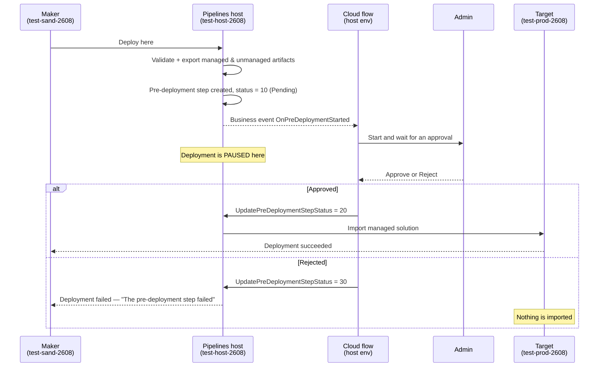

> **Critical:** the artifacts are exported **before** the approval and are then **locked** by the host. The same managed artifact is deployed to every later stage. Nobody can swap the solution after approval.

---

## 3. Prerequisites

| Requirement | Detail |
|---|---|
| Account | A **Power Platform administrator** or **Dataverse System Administrator**. This guide refers to that account as `<ADMIN-UPN>`. |
| Environments | **Three**, each with a Dataverse database: a **host**, a **development/source**, and a **target**. |
| Region | The host and all linked environments must be in the **same geographic region** (unless cross‑geo deployment is explicitly enabled). |
| Licence | A licence that permits Power Automate cloud flows and the premium **Microsoft Dataverse** connector. |

> **Why three environments?** The pipeline definition and the approval flow live in the **host**. The host is a separate environment from both the source and the target. A personal pipeline created from `make.powerapps.com` lives in the tenant's *platform host*, and **platform‑host pipelines cannot be extended** — so this lab uses a **custom host**, which is required for approvals.

---

## 4. Lab inventory (this lab's actual values)

Everything below was **built and verified end to end**. Substitute your own IDs where relevant.

### Environments

| Role | Display name | Environment ID | Dataverse URL |
|---|---|---|---|
| **Pipelines host** | `test-host-2608` | `<HOST-ENV-ID>` | `https://<HOST-ORG>.crm.dynamics.com` |
| **Source / Dev** | `test-sand-2608` | `<DEV-ENV-ID>` | `https://<DEV-ORG>.crm.dynamics.com` |
| **Target / Prod** | `test-prod-2608` | `<TARGET-ENV-ID>` | `https://<TARGET-ORG>.crm.dynamics.com` |

### Objects created

| Object | Name / value | Lives in |
|---|---|---|
| Pipeline | `Sand to Prod Pipeline` | host |
| Stage | `Deploy to Production` (Pre‑Deployment Step Required = **Yes**) | host |
| Cloud flow | `Pipeline Deployment Approval` | host |
| Approval solution | `PipelineApprovalDemo` v1.0.0.0 | host |
| Publisher | `Contoso Lab` / prefix `clab` | host + dev |
| Demo solution | `PipelineDemoSolution` (contains table `clab_demoitem`) | dev |
| Approver | `<ADMIN-UPN>` | — |

### Verified results

| Test | Pre‑deployment status | Outcome |
|---|---|---|
| **Approve** | `20` | `PipelineDemoSolution` **v1.0.0.1** imported into `test-prod-2608` as **managed**; table `clab_demoitem` present |
| **Reject** | `30` | `test-prod-2608` **stayed at v1.0.0.1** — v1.0.2.1 was never imported. Stage run error: *"The pre‑deployment step failed"*. Admin's reason shown to the maker. |

---

## Step 1 — Create the three environments

Skip any environment you already have. Each one **must** have a Dataverse database.

1. Go to the [Power Platform admin center](https://admin.powerplatform.microsoft.com).
2. Select **Manage** → **Environments** → **+ New**.
3. Create each environment with these settings:

   | Field | Host | Source | Target |
   |---|---|---|---|
   | Name | `test-host-2608` | `test-sand-2608` | `test-prod-2608` |
   | Type | Production | Sandbox | Production |
   | Region | *same for all three* | *same* | *same* |
   | **Add a Dataverse data store** | **Yes** | **Yes** | **Yes** |

4. Wait until all three show **Ready**.

> ✅ **Checkpoint:** three environments, same region, all with Dataverse, all Ready.

---

## Step 2 — Install the Pipelines app in the host

1. In the [Power Platform admin center](https://admin.powerplatform.microsoft.com), go to **Manage** → **Environments** and select **`test-host-2608`**.
2. On the environment page open the **Resources** area and select **Dynamics 365 apps**.
3. Select **+ Install app**.
4. In the list choose **Power Platform Pipelines**, then **Next** → accept the terms → **Install**.
5. Wait for the status to change from *Installing* to **Installed**. This typically takes **10–20 minutes**.

> ⚠️ Install the app **only in the host**. Do **not** install it in the source or target environments.

> ✅ **Checkpoint:** **Power Platform Pipelines** shows **Installed** in `test-host-2608`. A model‑driven app named **Deployment Pipeline Configuration** now exists in that environment.

---

## Step 3 — Configure the pipeline

Open the **Deployment Pipeline Configuration** app in the host:

`https://make.powerapps.com/environments/<HOST-ENV-ID>/apps` → play **Deployment Pipeline Configuration**.

### 3a. Register the development (source) environment

1. In the left navigation select **Environments**.
2. Select **+ New**.
3. Fill in:

   | Field | Value |
   |---|---|
   | **Name** | `test-sand-2608` |
   | **Environment Type** | **Development Environment** |
   | **Environment Id** | `<DEV-ENV-ID>` |

4. **Save**. The record validates automatically and its status becomes **Active**.

> 💡 **Where do I find the Environment Id?** Admin center → Environments → select the environment. The GUID is in the URL and on the environment details panel.

### 3b. Register the target environment

Repeat with:

| Field | Value |
|---|---|
| **Name** | `test-prod-2608` |
| **Environment Type** | **Target Environment** |
| **Environment Id** | `<TARGET-ENV-ID>` |

> ⚠️ If you get *"this environment is already associated with another pipelines host"*, the environment is linked to the tenant platform host. Select **Force Link** on the command bar to move it to your custom host.

### 3c. Create the pipeline

1. Left navigation → **Pipelines** → **+ New**.
2. **Name:** `Sand to Prod Pipeline`
3. **Deployment Type:** `Standard`
4. **Save**.
5. Still on the pipeline form, find the **Development Environments** subgrid and select **+ Add Existing Deployment Environment** → pick **`test-sand-2608`**.

### 3d. Create the deployment stage

1. On the same pipeline form, find the **Deployment Stages** subgrid → **+ New Deployment Stage**.
2. Fill in:

   | Field | Value |
   |---|---|
   | **Name** | `Deploy to Production` |
   | **Target Deployment Environment** | `test-prod-2608` |
   | **Previous Deployment Stage** | *(leave empty — this is the first stage)* |

3. **Save**.

> ✅ **Checkpoint:** one pipeline, one development environment, one stage pointing at the target.

---

## Step 4 — Turn on the approval gate

This single checkbox is what makes the deployment pause.

1. Still in the **Deployment Pipeline Configuration** app, open the **`Deploy to Production`** stage record.
2. Tick **Pre‑Deployment Step Required**.
3. **Save**.

> ⚠️ **This is the most important step in the lab.** Without it, `OnPreDeploymentStarted` never fires and the deployment runs straight through with no approval.

### The three checkboxes — don't confuse them

| Checkbox | When it pauses | Use it for |
|---|---|---|
| Pre‑Export Step Required | Before the solution is exported from dev | Custom validation / code scanning |
| Is Delegated Deployment | Deploys using a service principal instead of the maker | Makers with no access to the target |
| **Pre‑Deployment Step Required** | **After export, immediately before import into the target** | **Approvals ← this lab** |

> ✅ **Checkpoint:** open the solution's Pipelines tab later and you should see the notice *"Deployments may be pending until an associated background process succeeds."* That notice is proof the gate is armed.

---

## Step 5 — Create a solution to deploy

Keep this trivial — it exists only to give the pipeline something to move.

1. Go to `https://make.powerapps.com` and switch to **`test-sand-2608`**.
2. Select **Solutions** → **+ New solution**.
3. Fill in:

   | Field | Value |
   |---|---|
   | **Display name** | `Pipeline Demo Solution` |
   | **Name** | `PipelineDemoSolution` |
   | **Publisher** | **+ New publisher** → Display name `Contoso Lab`, Name `contosolab`, **Prefix `clab`** |

4. **Create**.
5. Open the solution → **+ New** → **Table** → **Table (blank)**.
6. **Display name:** `Demo Item` → **Save**.

> ⚠️ Use your **own publisher**, not the default `CDS Default Publisher`. Pipelines deploy solutions as **managed**, and a proper publisher prefix keeps things clean.

> ✅ **Checkpoint:** `Pipeline Demo Solution` exists in `test-sand-2608` and contains one table.

---

## Step 6 — Build the approval flow

> 📍 **The flow MUST be created in the pipelines HOST environment** (`test-host-2608`) — **not** in the source or target. The business event is raised by the host's Dataverse, so a flow anywhere else will never trigger.

### 6a. Create the flow inside a solution

1. Go to `https://make.powerautomate.com` and switch to **`test-host-2608`**.
2. Select **Solutions** → **+ New solution**:

   | Field | Value |
   |---|---|
   | **Display name** | `Pipeline Deployment Approval` |
   | **Name** | `PipelineApprovalDemo` |
   | **Publisher** | `Contoso Lab` (prefix `clab`) — create it here too |

3. Open the new solution → **+ New** → **Automation** → **Cloud flow** → **Automated**.
4. **Flow name:** `Pipeline Deployment Approval`
5. In the trigger search box type **`When an action is performed`**, choose the **Microsoft Dataverse** one, then **Create**.

> 💡 **Why inside a solution?** Solution‑aware flows use **connection references** instead of raw connections, which is what makes the flow exportable and portable (Step 9).

### 6b. Configure the trigger

Set these four fields **exactly**:

| Field | Value |
|---|---|
| **Catalog** | `Microsoft Dataverse Common` |
| **Category** | `Power Platform Pipelines` |
| **Table name** | `(none)` |
| **Action name** | `OnPreDeploymentStarted` |

> ⚠️ Set **Catalog** and **Category** first. **Action name** stays empty until both are chosen.

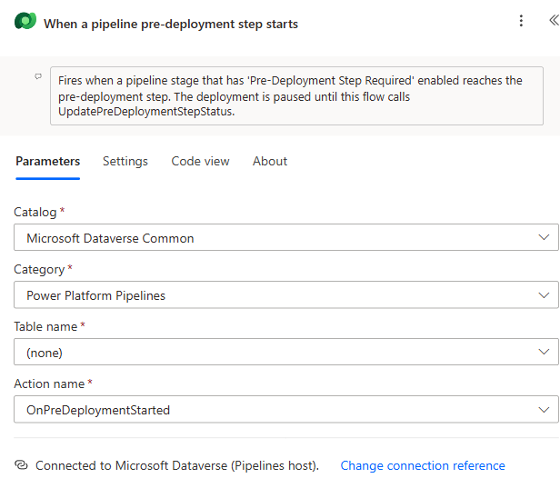

<details>
<summary>Underlying JSON (for reference)</summary>

```json
"inputs": {
  "host": {
    "connectionName": "shared_commondataserviceforapps",
    "operationId": "BusinessEventsTrigger",
    "apiId": "/providers/Microsoft.PowerApps/apis/shared_commondataserviceforapps"
  },
  "parameters": {
    "catalog": "commoncatalog",
    "category": "powerplatformpipelines",
    "subscriptionRequest/entityname": "none",
    "subscriptionRequest/sdkmessagename": "OnPreDeploymentStarted"
  }
}
```
</details>

### 6c. Add "Start and wait for an approval"

**+ New step** → search **`Start and wait for an approval`** (Approvals connector).

| Field | Value |
|---|---|
| **Approval type** | `Approve/Reject - First to respond` |
| **Title** | `Approve deployment of '<ArtifactName>' to <DeploymentStageName>` |
| **Assigned To** | `<ADMIN-UPN>` |
| **Details** | *(see below)* |
| **Item Link** | `StageRunDetailsLink` |
| **Item Link Description** | `Open the pipeline stage run` |

For **Details**, paste this. Everything in `@{...}` is dynamic content from the trigger:

```
A Power Platform Pipelines deployment is waiting for your approval.

| Field | Value |
| --- | --- |
| **Pipeline** | @{triggerOutputs()?['body/OutputParameters/DeploymentPipelineName']} |
| **Stage** | @{triggerOutputs()?['body/OutputParameters/DeploymentStageName']} |
| **Solution** | @{triggerOutputs()?['body/OutputParameters/ArtifactName']} |
| **Version** | @{triggerOutputs()?['body/OutputParameters/SolutionArtifactVersion']} |
| **Requested by** | @{triggerOutputs()?['body/OutputParameters/DeployAsUser']} |
| **Scheduled** | @{if(empty(triggerOutputs()?['body/OutputParameters/ScheduledTime']), 'Immediately', triggerOutputs()?['body/OutputParameters/ScheduledTime'])} |
| **Deployment notes** | @{triggerOutputs()?['body/OutputParameters/DeploymentNotes']} |

**Approve** to let the deployment continue, or **Reject** to stop it. Anything you type in the comments box is shown back to the maker in the pipeline run history.
```

> 💡 You can pick all of these from the **dynamic content** panel instead of typing expressions.

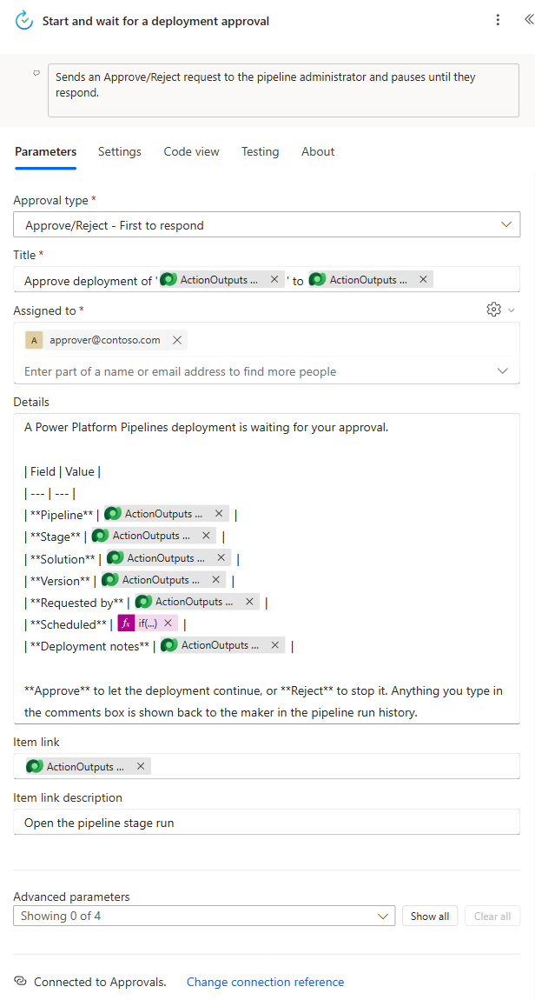

### 6d. Add the condition

**+ New step** → **Condition**.

| Left | Operator | Right |
|---|---|---|
| `outcome` *(from Start and wait for an approval)* | **is equal to** | `Approve` |

Expression form: `@outputs('Start_and_wait_for_a_deployment_approval')?['body/outcome']`

> ⚠️ The value is the literal string `Approve` — capital **A**, no "d".

### 6e. If yes → release the deployment

Inside **If yes**: **Add an action** → **Microsoft Dataverse** → **Perform an unbound action**.

| Field | Value |
|---|---|
| **Action Name** | `UpdatePreDeploymentStepStatus` |
| **StageRunId** | `@triggerOutputs()?['body/InputParameters/StageRunId']` |
| **PreDeploymentStepStatus** | `20` |
| **Comments** | `Approved by @{outputs('Start_and_wait_for_a_deployment_approval')?['body/responses'][0]?['responder']?['displayName']}. Comment: @{outputs('Start_and_wait_for_a_deployment_approval')?['body/responses'][0]?['comments']}` |

> 🔥 **The #1 gotcha:** `StageRunId` comes from **`InputParameters`**, *not* `OutputParameters`. Every other field on this trigger comes from `OutputParameters`. Get this wrong and the action fails with a missing‑parameter error.

> 💡 After selecting the **Action Name**, the `StageRunId`, `PreDeploymentStepStatus` and `Comments` fields appear. If you don't see them, expand **Show advanced options**.

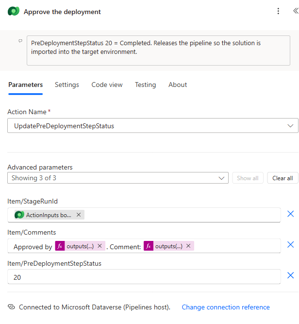

### 6f. If no → block the deployment

Inside **If no**: add the **same** action with **one** difference:

| Field | Value |
|---|---|
| **Action Name** | `UpdatePreDeploymentStepStatus` |
| **StageRunId** | `@triggerOutputs()?['body/InputParameters/StageRunId']` |
| **PreDeploymentStepStatus** | **`30`** |
| **Comments** | `Rejected by @{outputs('Start_and_wait_for_a_deployment_approval')?['body/responses'][0]?['responder']?['displayName']}. Reason: @{outputs('Start_and_wait_for_a_deployment_approval')?['body/responses'][0]?['comments']}` |

### 6g. Save and turn the flow on

1. **Save**.
2. Go back to the solution, confirm the flow shows **Status: On**. If it's off, open it and select **Turn on**.

Your finished flow:

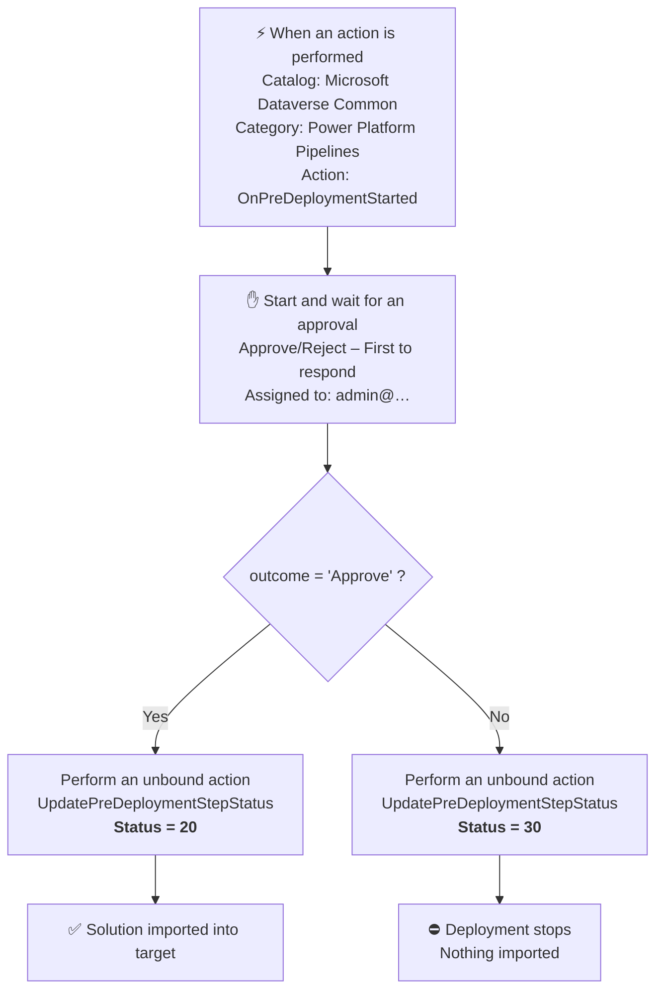

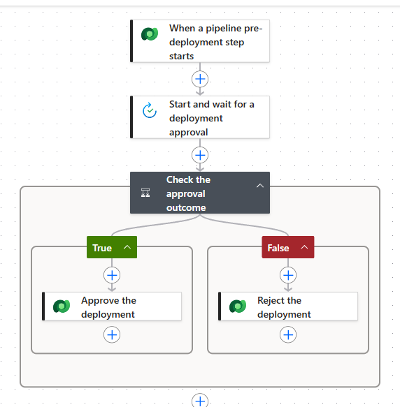

> ✅ **Checkpoint:** flow is **On**, lives in the **host**, and both branches call `UpdatePreDeploymentStepStatus`.

---

## Step 7 — Test the APPROVE path

### 7a. Request the deployment (as the maker)

1. Go to `https://make.powerapps.com` → switch to **`test-sand-2608`**.
2. **Solutions** → open **Pipeline Demo Solution**.
3. In the left menu of the solution select **Pipelines**.
4. You should see **Sand to Prod Pipeline** with stage **Deploy to Production**, and this notice:

   > *Deployments may be pending until an associated background process succeeds. This process is managed by your admin.*

   That notice confirms the approval gate is active.
5. Select **Deploy here** → **Next**.
6. Wait for validation to finish, then select **Deploy**.

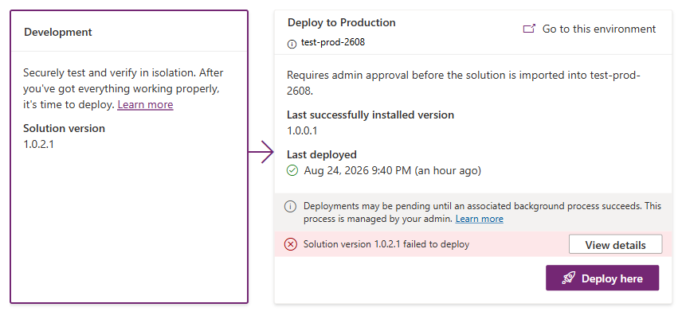

### 7b. Observe the pause

The stage run is now at **pre‑deployment status `10` (Pending)** and **nothing has been imported yet**. Select **View deployments** to see it waiting.

### 7c. Approve (as the admin)

1. Go to `https://make.powerautomate.com` → switch to **`test-host-2608`**.
2. Select **Approvals** in the left navigation → **Received** tab.
3. Open the request titled **`Approve deployment of 'PipelineDemoSolution' to Deploy to Production`**.
4. Confirm the details show the pipeline, stage, solution, version and requester.
5. Set **Choose your response** to **Approve**, type a comment such as
   `Approved for production release. Verified solution version and components.`
6. Select **Confirm**.

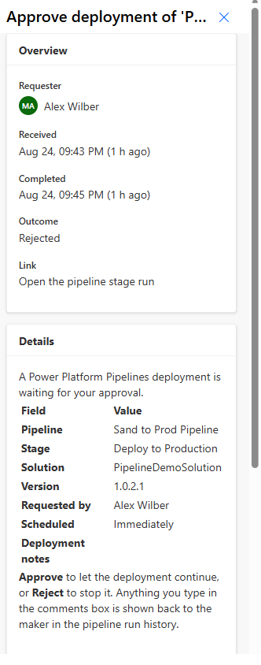

> 💡 The same request also arrives by email and in the Teams **Approvals** app — the admin can approve from any of them.

### 7d. Verify

Within a minute or two:

| Where | Expected |
|---|---|
| Power Automate → flow run history | **Succeeded** |
| Pipeline run history | Deployment **Succeeded** |
| `test-prod-2608` → Solutions | **`PipelineDemoSolution`** present, **Managed = Yes** |
| `test-prod-2608` → Tables | **`Demo Item`** (`clab_demoitem`) present |

**Verified in this lab:** pre‑deployment status became `20`, and `PipelineDemoSolution v1.0.0.1` was imported into `test-prod-2608` as a **managed** solution.

---

## Step 8 — Test the REJECT path

### 8a. Make a new version to deploy

In **`test-sand-2608`** → **Solutions** → select **Pipeline Demo Solution** → **Edit** → set **Version** to `1.0.2.0` → **Save**.

> 💡 Needed because a version already in the target can't be redeployed unless redeployment is enabled on the pipeline.

### 8b. Deploy and reject

1. Repeat Step 7a to request the deployment.
2. Go to **Approvals** → **Received** in the host environment.
3. Open the new request, set the response to **Reject**, and enter a reason such as
   `Rejected - change window not approved. Please resubmit after the CAB review on Wednesday.`
4. Select **Confirm**.

### 8c. Verify the deployment was blocked

| Where | Expected |
|---|---|
| Power Automate → flow run | **Succeeded** *(the flow worked correctly — it successfully rejected)* |
| Pipeline run history | **Failed** — *"The pre‑deployment step failed"* |
| `test-prod-2608` → Solutions | **Still the OLD version.** The new version was never imported. |
| Stage run → pre‑deployment notes | Your rejection reason, visible to the maker |

**Verified in this lab:** pre‑deployment status became `30`, `test-prod-2608` **stayed at v1.0.0.1**, and the maker saw:

> *Rejected by <APPROVER-NAME>. Reason: Rejected - change window not approved. Please resubmit after the CAB review on Wednesday.*

> ⚠️ Note the flow run shows **Succeeded** even on rejection. That's correct — the flow's job is to *report* the decision, not to *be* the decision. Judge the outcome by the **pipeline** status, not the flow status.

---

## Step 9 — Export the flow as a solution

### 9a. Export unmanaged (the editable source)

1. `https://make.powerautomate.com` → **`test-host-2608`** → **Solutions**.
2. Select **Pipeline Deployment Approval** (don't open it) → **Export solution** on the command bar.
3. Select **Next** → choose **Unmanaged** → **Export**.
4. The `.zip` downloads.

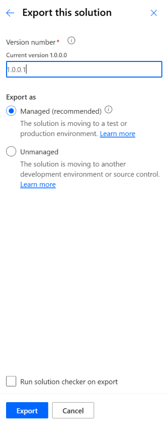

### 9b. Export managed (the deployable artifact)

Repeat, choosing **Managed** at the version step.

### 9c. Which one do I use?

| | Unmanaged | Managed |
|---|---|---|
| Purpose | Source of truth; keep in source control | Deploy to other environments |
| Editable after import | ✅ Yes | ❌ No — locked |
| Cleanly uninstallable | ❌ No | ✅ Yes |
| Use it for | Your dev/host environment, backups | QA, production hosts |

> ⚠️ **Never import an unmanaged solution into production.** Unmanaged components can't be cleanly removed.

**Both files produced by this lab:**

| File | Size | Managed flag |
|---|---|---|
| `PipelineApprovalDemo_1_0_0_0.zip` | 4,439 bytes | `0` (unmanaged) |
| `PipelineApprovalDemo_1_0_0_0_managed.zip` | 4,440 bytes | `1` (managed) |

Each contains:

```
solution.xml
customizations.xml          ← includes the 2 connection references
[Content_Types].xml
Workflows/PipelineDeploymentApproval-FAD8D655-50B0-4338-BB9D-EA47044F0BC9.json
```

---

## Shortcut — import the prebuilt solution

To skip Step 6 entirely, import the provided solution instead.

1. `https://make.powerautomate.com` → switch to your **host** environment → **Solutions** → **Import solution**.
2. **Browse** → pick `PipelineApprovalDemo_1_0_0_0.zip` (unmanaged) or `..._managed.zip`.
3. **Next**. You'll be asked to supply a connection for **two connection references**:

   | Connection reference | Connector |
   |---|---|
   | Microsoft Dataverse (Pipelines host) | Microsoft Dataverse |
   | Approvals | Approvals |

4. For each, select **+ New connection**, sign in as the admin, then return and pick it.
5. Select **Import** and wait for it to finish.
6. **⚠️ Two mandatory post‑import edits:**
   - Open the flow and change **Assigned To** on the approval action to **your** approver's email (it's hard‑coded to `<ADMIN-UPN>`).
   - **Turn the flow on** — imported flows arrive **off**.

> ✅ **Checkpoint:** flow is On, both connection references are bound, and the approver email is yours.

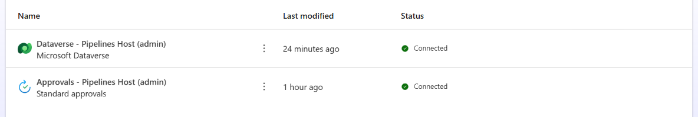

---

## Reference tables

### Trigger outputs from `OnPreDeploymentStarted`

| Output | Expression | Notes |
|---|---|---|
| Stage run ID | `triggerOutputs()?['body/InputParameters/StageRunId']` | ⚠️ **InputParameters** |
| Pipeline name | `triggerOutputs()?['body/OutputParameters/DeploymentPipelineName']` | Good for trigger conditions |
| Stage name | `triggerOutputs()?['body/OutputParameters/DeploymentStageName']` | Good for trigger conditions |
| Solution name | `triggerOutputs()?['body/OutputParameters/ArtifactName']` | |
| Solution version | `triggerOutputs()?['body/OutputParameters/SolutionArtifactVersion']` | |
| Requester | `triggerOutputs()?['body/OutputParameters/DeployAsUser']` | |
| Scheduled time | `triggerOutputs()?['body/OutputParameters/ScheduledTime']` | Empty = deploy now |
| Deployment notes | `triggerOutputs()?['body/OutputParameters/DeploymentNotes']` | AI‑generated summary |
| Link to stage run | `triggerOutputs()?['body/OutputParameters/StageRunDetailsLink']` | |
| **Managed** artifact | `triggerOutputs()?['body/OutputParameters/ArtifactFileDownloadLink']` | |
| **Unmanaged** artifact | `replace(triggerOutputs()?['body/OutputParameters/ArtifactFileDownloadLink'], 'artifactfile', 'artifactfileunmanaged')` | |

### `UpdatePreDeploymentStepStatus` parameters

Verified against the host environment's OData metadata — these are the **only three** parameters:

| Parameter | Type | Required | Notes |
|---|---|---|---|
| `StageRunId` | `Edm.Guid` | ✅ | From `InputParameters` |
| `PreDeploymentStepStatus` | `Edm.Int32` | ✅ | `10` / `20` / `30` |
| `Comments` | `Edm.String` | ❌ | Shown to the maker as *pre‑deployment step notes* |

> ⚠️ There is **no** `PreDeploymentProperties` parameter. (`UpdatePreExportStepStatus` has `PreExportProperties` and `UpdateApprovalStatus` has `ApprovalProperties`/`ApprovalComments` — but the pre‑deployment action does not.)

### Approval response fields

| Field | Expression |
|---|---|
| Overall outcome | `outputs('Start_and_wait_for_a_deployment_approval')?['body/outcome']` |
| Individual response | `...?['body/responses'][0]?['approverResponse']` |
| Comment | `...?['body/responses'][0]?['comments']` |
| Responder name | `...?['body/responses'][0]?['responder']?['displayName']` |
| Responder email | `...?['body/responses'][0]?['responder']?['email']` |
| Response date | `...?['body/responses'][0]?['responseDate']` |

> ⚠️ The available properties inside each response are exactly: `responder`, `requestDate`, `responseDate`, `approverResponse`, `comments`. **There is no `approver` property** — see Troubleshooting.

### Optional hardening — trigger conditions

With several pipelines in one host, restrict the flow so it only runs for the right one. Flow → **⋯** on the trigger → **Settings** → **Trigger Conditions**:

```
@equals(triggerOutputs()?['body/OutputParameters/DeploymentPipelineName'], 'Sand to Prod Pipeline')
```

| Goal | Condition |
|---|---|
| One specific pipeline | `@equals(triggerOutputs()?['body/OutputParameters/DeploymentPipelineName'], 'Sand to Prod Pipeline')` |
| One specific stage | `@equals(triggerOutputs()?['body/OutputParameters/DeploymentStageName'], 'Deploy to Production')` |
| Any stage containing "Prod" | `@contains(triggerOutputs()?['body/OutputParameters/DeploymentStageName'], 'Prod')` |

---

## Troubleshooting

### The deployment never pauses — it just deploys

| Check | Fix |
|---|---|
| Is **Pre‑Deployment Step Required** ticked on the stage? | Tick it and **Save** (Step 4) |
| Is this a *personal* pipeline created from `make.powerapps.com`? | Platform‑host pipelines **cannot** be extended. Rebuild it in a custom host. |

### The deployment pauses forever and no approval arrives

| Check | Fix |
|---|---|
| Is the flow in the **host** environment? | Move it. Flows in the source/target never trigger. |
| Is the flow **On**? | Imported flows arrive **off**. Turn it on. |
| Trigger set to `OnPreDeploymentStarted`? | Not `OnPreDeploymentCompleted` / `OnApprovalStarted` / `OnDeploymentRequested`. |
| Catalog / Category correct? | `Microsoft Dataverse Common` / `Power Platform Pipelines`. |
| A trigger condition filtering it out? | Check the pipeline name in the condition matches exactly. |
| Approvals database provisioned? | The first approval flow in a non‑default environment must be run by an environment admin. |

> 🚑 **Rescue a stuck deployment:** fix the flow, then open the failed run in Power Automate and select **Resubmit**. It replays with the original trigger payload and issues a fresh approval.

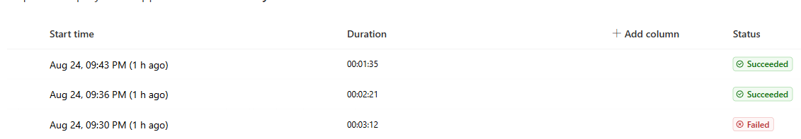

### Flow fails: `property 'approver/displayName' doesn't exist`

The full error:

> *The template language expression `outputs('…')?['body/responses'][0]['approver/displayName']` cannot be evaluated because property 'approver/displayName' doesn't exist, available properties are 'responder, requestDate, responseDate, approverResponse, comments'.*

**Cause:** the response object exposes **`responder`**, not `approver`.

**Fix:** use `['responder']?['displayName']`.

> This exact failure occurred while building this lab, was corrected, and the corrected version is what shipped in the exported solutions.

### Flow fails on the unbound action

| Symptom | Cause | Fix |
|---|---|---|
| Missing/invalid `StageRunId` | Pulled from `OutputParameters` | Use `triggerOutputs()?['body/InputParameters/StageRunId']` |
| Unknown parameter `PreDeploymentProperties` | That parameter doesn't exist | Remove it — only `StageRunId`, `PreDeploymentStepStatus`, `Comments` are valid |
| Privilege error | Connection identity lacks rights | The connection must be owned by someone who can update the deployment stage run record in the host |

### Environment won't link to the host

> *"This environment is already associated with another pipelines host."*

The environment is linked to the tenant platform host. Select **Force Link** on the command bar of the environment record after validation fails.

### Can't see the pipeline in the solution

| Check | Fix |
|---|---|
| Is the solution **unmanaged** and in a **registered development** environment? | Pipelines only appear on unmanaged solutions in registered dev environments |
| Same region as the host? | Cross‑geo requires explicit enablement |
| Do you have pipeline permissions? | Assign the **Deployment Pipeline User** role, or add the user to the **Deployment Pipeline Maker** team in the Deployment Pipeline Configuration app |

### Wrong "Microsoft Dataverse" connector

Two connectors share that name. You need the **modern** one:

| Connector | Internal name | Use it? |
|---|---|---|
| Microsoft Dataverse | `shared_commondataserviceforapps` | ✅ Yes |
| Microsoft Dataverse (legacy) | `shared_commondataservice` | ❌ No |

Only the modern one has **When an action is performed** and **Perform an unbound action**.

---

## References

- [Get started with Power Automate approvals](https://learn.microsoft.com/en-us/power-automate/get-started-approvals)
- [Extend pipelines in Power Platform](https://learn.microsoft.com/en-us/power-platform/alm/extend-pipelines) — authoritative source for triggers, actions and status codes
- [Set up pipelines in Power Platform](https://learn.microsoft.com/en-us/power-platform/alm/set-up-pipelines)
- [Pipelines extensibility samples (Microsoft)](https://download.microsoft.com/download/7/2/6/72633cb9-e046-4f3d-88ba-d64bffb6107a/PipelinesExtensibilitySamples_v1_June_2023_1_0_0_1.zip)
- [Poszytek — Power Platform Pipelines pre‑deployment approval flow](https://poszytek.eu/en/microsoft-en/pp-en/powerautomate-en/power-platform-pipelines-pre-deployment-approval-flow/)
- [Matthew Devaney — Configure Pre‑Deployment Stage Approvals](https://www.matthewdevaney.com/the-complete-power-platform-pipelines-alm-setup-guide/configure-pre-deployment-stage-approvals/)
- [Inogic — Automate solution deployments with approvals](https://www.inogic.com/blog/2024/02/automate-solution-deployments-with-approvals-using-power-platform-pipelines/)
