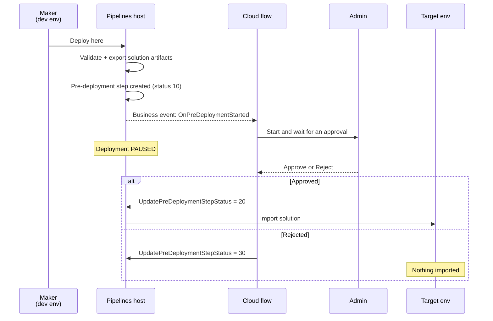
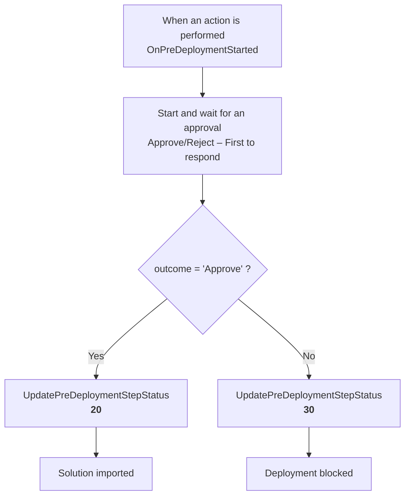

# Power Platform Pipelines — Pre-Deployment Approval Flow

Add an **admin approval gate** to a Power Platform pipeline.

When a maker requests a deployment, the pipeline pauses. An approval request goes to the administrator. Only if they **Approve** does the solution get imported into the target environment. If they **Reject**, the deployment stops and nothing is imported.

Built with the **Pre-Deployment Step Required** gated extension, a Dataverse business event, and a Power Automate cloud flow.

---

## What's in this repo

| Path | What it is |
|---|---|
| [`Pipeline-Approval-Hands-On-Guide.md`](./Pipeline-Approval-Hands-On-Guide.md) | **The main guide.** Step-by-step lab, from zero environments to a tested approval gate. |
| [`Pipeline-Approval-Hands-On-Guide.ko.md`](./Pipeline-Approval-Hands-On-Guide.ko.md) | Korean translation (한국어). Matches the English version line for line. |
| [`solution/`](./solution) | Ready-to-import solution packages — skip the manual build. |
| [`src/`](./src) | The same solution, unpacked into source files. For reading, diffing, and version control. |

### `solution/`

| File | Type | Use it when |
|---|---|---|
| `PipelineApprovalDemo_1_0_0_0.zip` | **Unmanaged** | You want to import it and then edit the flow |
| `PipelineApprovalDemo_1_0_0_0_managed.zip` | **Managed** | You're deploying to an environment where it should stay locked |

Both contain the same flow. The only difference is the `<Managed>` flag.

### `src/`

The unpacked form of the solution — this is what's inside the `.zip`.

| File | Purpose |
|---|---|
| `solution.xml` | Solution identity: unique name, version, publisher, component list |
| `customizations.xml` | Registers the flow as a Dataverse process + declares the two connection references |
| `[Content_Types].xml` | Package manifest (which file extensions exist). Required — imports fail without it |
| `Workflows/PipelineDeploymentApproval-*.json` | **The actual flow logic** — trigger, approval, condition, both callbacks |

---

## How it works

The pipeline doesn't know anything about approvals. It just raises an event and waits for an answer.



### The three moving parts

**1. A checkbox on the pipeline stage**

`Pre-Deployment Step Required` — this is what makes the deployment pause. Without it, nothing else in this repo does anything.

**2. A business event that triggers the flow**

Dataverse raises `OnPreDeploymentStarted`. The flow subscribes via the **When an action is performed** trigger:

| Field | Value |
|---|---|
| Catalog | `Microsoft Dataverse Common` |
| Category | `Power Platform Pipelines` |
| Action name | `OnPreDeploymentStarted` |

**3. An unbound action that answers back**

The deployment stays paused until the flow calls `UpdatePreDeploymentStepStatus`:

| Status | Meaning | Result |
|---|---|---|
| `10` | Pending | Set by the system — still waiting |
| `20` | Completed | **Deployment continues.** Solution imported. |
| `30` | Failed | **Deployment stops.** Nothing imported. |

### The flow



---

## Quick start

> Full instructions are in the [hands-on guide](./Pipeline-Approval-Hands-On-Guide.md). This is the short version.

### Prerequisites

- **Three environments**, each with Dataverse, all in the **same region**: a pipelines **host**, a **development** environment, and a **target** environment
- **Power Platform admin** or **Dataverse System Administrator**
- A licence covering Power Automate cloud flows and the premium **Microsoft Dataverse** connector

### Steps

1. **Install** the **Power Platform Pipelines** app into the host environment
   *(Admin center → your host env → Dynamics 365 apps → Install app)*

2. **Configure** a pipeline in the **Deployment Pipeline Configuration** app — register your dev and target environments, create a pipeline, add a stage

3. **Tick `Pre-Deployment Step Required`** on the stage ← *the gate*

4. **Import** `solution/PipelineApprovalDemo_1_0_0_0.zip` into the **host** environment
   - Supply connections for the two connection references (**Microsoft Dataverse** and **Approvals**)

5. **Two mandatory post-import edits:**
   - Change **Assigned To** on the approval action to your approver's email — it ships as the placeholder `approver@contoso.com`
   - **Turn the flow on** — imported flows arrive **off**

6. **Test it.** Open an unmanaged solution in your dev environment → **Pipelines** → **Deploy here**. The deployment should pause, and an approval should land in Power Automate → **Approvals**.

---

## Things that trip people up

**The flow must live in the pipelines HOST environment.** Not the dev environment, not the target. The business event is raised by the host's Dataverse, so a flow anywhere else never triggers.

**`StageRunId` comes from `InputParameters`.** Every other trigger field comes from `OutputParameters`. This one doesn't:

```
@triggerOutputs()?['body/InputParameters/StageRunId']
```

**The approver is `responder`, not `approver`.** The response object exposes `responder`, `requestDate`, `responseDate`, `approverResponse`, `comments`:

```
outputs('...')?['body/responses'][0]?['responder']?['displayName']
```

**A rejected deployment still shows the flow as `Succeeded`.** That's correct — the flow's job is to *report* the decision, not to *be* it. Judge the result by the **pipeline** status, not the flow status.

**Personal pipelines can't be extended.** Pipelines created from `make.powerapps.com` live in the tenant *platform host*. You need a **custom host** for approvals.

More in the [troubleshooting section](./Pipeline-Approval-Hands-On-Guide.md#troubleshooting) of the guide.

---

## Working with `src/`

The `src/` folder and the `.zip` files hold the same solution in two forms. To convert between them, use the Power Platform CLI:

```bash
# src/ -> zip
pac solution pack --zipfile solution.zip --folder src --packagetype Unmanaged

# zip -> src/
pac solution unpack --zipfile solution.zip --folder src --packagetype Unmanaged
```

Keep `src/` in version control — the JSON and XML diff cleanly, unlike a binary `.zip`.

---

## Notes

- The solution carries **no** environment IDs, connection IDs, or tenant identifiers. It uses **connection references**, so whoever imports it plugs in their own credentials.
- The only value you must change is the approver email (`approver@contoso.com`).
- Tested end to end on Dataverse `9.2`, Power Platform Pipelines package `9.1.2026034` — both the approve and reject paths.

## References

- [Extend pipelines in Power Platform](https://learn.microsoft.com/en-us/power-platform/alm/extend-pipelines) — official docs for triggers, actions, and status codes
- [Set up pipelines in Power Platform](https://learn.microsoft.com/en-us/power-platform/alm/set-up-pipelines)
- [Get started with Power Automate approvals](https://learn.microsoft.com/en-us/power-automate/get-started-approvals)
