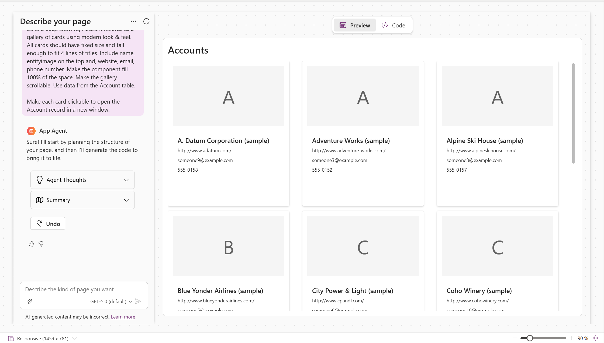
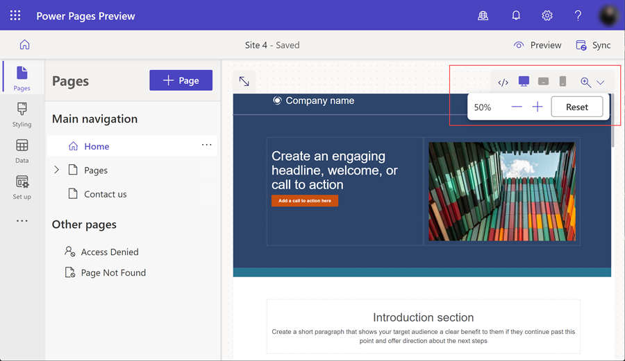
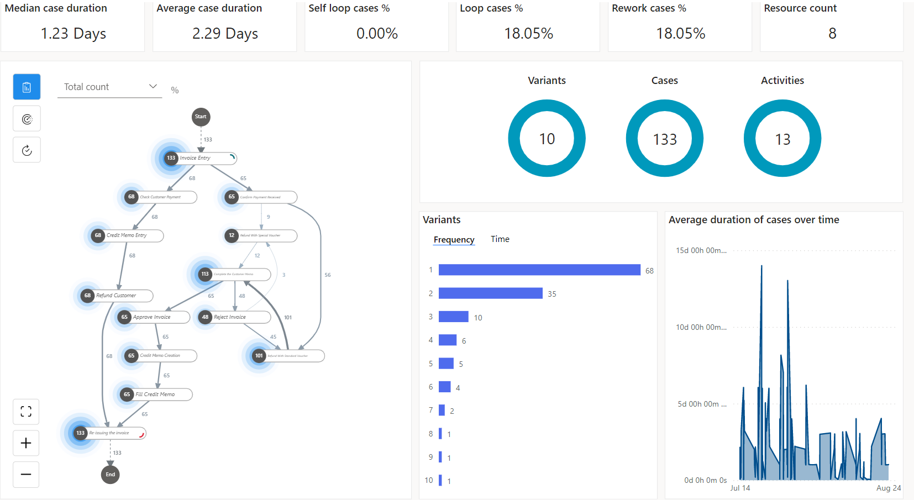
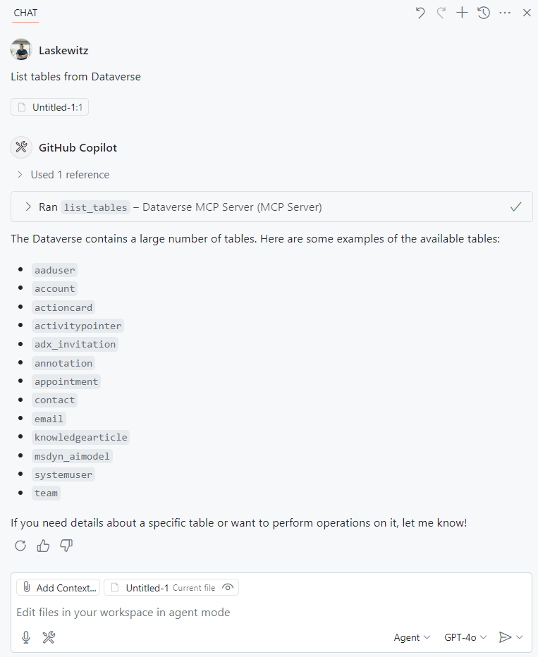
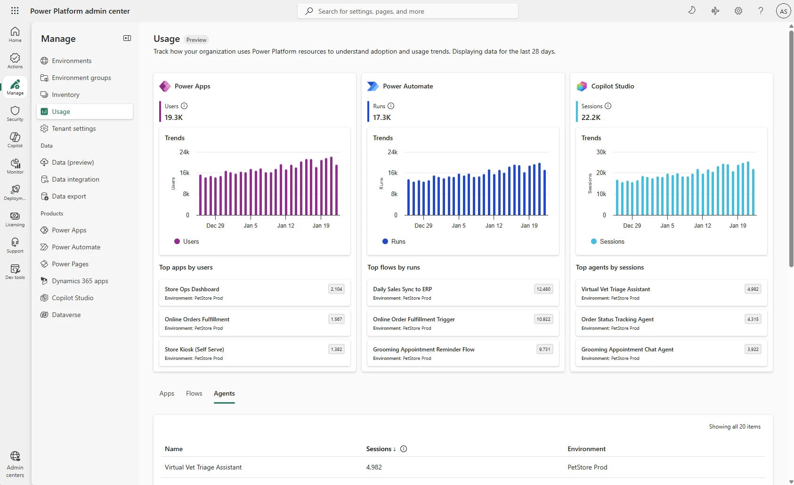

# Power Platform 2026 Release Wave 1: AI 에이전트 시대를 위한 앱, 자동화, 데이터, 거버넌스의 진화

> author: **Yooyeun Kim**, Solution Engineer

Microsoft는 2026년 3월 18일, [Microsoft Power Platform 2026 Release Wave 1 계획](https://learn.microsoft.com/en-us/power-platform/release-plan/2026wave1/)을 공개했습니다. 이번 Release Wave 1은 2026년 4월부터 9월까지 순차적으로 제공될 예정인 기능들을 포함하며, Power Apps, Power Pages, Power Automate, Microsoft Copilot Studio, Microsoft Dataverse, 그리고 Power Platform 거버넌스 및 관리 기능 전반에 걸친 업데이트를 다룹니다.

Power Platform은 단순한 low-code 개발 도구를 넘어, AI 에이전트 기반의 업무 애플리케이션을 만들고, 자동화하고, 운영·관리하는 엔터프라이즈 플랫폼으로 확장되는 흐름이라고 볼 수 있습니다.

*Microsoft Power Platform 2026 Release Wave 1은 앱 개발, 자동화, 에이전트, 데이터, 거버넌스 전반의 진화를 포함합니다*

---

## 1. Power Apps: 업무 앱이 더 현대적이고, 더 지능적으로 바뀝니다

Power Apps의 이번 업데이트는 크게 현대적인 사용자 경험, 모바일·오프라인 개선, 검색 품질 향상, AI 기반 앱 경험 확대로 정리할 수 있습니다. Microsoft는 model-driven app의 modern look을 기본 경험으로 확대하고, streamlined header와 navigation을 통해 더 일관되고 효율적인 업무 화면을 제공하는 방향으로 Power Apps를 개선하고 있습니다.

비즈니스 입장에서 중요한 변화는 “앱을 더 예쁘게 만드는 것”에 그치지 않습니다. 현업 사용자는 더 빠르게 데이터를 찾고, 더 적은 클릭으로 업무를 처리하며, maker는 더 일관된 디자인과 컴포넌트를 기반으로 앱을 구축할 수 있습니다. 특히 grid filters와 lookup 검색이 개선되면서, Dataverse 기반 업무 앱에서 필요한 레코드를 더 빠르게 찾을 수 있는 경험이 강화됩니다.

또 하나의 핵심은 AI 기반 앱 생성과 데이터 이해입니다. Generative pages는 전 세계 지원 지역으로 확대되고, 외부 code generation tool을 활용한 생성형 페이지 제작도 포함됩니다. 이는 글로벌 조직이나 다국어 환경을 운영하는 기업에게 의미가 큽니다. 생성형 페이지가 지역별 언어, 날짜, 숫자 형식, 읽기 방향과 같은 사용자 기대에 맞게 동작할 수 있기 때문입니다.

*Power Apps generative pages*

Power Apps는 Microsoft 365 Copilot과의 결합도 강화되고 있습니다. Microsoft의 2026년 3월 Power Platform 업데이트에서는 model-driven apps 안에서 Microsoft 365 Copilot을 사용해 앱 데이터를 요약하고, 현재 활성화된 항목을 시각화하고, 특정 레코드의 이력을 파악하며, Work IQ를 통해 관련 콘텐츠까지 참조할 수 있는 흐름을 소개했습니다. 이는 앱 안에서 “무슨 일이 일어나고 있는가?”를 파악한 뒤 “다음에 무엇을 해야 하는가?”로 자연스럽게 이어지는 경험입니다.

예를 들어, 영업 담당자가 고객 레코드를 보면서 Copilot에게 최근 활동 요약을 요청하거나, 운영 담당자가 이슈 레코드 목록을 보며 우선순위를 빠르게 파악하는 식의 활용이 가능합니다. 즉 Power Apps는 단순 입력 화면이 아니라, 업무 데이터를 이해하고 다음 행동을 돕는 intelligent business app으로 진화하고 있습니다.

---

## 2. Power Pages: 보안과 AI가 강화된 외부-facing 비즈니스 포털

Power Pages는 고객, 파트너, 시민, 임직원 등 조직 외부 또는 내부 사용자를 대상으로 하는 secure, data-driven business portal을 만들기 위한 Power Platform 구성 요소입니다. 이번 Release Wave 1에서는 AI 기반 개발 생산성, 보안 에이전트, 인증·권한 관리, site analytics와 server logs, end-user transaction auditing 등이 주요 업데이트로 포함됩니다.

특히 주목할 부분은 Power Pages security agent입니다. 사이트 제작자는 보안 에이전트를 통해 복잡한 역할과 권한 설정을 더 쉽게 구성할 수 있고, 관리자는 admin security agent를 통해 phishing, DDoS, spam, offensive content 같은 위험을 모니터링하고 완화할 수 있습니다. 외부-facing 포털은 조직 밖의 사용자와 직접 연결되기 때문에, 이러한 보안 기능은 실제 운영 관점에서 매우 중요합니다.

Power Pages는 개발자 경험도 강화하고 있습니다. AI coding tools를 활용해 Power Pages 사이트를 더 빠르게 만들 수 있고, secure server-side logic, Power Platform CLI 기반 사이트 생성·삭제, client APIs, Bootstrap 5와 enhanced data model 지원도 포함됩니다. 이는 low-code maker뿐 아니라 pro-developer가 함께 참여하는 엔터프라이즈 포털 프로젝트에 유용합니다.

*Power Pages design studio*

Power Pages 업데이트는 “포털을 더 빨리 만든다”는 의미를 넘어섭니다. 앞으로는 포털도 AI 기반으로 설계·확장되고, 관리자는 인증, 권한, 보안 이벤트, 사용량, 성능 데이터를 기반으로 운영 상태를 더 체계적으로 볼 수 있게 됩니다. 따라서 고객 포털, 파트너 포털, 민원 포털, 서비스 신청 포털처럼 외부 사용자와 연결되는 업무를 운영하는 조직이라면 이번 업데이트를 주목할 필요가 있습니다.

---

## 3. Power Automate: 자동화가 더 지능적이고 복원력 있게 바뀝니다

Power Automate는 cloud flows, desktop flows, process mining을 아우르는 Microsoft의 자동화 플랫폼입니다. 이번 Release Wave 1에서는 AI 기반 자동화 작성, desktop flow의 지능화와 self-healing, Copilot Studio와의 연결, object-centric process mining, 라이선스 및 사용량 거버넌스 강화가 핵심입니다.

먼저 Cloud flows 영역에서는 실수로 삭제한 flow 복원, Process license capacity 공유, licensing dashboard 개선, cloud flow designer의 inline property view 개선 등이 포함됩니다. 이는 자동화가 많아질수록 운영팀과 CoE 팀이 자주 마주하는 관리 문제를 줄이는 데 도움이 됩니다.

Desktop flows에서는 version control, hosted machine template을 위한 VM ./img/2026w1-image capture, 직접 스케줄링, unattended run video logs, test suite를 통한 subflow 테스트 등이 예정되어 있습니다. 특히 RPA를 운영하는 입장에서 “자동화가 실제로 어떻게 실행되었는가”, “변경 후에도 안정적으로 동작하는가”, “문제가 생겼을 때 빠르게 재현하고 복구할 수 있는가”가 중요하기 때문에, 이러한 기능은 운영 안정성 측면에서 의미가 큽니다.

*Power Automate process mining*

Process mining도 크게 강화됩니다. 특히 이번 Wave에서는 여러 업무 객체가 서로 얽혀 있는 복잡한 프로세스를 분석할 수 있는 Object-centric process mining이 정식 기능으로 제공될 예정입니다. 예를 들어 주문, 송장, 고객, 제품처럼 하나의 프로세스 안에서 함께 움직이는 여러 데이터를 연결해 분석할 수 있어, 실제 기업 업무의 병목과 예외 상황을 더 현실적으로 파악할 수 있습니다. 또한 Process Intelligence Studio, 사용자 정의 KPI, Microsoft Fabric semantic model export 기능을 통해 분석 결과를 더 쉽게 시각화하고, 조직의 데이터 분석 환경과도 연결할 수 있습니다. 복잡한 업무 프로세스를 가진 조직에서 특히 활용 가치가 큽니다.

또한 Power Automate와 Copilot Studio의 연결이 더 중요해지고 있습니다. Power Automate는 cloud workflow를 AI agent 및 Copilot Studio-powered actions와 연결하고, Copilot Studio에서 desktop flows를 직접 호출해 정해진 절차가 필요한 작업을 안정적으로 수행할 수 있도록 하는 방향으로 발전하고 있습니다.

---

## 4. Microsoft Copilot Studio: 엔터프라이즈 AI 에이전트 플랫폼으로 확장

Copilot Studio는 조직이 AI agent와 agentic workflow를 만들고 운영할 수 있도록 지원하는 SaaS 기반 에이전트 플랫폼입니다. 이번 Release Wave 1에서 Copilot Studio는 단순 대화형 agent 제작을 넘어, Microsoft 365 Copilot Agent Builder와의 연계, 고급 도구와 지식 연결, agent evaluation, multi-agent orchestration, 보안 및 거버넌스 영역이 강화됩니다.

가장 중요한 변화 중 하나는 평가와 운영 가능성입니다. Copilot Studio에는 generative AI 응답 품질 분석, multi-turn conversation 전체 평가, 실시간 evaluation results 확인, custom metrics for analytics, 사용자 sentiment 분석 등이 포함됩니다. 이는 agent를 PoC 수준에서 만드는 것을 넘어, 실제 업무에 배포한 뒤 “잘 동작하는지”, “품질이 유지되는지”, “사용자가 만족하는지”, “프롬프트나 지식 변경 후 성능이 떨어지지 않았는지”를 검증하는 데 필요합니다.

또한 SharePoint source에서 code interpreter를 사용하는 기능, SharePoint lists를 knowledge source로 추가하는 기능, 파일과 instruction을 그룹화해 agent 답변을 유도하는 기능이 포함됩니다. 이는 조직 내부 문서, 목록 데이터, 업무 지식이 agent의 답변 품질에 직접 연결된다는 의미입니다.

*YouTube: Microsoft Copilot Studio | 2026 Release Wave 1*

Agent workflow 측면에서는 agent node를 통해 agent를 workflow step으로 호출하고, MCP-compliant tools를 agent workflow에서 사용하는 기능이 포함됩니다. 이는 앞으로 agent가 단순히 대화만 하는 것이 아니라, 여러 도구와 시스템을 연결해 업무를 단계적으로 수행하는 구조로 확장된다는 점을 보여줍니다.

보안 측면에서도 중요한 기능이 포함됩니다. 추가 threat protection, credential oversharing 감지, maker-provided credentials 사용 차단 등은 agent가 실제 업무 시스템과 연결될 때 반드시 필요한 통제입니다. AI agent가 데이터를 조회하고 액션을 수행할수록, “누가 만든 agent인가”, “어떤 권한으로 실행되는가”, “민감한 인증 정보가 잘못 공유되지 않는가”를 관리하는 것이 중요해집니다.

---

## 5. Microsoft Dataverse: AI agent를 위한 신뢰 가능한 데이터 기반

Dataverse는 Power Platform의 low-code data platform이자, 이제는 AI agent와 Copilot application을 위한 엔터프라이즈 데이터 기반으로 더 중요해지고 있습니다. 이번 Release Wave 1에서는 Dataverse in Work IQ, agent programmability, MCP server, Python SDK, storage management 등이 주요 방향으로 제시됩니다.

특히 Dataverse가 Microsoft 365 Copilot 경험과 연결되면, 사용자는 자연어 대화를 통해 line-of-business 데이터를 조회하고, multi-step workflow를 실행할 수 있습니다. 이때 agent는 조직별 업무 데이터에 기반해 더 정확한 결정을 내릴 수 있고, Dataverse의 투명한 agent identity와 auditability를 통해 추적 가능성을 확보할 수 있습니다.

개발자 관점에서는 Dataverse SDK for Python, Dataverse Work IQ APIs, MCP servers가 중요합니다. 이는 Power Platform이 low-code maker만을 위한 플랫폼이 아니라, pro-developer가 Python, API, MCP 기반으로 agentic solution을 확장할 수 있는 플랫폼으로 발전하고 있음을 보여줍니다.

*Dataverse MCP use in GitHub Copilot: [Power Platform MCP Labs](https://microsoft.github.io/pp-mcp/)*

Dataverse의 또 다른 실무적 업데이트는 deleted records 복원, bulk delete UX 개선, first-time Dataverse sync를 위한 guided table selection 등입니다. 이러한 기능은 대규모 운영 환경에서 데이터 관리 리스크를 줄이고, 관리자와 maker의 실수를 복구할 수 있는 여지를 넓혀줍니다.

---

## 6. Governance & Administration: AI 확산을 위한 관리 체계 강화

Power Platform 도입이 확산될수록 비즈니스에 가장 많이 고민하는 부분은 “더 많은 사람이 만들 수 있게 할 것인가”와 “어떻게 안전하게 통제할 것인가” 사이의 균형입니다. 이번 Release Wave 1에서 Power Platform governance and administration은 이 균형을 위해 Managed Security, Managed Governance, Managed Operations라는 세 축을 강화합니다.

Managed Security는 agent lifecycle 전반의 보안 통제를 강화합니다. sensitivity labels, external user permissions, network connectivity, Virtual Network support, Copilot Studio agent security admin controls 등이 포함되며, 이를 통해 실험 환경과 운영 환경을 구분하고, 안전한 혁신 영역을 제공하면서도 production workload에는 더 강한 통제를 적용할 수 있습니다.

Managed Governance는 사후 수동 검토에서 벗어나, 실시간 risk assessment와 AI-powered governance agent를 통해 위험을 더 빠르게 식별하고 개선할 수 있도록 합니다. Agentic Center of Enablement, default environment에서 앱 이동, sensitivity label 표시, connector sensitivity visibility 등은 CoE와 IT 관리자가 tenant 전반을 더 투명하게 운영하는 데 도움이 됩니다.

Managed Operations는 비용과 운영 상태를 더 잘 관리하기 위한 방향입니다. Power Platform admin center에서 usage patterns, Copilot credit consumption, PAYG caps, license reclaim, connector dependencies, operational health monitoring을 더 세밀하게 볼 수 있도록 개선됩니다. 이는 단순히 “누가 많이 쓰는가”를 보는 수준이 아니라, ROI를 설명하고, 비용 초과를 방지하고, 장애나 보안 이슈가 발생했을 때 영향을 빠르게 파악하는 데 연결됩니다.

*Power Platform Admin Center Usage page*

ALM 측면에서도 중요한 변화가 있습니다. GitHub source code integration, Deploy from Git with pipelines, Copilot Studio의 inline deployment 기능이 포함됩니다. 이는 Power Platform solution을 더 성숙한 개발·배포 프로세스 안에서 관리하려는 입장이라 중요한 변화입니다. 특히 개발, 테스트, 운영 환경을 분리하고 변경 이력을 추적해야 하는 엔터프라이즈 조직에서는 Git 기반 ALM이 점점 더 중요해질 것입니다.

---

### 추가 자료: Power Platform Wave 1의 핵심은 “AI를 안전하게 업무에 넣는 것”

[Microsoft Dynamics 365 Blog](https://www.microsoft.com/en-us/dynamics-365/blog/business-leader/2026/03/18/2026-release-wave-1-plans-for-microsoft-dynamics-365-microsoft-power-platform-and-copilot-studio-offerings/)에서 Power Platform과 Copilot Studio의 2026 Release Wave 1 주요 기능을 제품 리더와 엔지니어 데모 중심으로 확인할 수 있습니다.

또한 [Release Planner](https://releaseplans.microsoft.com/en-us/?app=Power+Apps)에서는 제품별로 기능을 필터링하고, 개인화된 release plan을 만들 수 있습니다. 관심 제품, 릴리스 상태, 일반 공급 시점, 관리자 활성화 필요 여부를 기준으로 기능을 분류하기 때문에, 내부 검토 자료로 활용하는 것을 권장합니다.

---

## 마무리: Power Platform Wave 1의 핵심은 “AI를 안전하게 업무에 넣는 것”

2026 Release Wave 1은 단순한 기능 업데이트가 아닙니다. Power Platform이 앱 개발, 업무 자동화, AI agent 제작, 엔터프라이즈 데이터 연결, 운영·보안·거버넌스를 하나의 플랫폼 경험으로 묶어가는 과정입니다.

Power Apps는 더 지능적인 업무 앱으로, Power Automate는 더 복원력 있는 자동화 플랫폼으로, Copilot Studio는 엔터프라이즈 AI agent 플랫폼으로, Dataverse는 agentic application을 위한 신뢰 가능한 데이터 기반으로 진화하고 있습니다. 그리고 이 모든 확산을 Power Platform admin center와 governance 기능이 뒷받침합니다.

이번 Wave 1의 핵심 질문은 “어떤 기능이 새로 나왔는가?”보다 한 단계 더 나아가야 합니다.
- 우리 조직의 어떤 업무 앱에 AI를 넣을 것인가?
- 어떤 자동화를 agent와 연결할 것인가?
- Dataverse와 Microsoft 365 데이터를 어떻게 안전하게 활용할 것인가?
- 확산되는 agent와 low-code 자산을 어떤 기준으로 관리할 것인가?

이러한 질문들에 답하기 시작할 때, Power Platform 2026 Release Wave 1은 단순한 업데이트 목록이 아니라, 조직의 AI 전환을 현실적인 업무 시스템으로 구현하는 출발점이 될 수 있습니다.

> published at 2026-04-30 via yooyeun.kim@microsoft.com