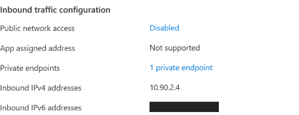
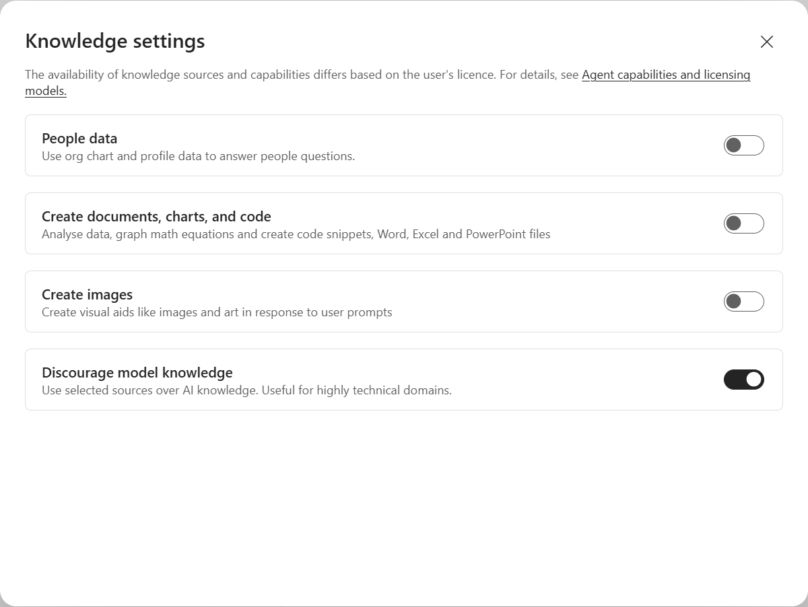
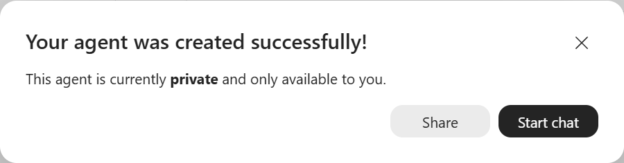
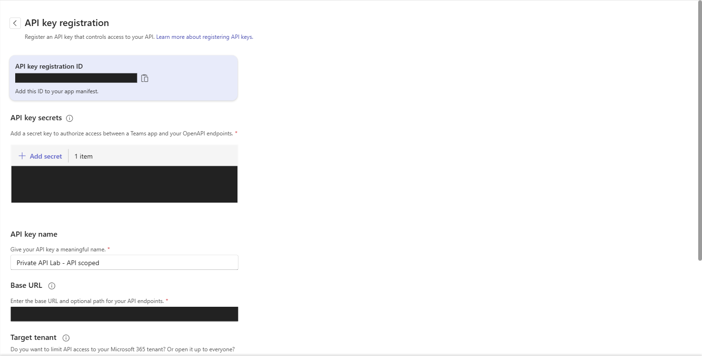
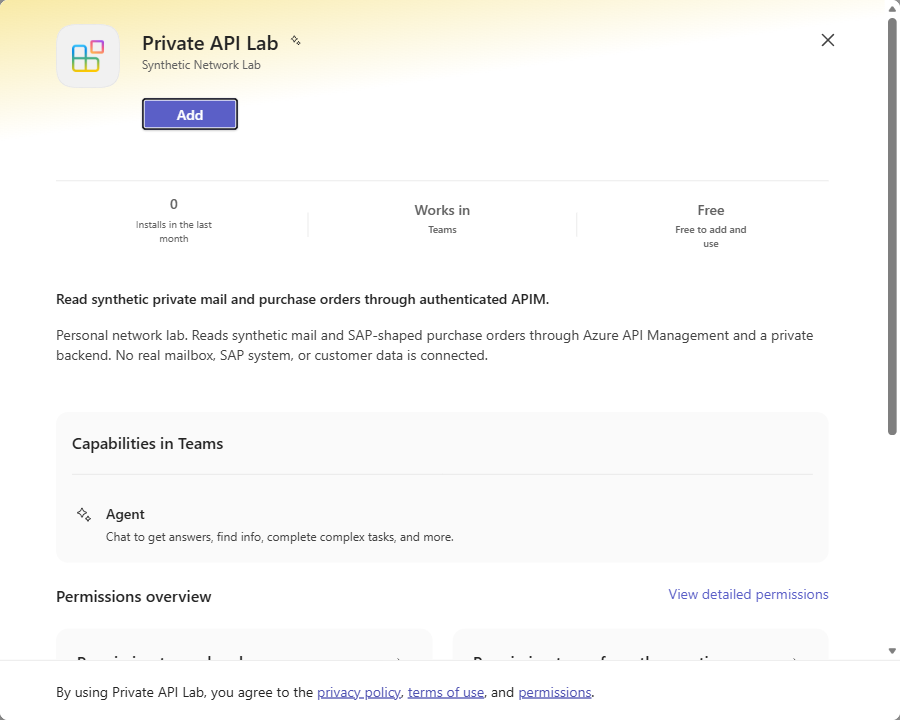
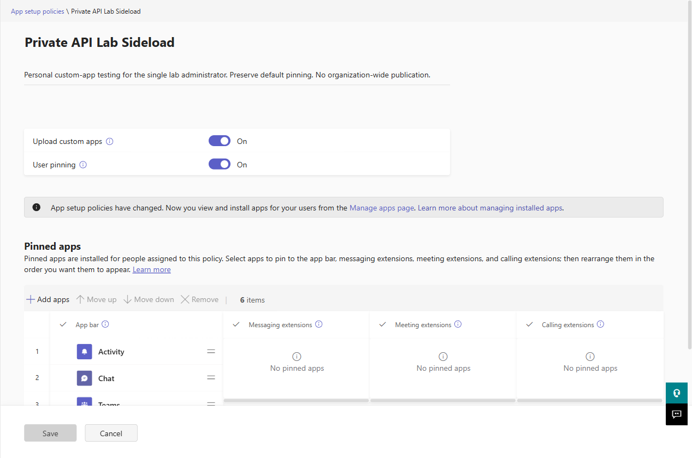
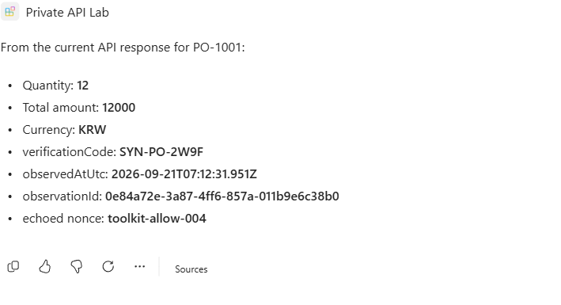

# Microsoft 365 Copilot agents with a private API backend

Compare an **Agent Builder knowledge agent** with an **Agents Toolkit declarative agent**. The Toolkit agent calls an authenticated, public Azure API Management gateway. APIM reaches a private synthetic mail/purchase-order API through an Azure Virtual WAN hub.

This lab does not create, select, or modify a Power Platform environment, enterprise policy, or custom connector. The Toolkit API action does not use Power Platform subnet injection. This is a separate experiment from the [Copilot Studio VNet-injection lab](../../public/README.md).

**Execution status and measured results:** [report.md](report.md). Instructions below are the replay procedure, not evidence that a test passed.

The completed run includes actual Toolkit-agent live reads, a denied private path, and recovery after restoring that path. The report links the answers, execution records and matching backend telemetry.

## Architecture

```text
Agent Builder
  -> uploaded, dated synthetic knowledge snapshot
  -> no custom REST action configured

Toolkit declarative agent, running in Microsoft 365 Copilot
  -> API plugin + Microsoft token store
  -> public HTTPS APIM gateway [API-scoped subscription key]
  -> APIM VNet, Korea Central         10.90.1.0/24
     snet-apim                       10.90.1.0/27
  -> Virtual WAN Standard hub        10.90.0.0/24
  -> private-backend VNet             10.90.2.0/24
     snet-private-endpoints          10.90.2.0/27
  -> private endpoint + NSG
  -> HTTPS App Service API [public network access disabled]
```

Both spokes connect to the hub. There is **no direct spoke-to-spoke peering**. Virtual WAN creates a hub-managed peering on each spoke, so the peering lists are not empty. Private DNS resolves the normal `*.azurewebsites.net` backend hostname to its private endpoint. APIM uses that normal hostname, retaining certificate-name and trust-chain validation.

| Enterprise setting | Lab implementation | Limit |
|---|---|---|
| Korea Central network connected to a virtual hub | Real Korea Central VNets and Virtual WAN hub | No regional failover test. |
| Firewall-controlled access to an internal gateway | NSG on the private-endpoint subnet | Not an Azure Firewall, NVA, or customer firewall appliance. |
| Internal API gateway and business services | Private App Service serving synthetic mail and SAP-shaped purchase orders | Not a physical on-premises site, VPN/ExpressRoute, mailbox, SAP RFC/BAPI, or real SAP OData service. |
| APIM in front of a private backend | Classic **Developer**, external VNet mode | Functional lab tier; not Standard v2, a production SLA, or a performance comparison. |
| Agent authentication | API-scoped key held in the Microsoft token store | Shared credential, **not per-user Entra identity or record-level authorization**. |

The Microsoft 365-to-APIM hop is public HTTPS. This design does **not** satisfy an end-to-end private-only ingress requirement. Protecting an endpoint with identity or a key is not the same as making it private.

## 1. Confirm prerequisites and cost

Use PowerShell 7.2+, Azure CLI with Bicep, Node.js, and Microsoft 365 Agents Toolkit. Use a licensed Copilot account in your own organizational test tenant with permission to create and personally install agents. Do not change tenant-wide app policies merely to make the lab run.

```powershell
$subscription = '<my-subscription-id>'
$tenant = '<my-tenant-id>'
$group = '<my-new-resource-group>'
$admin = '<my-lab-admin-upn>'

az account show --subscription $subscription
atk --version
```

Run subsequent commands from this `public` directory. Each Azure command explicitly selects the subscription.

**Cost:** resources continue billing while retained. Korea Central retail prices observed on 21 September 2026 included APIM Developer at about **$0.07/hour**, a Standard hub at **$0.25/hour**, and routing infrastructure at **$0.10/unit-hour**. The template requests two routing units. Add App Service B1, private endpoint, DNS, traffic, and log ingestion. Plan for approximately **$13/day**, excluding usage and tax; this is an estimate, not a budget cap. Existing Copilot licensing is separate.

## 2. Deploy the network and private API

The [Bicep template](infra/main.bicep) creates only resources in the supplied resource group. It does not configure an existing Power Platform environment.

```powershell
# Use the public egress IPv4 of the computer performing the upload.
$clientIPv4 = Read-Host 'Deployment computer public IPv4'

$outputs = .\scripts\Deploy-Lab.ps1 `
  -SubscriptionId $subscription -ResourceGroupName $group `
  -PublisherEmail $admin -PublisherName 'Synthetic Network Lab' `
  -BootstrapClientIPv4 $clientIPv4 -RegisterProviders

$gateway = $outputs.gatewayBaseUrl.value
$backend = $outputs.backendBaseUrl.value
$apim = $outputs.apimName.value
```

Virtual hub and APIM creation can take tens of minutes. Wait for the deployment to finish; do not repeatedly submit the same deployment.

If infrastructure deployment succeeded but the code upload was interrupted, reuse the same command with `-UploadBackendOnly`. This reads the existing deployment outputs and does not redeploy the network.

The script uploads the dependency-free [Node backend](backend/server.js) through a temporary, **single-client-IP SCM rule**. The API's main public site remains deny-all. In cleanup, it disables public network access and removes the SCM rule, including when upload fails. This upload window is preparation, not private-path evidence.



The screenshot's service IPv6 address is visibly redacted. The example private address is retained.

The APIM subnet has **no delegation**: classic APIM injection is different from Standard v2 integration and Power Platform delegation. Do not copy this subnet configuration into those other products.

## 3. Enable correlated evidence

After the main deployment succeeds, deploy the optional [telemetry module](infra/telemetry.bicep):

```powershell
az deployment group create --subscription $subscription `
  --resource-group $group --name m365-copilot-private-network-telemetry `
  --template-file .\infra\telemetry.bicep `
  --parameters existingApimName=$apim --query properties.outputs
```

It instruments only the synthetic API with 100% sampling and information verbosity, using APIM's managed identity. Authorization/key headers and client IPs are not captured; response capture is bounded to 4 KB. The workspace has a 1 GB/day ingestion cap, which is **not a hard spending limit**. Role-assignment permission and the monitoring resource providers are required.

Allow time for configuration, role propagation, and ingestion. Absence of a log entry alone does not prove absence of a call.

## 4. Run API controls before testing an agent

Create a private evidence directory outside the public edition:

```powershell
$evidence = '..\private\evidence'
New-Item -ItemType Directory -Path $evidence -Force | Out-Null

.\scripts\Invoke-LabProbe.ps1 -SubscriptionId $subscription `
  -ResourceGroupName $group -Path /health -Nonce control-health-001 `
  -RecordPath "$evidence\control-health.json"

.\scripts\Invoke-LabProbe.ps1 -SubscriptionId $subscription `
  -ResourceGroupName $group -Path /health -WithoutKey -ExpectedStatus 401 `
  -Nonce control-no-key-001 -RecordPath "$evidence\control-no-key.json"

.\scripts\Invoke-LabProbe.ps1 -SubscriptionId $subscription `
  -ResourceGroupName $group -Path /health -DirectBackend -ExpectedStatus 403 `
  -Nonce control-direct-001 -RecordPath "$evidence\control-direct.json"
```

The probe retrieves the API-scoped subscription key into process memory. It never writes the key into evidence. These are explicitly labeled **PowerShell controls**, not Copilot invocations.

The read-only API contains `MAIL-1001`, `MAIL-ZERO`, `PO-1001`, and `PO-ZERO`. `MISSING-9999` is absent. Every response generates `observedAtUtc` and `observationId` in the backend, echoes the caller's `nonce`, and includes a stored synthetic `verificationCode`. Do not place expected proof values in agent instructions.

## 5. Create the Agent Builder comparison

In Microsoft 365 Copilot, select **New agent -> Skip to configure**.

1. Name it `Private API Knowledge Lab`.
2. Paste [agent-builder/instructions.txt](agent-builder/instructions.txt) into Instructions.
3. Upload [knowledge-snapshot.txt](agent-builder/knowledge-snapshot.txt) under **Knowledge -> Attachments**. Wait until the upload finishes.
4. Leave Cloud files, Outlook, Teams, Copilot connectors, and Web search off. Under **Knowledge settings**, leave People data off, turn off document/code and image generation, and enable **Discourage model knowledge**. This setting prioritizes sources; it does not guarantee that all model knowledge is blocked.
5. Select **Create**. Keep the agent private; do not share it or publish it to the organization.





In a new conversation, ask:

> According to the uploaded snapshot, what are the quantity and total amount for PO-1001? State the snapshot date and revision.

Then use a fresh conversation:

> Read the current PO-1001 from the private API. Use nonce builder-live-001 and return the current quantity, amount, verificationCode, observedAtUtc and observationId.

Record the actual answers. The first is a **snapshot-grounding** test. The second checks whether the agent correctly distinguishes unavailable live data. It is **not a network-denied test**, because no API action is configured.

Embedded-file grounding is not a custom Copilot connector. Synced and federated Copilot connectors have different capabilities; this experiment does not test either connector ingestion or connector refresh.

## 6. Build the Toolkit declarative agent

[private-api-agent](private-api-agent/) was scaffolded with Agents Toolkit. It contains the app manifest, declarative-agent instructions, and an authenticated OpenAPI plugin. Only the three read operations are exposed; no web or organizational knowledge is configured.

```powershell
.\scripts\Prepare-Agent.ps1 -GatewayBaseUrl $gateway
Set-Location .\private-api-agent
atk auth login m365 --tenant $tenant
```

For the normal Toolkit provisioning path, supply the API-scoped key only to this process:

```powershell
$keyUrl = "$($outputs.apimId.value)/subscriptions/" +
  "$($outputs.apiSubscriptionName.value)/listSecrets?api-version=2024-05-01"
$keyResponse = az rest --subscription $subscription --method post `
  --url $keyUrl --output json --only-show-errors | ConvertFrom-Json
if ($LASTEXITCODE -ne 0) { throw 'Could not retrieve the lab API key.' }
$env:SECRET_APIM_KEY = $keyResponse.primaryKey
$keyResponse = $null
try {
  atk provision --env dev --telemetry false
  if ($LASTEXITCODE -ne 0) { throw 'Toolkit provisioning failed.' }
}
finally {
  Remove-Item Env:\SECRET_APIM_KEY -ErrorAction SilentlyContinue
}
```

The lifecycle registers the credential for **HomeTenant + SpecificApp**, packages the agent, and installs it with **personal** scope. It then updates the same registration to the returned **M365_APP_ID**; approve that scoped binding update when prompted. There is deliberately no tenant-publishing lifecycle. Generated environment files and app packages are ignored by Git.

**Browser fallback:** if Toolkit authentication cannot run on the development machine, create the app in [Developer Portal](https://dev.teams.microsoft.com/), then use **Tools -> API key registration**. Register the API-scoped key with the exact APIM base URL and **Home tenant / Existing teams app** restrictions. Put the auth config ID in ignored `env\.env.dev` as `API_KEY_REGISTRATION_ID`; put the Developer Portal app ID in `TEAMS_APP_ID`. Build with `atk package --env dev`, import the package into that same app, and personally install it. **After installation, complete the runtime-ID binding in section 6.4.** An auth config ID is not the secret key. Never include the key in a prompt, manifest, screenshot, or Git file.



Deployment-specific identifiers, URL, and credential fields are redacted.

### 6.1. Import and personally install the package

Package import and personal installation are separate steps.

1. In Developer Portal, open **Apps -> Import app** and select `private-api-agent\appPackage\build\appPackage.dev.zip`. Update the existing lab app rather than creating a second app with a different ID.
2. Confirm that package validation reports no issues. This checks the package, not permission to install it.
3. Select **Preview in Teams -> Add** for your own account. Do not submit the app for organization-wide publication.
4. With the same account and tenant, open [Microsoft 365 Copilot](https://m365.cloud.microsoft/chat). Find **Private API Lab** under **Agents** or **All agents** and open its conversation.
5. Complete the runtime credential binding in section 6.4 before starting live API tests. A missing app or a rejected installation is not a private-network failure.



Teams personal sideloading also makes an agent available in Microsoft 365 Copilot, subject to licensing and policy. Importing the ZIP into Developer Portal alone does not complete that installation.

### 6.2. If custom-app uploads are disabled

Use a normal, appropriately licensed test user. Change only the approved user's policy, not the Global policy.

1. In [Teams admin center](https://admin.teams.microsoft.com), open **Users -> Manage users -> your test user -> Policies**. Record the current **App setup policy**.
2. Open **Teams apps -> Setup policies -> Add**. Name the new policy `Private API Lab Sideload`.
3. Set **Upload custom apps** to **On**. Preserve the original policy's user-pinning setting and pinned apps. Save the policy.
4. Return to the test user's **Policies** tab. Select **App setup policy -> Edit**, choose the new policy, and select **Apply -> Confirm**.
5. Verify the assignment actually succeeded. Allow propagation, refresh the user's Teams session, and retry the personal installation. Do not repeatedly recreate the app or broaden the policy to other users.



**Account-type prerequisite:** the first assignment in this lab failed with `AccountTypeValidationFailed` (40012). Teams classified the administrator as `PureOnlineApplicationInstance`, and **Microsoft Teams Phone Resource Account** was assigned. The correction in section 6.3 resolved this prerequisite. Global custom-app upload remained Off throughout.


If this occurs, inspect **Microsoft 365 admin center -> Users -> Active users -> test user -> Licenses and apps**. Do not remove a resource-account license blindly: it may serve a voice workload. Obtain approval to correct the account's licensing or use a suitable licensed human test account, then recheck its Teams account type and policy assignment.

### 6.3. Preserve calling-plan prerequisites

Only apply this correction to a human test account that was incorrectly given resource-account licensing. First check its assigned phone numbers and the tenant's resource application instances, auto attendants and call queues. No such dependencies were found in this lab.

**Selecting the Teams Phone Standard product is not sufficient if its Phone System app is disabled.** A retained Calling Plan still needs an enabled Phone System or resource-account service plan. Removing only the resource-account license was rejected in this lab.

After approval for both changes:

1. Record all current product and service-plan selections under **Licenses and apps**.
2. Clear **Microsoft Teams Phone Resource Account**.
3. Expand **Apps** and enable **Microsoft 365 Phone System** specifically under the already-assigned **Microsoft Teams Phone Standard** product.
4. Preserve the Calling Plan and every other product/service-plan selection. Save only the approved changes, then reload and compare with the recorded state.
5. Recheck the Teams user type and retry the account-only app setup policy assignment.

Do not save if editing Apps also deselects unrelated products. This happened with two products whose service plans were all disabled in the lab's initial configuration. The applied update explicitly preserved them; the fresh service read showed exactly the two approved changes.


The account then became `PureOnlineTeamsOnlyUser` / `User`. The custom app policy assigned successfully, effective sideloading became allowed, and personal installation completed.


### 6.4. Bind the API key to the installed runtime app

These identifiers serve different purposes:

| Identifier | Purpose |
|---|---|
| `TEAMS_APP_ID` | External app-manifest / Developer Portal ID. |
| `M365_APP_ID` | Acquired runtime app ID returned by personal publication. Use this for the final API-key `SpecificApp` binding. |
| `M365_TITLE_ID` | Copilot title/routing identity. Do not substitute it for the app ID. |

In this run, binding the credential to the external manifest ID caused:

> App ID in request does not match the App ID in the configured authentication.

This is an authentication-configuration failure **before APIM ingress**, not a VNet failure.

**Toolkit path:** the supplied lifecycle runs `apiKey/update` after `copilotAgent/publish`, using its `M365_APP_ID` output. The registration name includes that runtime ID so the installed Toolkit version also detects an app-ID-only change. The secret, home-tenant restriction and single-app restriction are preserved.

**Browser fallback:** use the already-installed app's acquired identity; do not republish merely to discover it. Toolkit's read-only `getLaunchInfoByManifestId` lookup uses an authenticated Titles-service session:

```http
GET https://titles.prod.mos.microsoft.com/config/v1/environment

POST <titlesServiceUrl>/catalog/v1/users/titles/launchInfo
Content-Type: application/json

{
  "Id": "<external-manifest-app-id>",
  "IdType": "ManifestId",
  "Filter": {
    "SupportedElementTypes": [
      "OfficeAddIns", "ExchangeAddIns", "FirstPartyPages",
      "Dynamics", "AAD", "LineOfBusiness", "StaticTabs",
      "ComposeExtensions", "Bots", "GraphConnector",
      "ConfigurableTabs", "Activities", "MeetingExtensionDefinition",
      "OpenAIPlugins", "Gpts", "DeclarativeCopilots", "Plugins"
    ]
  }
}
```

Use the returned **`acquisition.appId`** and confirm the returned title belongs to your installed agent. This is the service lookup used by Toolkit, not an anonymous endpoint or a general-purpose Graph API. Authenticate with the same authorized lab account; do not save or publish its access token. In this installation the acquired app ID also matched the installed Teams catalog ID, but retrieve it rather than assuming those IDs are interchangeable.

1. Open the existing registration in **Developer Portal -> Tools -> API key registration**.
2. Keep **Home tenant** and **Existing teams app** selected.
3. Replace only **Existing teams app** with the verified acquired app ID. Keep the registration ID, base URL and stored secret unchanged.
4. Save, reopen the registration, and confirm the value persisted.
5. Allow propagation and retry in a fresh agent conversation. Do not switch to Any app/Any tenant to bypass the mismatch.

The immediate retry in this run still saw the old failure; the first confirmed success was approximately seven minutes after the update. That is an observed interval, not a promised cache lifetime. Microsoft's related API-key-service guidance warns that updates can take up to an hour, without specifying a separate TTL for this binding field.

## 7. Test live access, network denial, and recovery

Use a **new conversation** and a new nonce for every decisive request. Open the installed agent URL with `developerMode=Basic` in its query string, then enter `-developer on` in that conversation. The launch parameter was necessary to obtain `DeveloperLogs` in this run's Copilot web experience. If the synthetic gateway connection prompts for access, allow that lab connection only.

> Read PO-1001 using nonce toolkit-allow-004. Return the quantity, total amount and currency, verificationCode, observedAtUtc, observationId and echoed nonce.

Also read `MAIL-1001`, `PO-ZERO`, and `MISSING-9999`. Save the action details and the answer. A plausible answer without the action result is insufficient.

**Baseline gate:** require a successful agent response, HTTP 200 in the execution details, and a matching backend observation. If a generic processing error appears, inspect **Agent debug info -> Raw info -> pluginDeveloperInfo.functionExecutions** for the actual error. Request headers may contain credentials: omit them from saved/shared evidence. Do not label an authentication error as a VNet failure.



| New conversation | Prompt |
|---|---|
| Mail | `Read MAIL-1001 using nonce toolkit-mail-001. Return the record and the echoed nonce, verificationCode, observedAtUtc and observationId.` |
| Zero-valued record | `Read PO-ZERO using nonce toolkit-zero-001. Return quantity, total amount, currency and the backend proof fields. Distinguish an existing zero-valued record from a missing record.` |
| Missing record | `Read MISSING-9999 as a purchase order using nonce toolkit-missing-001. Report the actual API result without inventing a record.` |

From the `public` directory, deny only APIM-to-backend HTTPS:

```powershell
.\scripts\Set-BackendAccess.ps1 -SubscriptionId $subscription `
  -ResourceGroupName $group -Access Deny `
  -RecordPath "$evidence\network-deny.json"
```

Keep APIM's public endpoint, authentication, agent, API, data, and DNS unchanged. NSGs are stateful: allow propagation and connection expiry, and confirm a fresh authenticated control call actually fails before collecting the agent's negative result. **A 401, missing tool, or warm-up failure is not network evidence.** Do not manufacture an API error response as a substitute.

The observed denial in this lab was HTTP 500 after approximately eight seconds. Record a control before interpreting the agent response:

```powershell
Start-Sleep -Seconds 45
.\scripts\Invoke-LabProbe.ps1 -SubscriptionId $subscription `
  -ResourceGroupName $group -Path /purchase-orders/PO-1001 `
  -Nonce control-deny-001 -ExpectedStatus 500 `
  -RecordPath "$evidence\control-deny-001.json"

.\scripts\Get-LabEvidence.ps1 -SubscriptionId $subscription `
  -ResourceGroupName $group -Nonce control-deny-001 `
  -OutputPath "$evidence\control-deny-001-telemetry.json" -WaitSeconds 180
```

Use new nonces and filenames on a replay. The scripts refuse to overwrite probe/telemetry evidence. If the response is still 200, preserve it, allow further propagation or connection expiry, and retry with a new nonce. An unexpected status is not automatically a passing denial. Require the matching failed backend dependency, not merely the HTTP 500.

Ask the same live question with nonce `toolkit-deny-001`. The required outcome is an actual failed backend action and no invented live values.

Restore the rule even if an intermediate test fails. If automating these commands, place this restoration in a `finally` block; do not wait for the documentation or telemetry analysis to finish:

```powershell
.\scripts\Set-BackendAccess.ps1 -SubscriptionId $subscription `
  -ResourceGroupName $group -Access Allow `
  -RecordPath "$evidence\network-recovery.json"
```

Run the recovery control:

```powershell
.\scripts\Invoke-LabProbe.ps1 -SubscriptionId $subscription `
  -ResourceGroupName $group -Path /purchase-orders/PO-1001 `
  -Nonce control-recovery-001 `
  -RecordPath "$evidence\control-recovery-001.json"

.\scripts\Get-LabEvidence.ps1 -SubscriptionId $subscription `
  -ResourceGroupName $group -Nonce control-recovery-001 `
  -OutputPath "$evidence\control-recovery-001-telemetry.json" -WaitSeconds 180
```

After a successful control call, use a new conversation and nonce `toolkit-recovery-001`. Require fresh backend observation fields matching the agent's own action, not the PowerShell control.

Correlate each nonce:

```powershell
.\scripts\Get-LabEvidence.ps1 -SubscriptionId $subscription `
  -ResourceGroupName $group -Nonce toolkit-allow-004 `
  -OutputPath "$evidence\toolkit-allow-004-telemetry.json" -WaitSeconds 300
```

The [report](report.md) must distinguish API controls, agent execution, documentation-based conclusions, and anything not run.

If agent installation or the positive agent baseline remains blocked, direct controls can still measure the APIM-to-private-backend path. Mark attempted agent reads as unsuccessful and the deferred cases **Not run**; a successful PowerShell response is not an agent result.

## 8. Cleanup and public sharing

Delete only the new lab resource group when finished:

```powershell
az group delete --subscription $subscription --name $group --yes
```

Separately remove both personal agents, the Developer Portal app and its API-key registration. Azure resource-group deletion does not remove Microsoft 365 artifacts. Do not unlink or delete the previous Power Platform lab.

If removing the lab, restore only the test user's recorded original app setup policy assignment, allow propagation, and remove the custom policy after confirming no users depend on it. In this run, the custom policy is assigned only to the lab administrator. Do not automatically undo the separately approved correction of the human account's licensing.

Only `public/` and the new folder's `.gitignore` are intended for publication. `private/`, runtime environment files, dependencies, and built packages remain excluded. Inspect screenshots as well as text before pushing; `.gitignore` is not encryption or a substitute for access control.

## References

- [Agent Builder and external-action limits](https://learn.microsoft.com/en-us/microsoft-365/copilot/extensibility/agent-builder)
- [Agent Builder knowledge uploads and source restrictions](https://learn.microsoft.com/en-us/microsoft-365/copilot/extensibility/agent-builder-add-knowledge)
- [Private agent creation and sharing](https://learn.microsoft.com/en-us/microsoft-365/copilot/extensibility/agent-builder-share-manage-agents)
- [Declarative-agent architecture](https://learn.microsoft.com/en-us/microsoft-365/copilot/extensibility/declarative-agent-architecture)
- [API-key plugin authentication](https://learn.microsoft.com/en-us/microsoft-365/copilot/extensibility/plugin-authentication-api-key)
- [Entra SSO alternative](https://learn.microsoft.com/en-us/microsoft-365/copilot/extensibility/plugin-authentication-entra-sso)
- [Agents Toolkit CLI](https://learn.microsoft.com/en-us/microsoftteams/platform/toolkit/microsoft-365-agents-toolkit-cli)
- [Personal agent sideloading through Teams](https://learn.microsoft.com/en-us/microsoft-365/copilot/agent-essentials/agent-policies/agent-sideload)
- [Teams app setup policies](https://learn.microsoft.com/en-us/microsoftteams/teams-app-setup-policies)
- [Teams resource-account purpose and licensing](https://learn.microsoft.com/en-us/microsoftteams/aa-cq-manage-resource-accounts)
- [Developer mode and agent execution diagnostics](https://learn.microsoft.com/en-us/microsoft-365/copilot/extensibility/debugging-agents-copilot-studio)
- [Toolkit acquisition identity lookup](https://github.com/OfficeDev/microsoft-365-agents-toolkit/blob/df3411aa755889919dc910d006c37f4ca7d2940d/packages/fx-core/src/component/m365/packageService.ts#L401-L480)
- [API-key service registration and propagation guidance](https://learn.microsoft.com/en-us/microsoftteams/platform/messaging-extensions/api-based-secret-service-auth)
- [APIM network options](https://learn.microsoft.com/en-us/azure/api-management/virtual-network-concepts)
- [APIM classic external VNet configuration](https://learn.microsoft.com/en-us/azure/api-management/api-management-using-with-vnet)
- [APIM Application Insights evidence](https://learn.microsoft.com/en-us/azure/api-management/api-management-howto-app-insights)
- [Power Platform VNet-supported workloads](https://learn.microsoft.com/en-us/power-platform/admin/vnet-support-overview)
