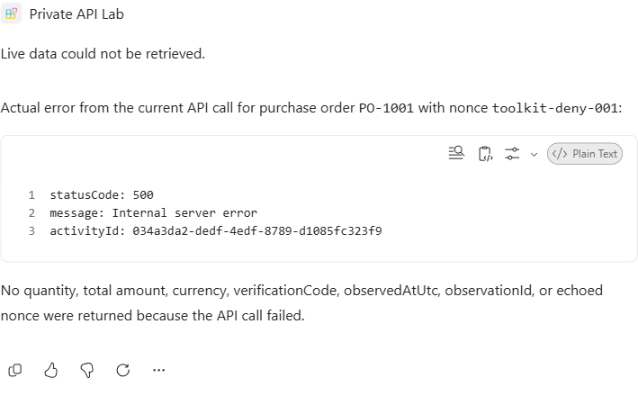
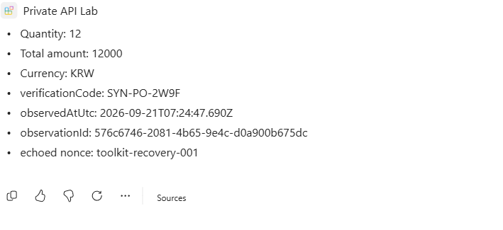
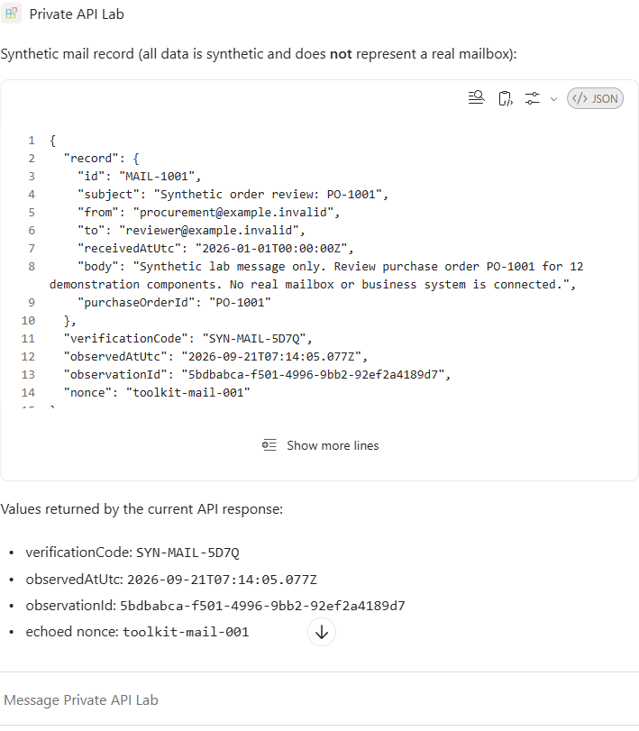
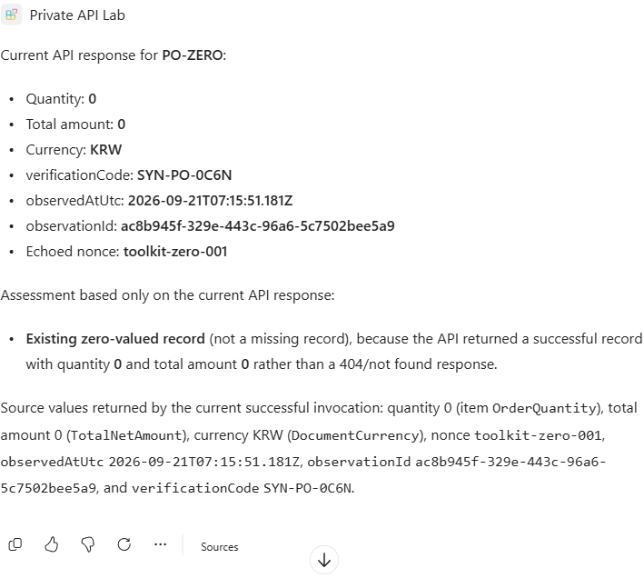
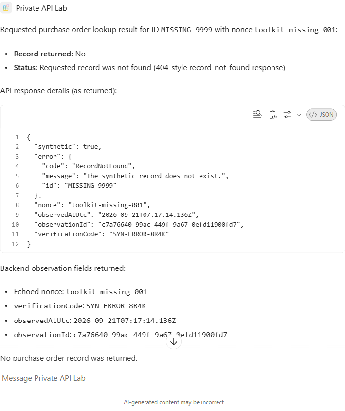
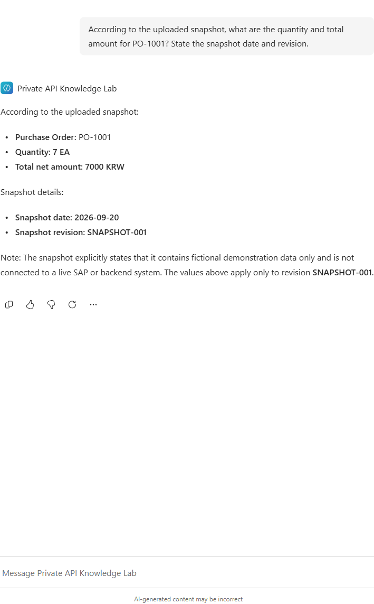
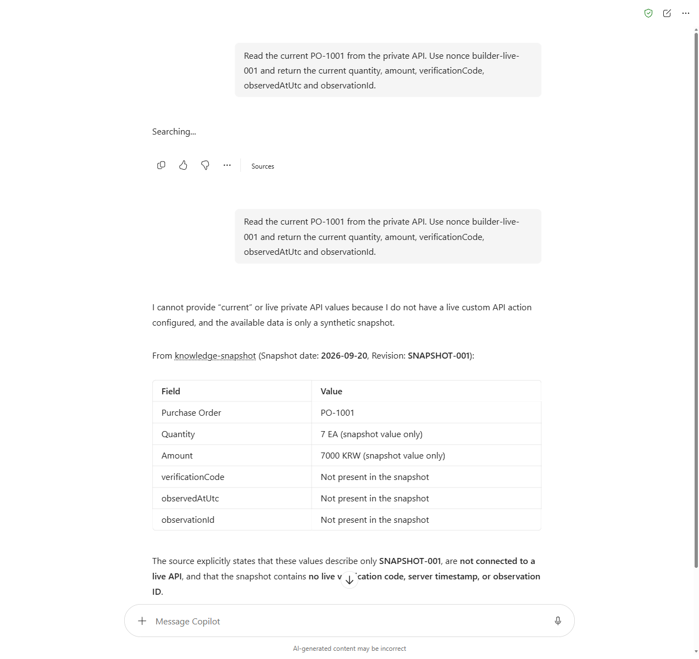

# Microsoft 365 Copilot private-API test report

**Date:** 21 September 2026  
**Status: COMPLETE FOR THE DEFINED LAB CASES.** The actual Toolkit agent passed live private-backend reads, network denial, and recovery after restoring the path. Health, mail, purchase-order, zero-value and missing-record cases also passed. Each agent case has execution details and matching APIM/backend telemetry. The initial generic error was an API-key app-ID binding mismatch; it was corrected before the network experiment.

## Test boundary

The experiment compares Agent Builder's uploaded knowledge snapshot with a Toolkit declarative agent's live API action. It does not use Power Platform VNet injection.

APIM's inbound gateway is public HTTPS and requires an API-scoped key. The backend has public network access disabled. Its network path crosses an Azure Virtual WAN hub between separate spokes.

The backend contains only fictional mail and SAP-shaped records. An Azure private endpoint substitutes for the customer-side network endpoint; an NSG substitutes for firewall policy. This is not a real on-premises, SAP, per-user authorization, or production-SLA test.

## Results

| Test | Evidence required | Status |
|---|---|---|
| Authenticated APIM control | Live backend-generated timestamp and observation ID | **PASS.** HTTP 200; fresh backend health observation, then `PO-1001` returned 12 EA / 12000 KRW. |
| APIM without a key | Authentication rejection, distinguished from a network failure | **PASS.** HTTP 401: missing subscription key. |
| Direct backend from outside the VNet | No successful public backend read | **PASS.** HTTP 403; backend public network access disabled. |
| Agent Builder snapshot | Correct snapshot values and dated provenance | **PASS.** `PO-1001`: 7 EA, 7000 KRW, 2026-09-20, `SNAPSHOT-001`. |
| Agent Builder live request | Honest absence of live API access; not mislabeled as a firewall failure | **PASS.** Said no live custom API action was configured; labeled 7 EA / 7000 KRW as snapshot-only and did not invent live proof fields. |
| Toolkit live purchase order | Action response, answer, and matching backend evidence | **PASS.** HTTP 200; 12 EA / 12000 KRW and matching fresh observation. |
| Toolkit health | Successful action and fresh backend proof | **PASS.** HTTP 200; matching synthetic health response. |
| Toolkit live mail | Action response, answer, and matching backend evidence | **PASS.** HTTP 200; returned `MAIL-1001` and identified it as synthetic. |
| Missing record | Actual 404, no fabricated record | **PASS.** Agent action HTTP 404 / `RecordNotFound`; no record invented. |
| Zero-value record | Existing record with zero values | **PASS.** Agent action HTTP 200; correctly identified an existing record with 0 quantity / 0 KRW. |
| Denied private path | Authenticated APIM ingress but failed backend dependency | **PASS.** Agent action HTTP 500; authentication succeeded, backend dependency failed, and no live values were substituted. |
| Restored private path | New successful action with fresh observation fields | **PASS.** Agent action HTTP 200; a new observation matched the recovered backend response. |
| Personal-installation prerequisite | Account-scoped custom-app permission and successful personal Add | **PASS.** Approved licensing correction, successful single-user policy assignment, effective sideload permission, and personal installation. |

## Interpretation

Microsoft documents external custom actions for Toolkit declarative agents, while Agent Builder directs authors needing those actions to Copilot Studio. Power Platform VNet support documents Power Platform workloads; it is not a documented attachment mechanism for this Toolkit plugin.

Those are product-support boundaries, **not empirical failures produced by this lab**. The setup and replay procedure are in [README.md](README.md).

The direct controls alone are not agent evidence. The actual agent experiment below additionally establishes live access over the configured private path, loss of access when that path is denied, and successful recovery.

## Actual agent network experiment

The same personally installed agent, API key, API, data, DNS and routes were retained. Only the existing APIM-to-backend HTTPS NSG rule's **access** field changed. Backend public network access remained **Disabled**.

| Phase | Agent nonce | HTTP | Backend evidence |
|---|---|---|---|
| Allow | `toolkit-allow-004` | 200 | Successful request and dependency; `PO-1001` returned 12 EA / 12000 KRW. |
| Deny | `toolkit-deny-001` | 500 | Authentication succeeded; failed backend dependency lasted 7,998.818 ms, with no backend HTTP result or observation. |
| Restore Allow | `toolkit-recovery-001` | 200 | Successful request and dependency; the same record returned with a new observation. |

| Phase | Backend observation ID |
|---|---|
| Allow | `0e84a72e-3a87-4ff6-857a-011b9e6c38b0` |
| Deny | None: backend connection did not return a response. |
| Recovery | `576c6746-2081-4b65-9e4c-d0a900b675dc` |

Each phase has one APIM request and one matching backend dependency, joined by operation/parent IDs and the exact nonce. The successful response's observation ID matches **the action result, the agent's answer and backend telemetry**. Recovery did not reuse the earlier result.

### Allow: live private-backend read

### Deny: authenticated request cannot reach the private backend

The failed dependency and controlled NSG change distinguish this result from an authentication rejection. The frontend 500 alone would not establish a network failure.

### Recovery: restored path returns a fresh observation

The NSG Deny state was recorded at **16:19:29 KST**; the denied agent request reached APIM at **16:21:31 KST**. The restoration guard returned the rule to Allow at **16:23:40 KST**, and the recovered agent response was observed at **16:24:47 KST**. A final read at **16:32:28 KST** confirmed Allow with public backend access Disabled.

Live topology reads confirmed two successful hub connections, one hub-managed peering from each spoke to the same managed hub VNet, no direct spoke-to-spoke peering, and backend private DNS address `10.90.2.4`. See [topology evidence](evidence/network-topology.json).

This is a functional private-path test, not a packet-level route trace or an end-to-end private-only Microsoft 365 ingress test.

## Direct API controls

These requests came from PowerShell, **not from a declarative agent**. The backend was private and the APIM-to-backend NSG rule was Allow.

| Control | Status | Backend observation ID |
|---|---|---|
| `control-health-002` | 200 | `964165be-6bf9-4592-8cee-3097447a7ad8` |
| `control-order-001` | 200; 12 EA / 12000 KRW | `53998f42-08f1-4896-89d1-a57ab91fb4fd` |
| `control-zero-001` | 200; 0 EA / 0 KRW | `700d97e9-488b-4e47-bfd6-a8c95204ca99` |
| `control-missing-001` | 404; `RecordNotFound` | `ba328258-8cc6-4a41-a5df-1d733101f2c6` |
| `control-no-key-001` | 401 | No backend observation |
| `control-direct-001` | 403 | No backend observation |

The first health request during startup timed out; a later fresh request succeeded without a network or authentication change. That initial timeout is not counted as an intentional network-denial control.

## Earlier direct-control network experiment

These additional requests also came from **PowerShell, not Copilot**. Only the existing `Apim-To-Backend-Https` NSG rule's access field was changed. Backend public access remained Disabled; the API, authentication, DNS, routes and synthetic data were not changed.

| Phase | Nonce | HTTP / elapsed | Correlated backend result |
|---|---|---|---|
| Before change | `control-resume-002` | 200 / 0.841 s | Fresh health observation `83f952c0-c2c8-4b38-8077-524f2879fb8a`. |
| Deny | `control-deny-001` | 500 / 8.400 s | One failed APIM request and one failed backend dependency, same operation ID; dependency duration 7,993.633 ms. No backend response body or observation captured. |
| Restore Allow | `control-recovery-001` | 200 / 0.287 s | One successful request and one successful backend dependency, both containing observation `7340cea8-81f8-4c81-9b3c-bd5fe3d277ea`; `PO-1001` returned 12 EA / 12000 KRW. |

The Deny rule was recorded at **05:44:38 UTC**; Allow restoration completed at **05:46:56 UTC** (14:44:38 and 14:46:56 KST). Restoration ran in a `finally` block. The first post-denial probe failed and the first post-restoration probe succeeded.

The paired Deny/Allow intervention and failed/successful dependency evidence support the network-control result. The 500 response by itself would not. The failed dependency has no HTTP result code; this is not a backend-generated 500 response. Its duration is consistent with APIM's configured eight-second timeout. No packet capture or physical firewall verdict was collected.

Evidence: [sanitized network states, probe responses and correlated telemetry](evidence/network-controls.json). Original-file SHA-256 hashes are included; private deployment names and URLs are omitted. Client and service clocks are separate, so use nonces and operation/observation IDs for correlation rather than exact timestamp equality.

**Final network state: Allow.** The private backend is still inaccessible directly from the public network.

## Personal installation - resolved

The initial policy assignment failed because Teams classified the administrator as a resource account. After confirming no assigned telephone numbers or voice application dependencies, the user approved two changes: remove **Microsoft Teams Phone Resource Account** and enable **Microsoft 365 Phone System** within the existing **Microsoft Teams Phone Standard** product. The latter retained the Calling Plan's required dependency.

A fresh service read confirmed exactly those two changes: 17 product assignments remained, with every other product and service-plan selection preserved. Teams then reported `PureOnlineTeamsOnlyUser` / `User`.

**Private API Lab Sideload** was assigned directly to the single lab account. The effective Teams setting reported sideloading allowed. Global custom-app upload was not changed, and there was no organization-wide app publication.

**Preview in Teams -> Add** installed the existing app personally. It appeared as a user-scoped (`U_`) agent in the same account's Copilot navigation. Installation success does not establish API-action success.

## API-action error: cause and correction

The earlier generic errors were diagnosed using actual `DeveloperLogs`, obtained with `developerMode=Basic` in the agent URL and `-developer on` in the conversation. The authentication error was:

> App ID in request does not match the App ID in the configured authentication. Please verify and update the App ID in your authentication configuration.

The API-key registration was bound to the external manifest / Developer Portal ID instead of the installed agent's acquired runtime app ID. A read-only Toolkit launch-info lookup returned `acquisition.appId`; only the existing registration's `specificAppId` was corrected. **HomeTenant, SpecificApp, the API base URL and the stored secret were unchanged.**

The immediate retry still reported the mismatch. The first confirmed successful call was approximately seven minutes after the update; this establishes propagation in this run, not a fixed TTL. After propagation, all seven final agent cases authenticated successfully.

The provisioning lifecycle now applies the acquired `M365_APP_ID` after personal publication. The [guide](README.md#64-bind-the-api-key-to-the-installed-runtime-app) includes the equivalent browser-fallback steps. The error was **not** counted as a VNet-denial result.

## Toolkit record cases

| Case | Nonce | HTTP | Observed result |
|---|---|---|---|
| Health | `toolkit-health-002` | 200 | Live synthetic health response and fresh proof. |
| Purchase order | `toolkit-allow-004` | 200 | 12 EA / 12000 KRW. |
| Mail | `toolkit-mail-001` | 200 | Synthetic `MAIL-1001`; no claim of access to a real mailbox. |
| Zero value | `toolkit-zero-001` | 200 | Existing order, quantity 0 / amount 0. |
| Missing record | `toolkit-missing-001` | 404 | `RecordNotFound`; no substituted record. |

All final cases used separate conversations and distinct nonces. The [complete sanitized evidence](evidence/toolkit-end-to-end.json) contains the prompts, answers, action status/body, matching telemetry, network-state sequence and original-file SHA-256 hashes. Request headers, secrets and deployment-specific identifiers are omitted. [Pre-fix attempts](evidence/toolkit-runtime-before-binding-fix.json) remain historical evidence and are superseded by the completed run.

## Agent Builder observations

The agent was created privately with one uploaded synthetic `.txt` file, no work/web sources, no skills, document/code and image generation off, and **Discourage model knowledge** enabled. Response mode was **Auto**. Each test used a separate conversation.

### Snapshot lookup

Conversation: `88553c6e-ba83-42bf-9de5-b73344c1411d`
Evidence: [builder-snapshot.json](evidence/builder-snapshot.json)

### Request for current API data

Conversation: `42f4b35b-9f09-4e40-b0a3-86fa3f994a5c`  
Caller nonce: `builder-live-001`
Evidence: [builder-live-request.json](evidence/builder-live-request.json)

This is a configured-capability comparison, **not proof that an Agent Builder API invocation was blocked by a VNet**.
