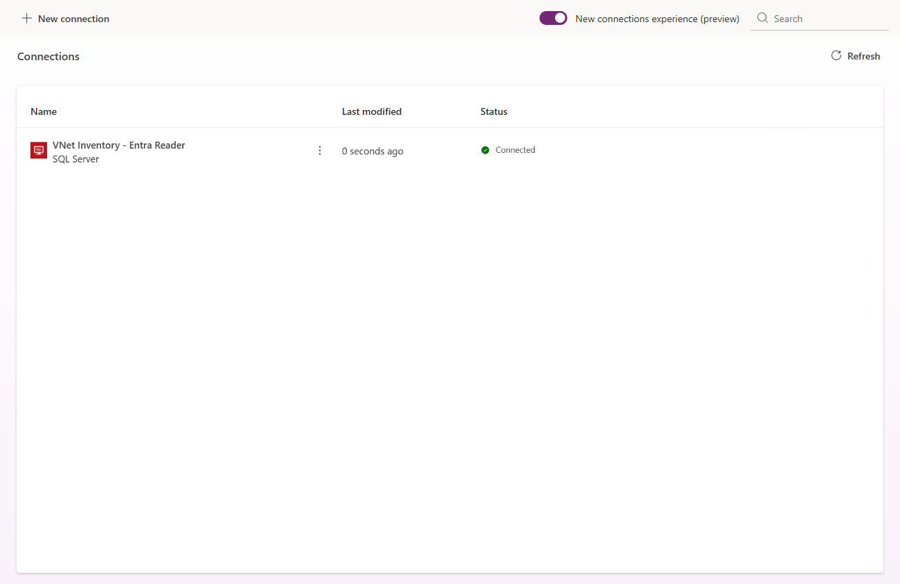
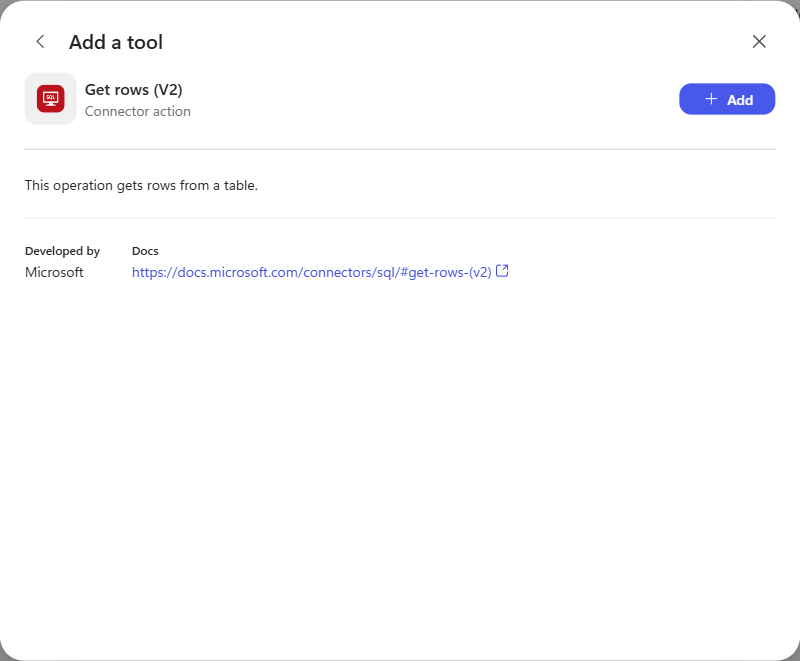
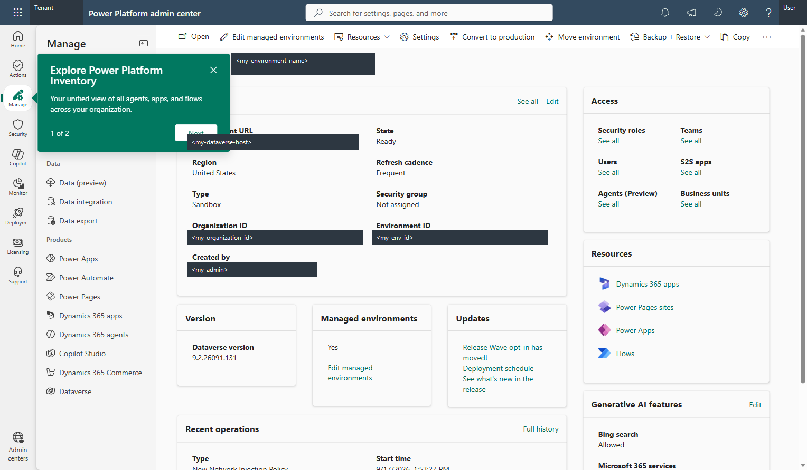

# Power Platform VNet injection with a Copilot Studio agent

> **Sanitized public edition.** Replace `<my-...>` placeholders with your own values before running commands. Tenant, environment, subscription, account, application, resource identifiers, and identifying screenshot fields have been redacted. Conversation IDs, synthetic inventory, observation IDs, and example private address ranges are intentionally retained.
>
> The reported results describe the original executed lab, not a new run of these placeholder files. Source hashes below describe this sanitized copy; source file and connection-reference names use `sample_vnetinventory` and `my-connection-id` as examples.


Connect a **new-experience Copilot Studio agent** to a private Azure SQL database. Run the same inventory request before and after enabling environment-level VNet injection.

**Result:** the agent could not read the private database before injection and returned the correct live inventory after injection. See [report.md](report.md) for actual results, controls, and screenshots.

## Architecture

```text
Copilot Studio agent (new experience; web search and memory off)
  -> SQL Server connector: Get rows (V2)
  -> Power Platform delegated subnet
  -> Azure SQL private endpoint
  -> InventoryDemo / dbo.InventoryLive

West US:  <my-primary-vnet>  10.80.0.0/16
          snet-powerplatform  10.80.1.0/24  [delegated]
          snet-private-endpoints 10.80.2.0/24  [SQL endpoint]

East US:  <my-failover-vnet> 10.81.0.0/16
          snet-powerplatform  10.81.1.0/24  [delegated]

The VNets are peered. Both link to privatelink.database.windows.net.
```

Azure SQL is used instead of Cosmos DB for PostgreSQL, which Microsoft [no longer recommends for new projects][cosmos]. The native SQL connector supports the required V2 read action; **no custom connector is required by this design**.

<details>
<summary>What injection, delegation, private endpoints, and DNS mean</summary>

**VNet injection** routes supported Power Platform connector workloads through your Azure network. It does not move the entire agent or language model into your VNet.

**Subnet delegation** reserves a subnet for the Power Platform service. Do not place the SQL private endpoint in that subnet.

A **private endpoint** gives the SQL service a private IP in a separate subnet. It does not automatically turn off the SQL public endpoint.

**Private DNS** makes the normal SQL hostname resolve to that private IP from the linked VNets. Configure the connector with `server.database.windows.net`, not a private IP or the `privatelink` hostname.

</details>

The paired VNets follow the environment's **West US** placement and the [supported Power Platform region mapping][overview]. Two VNets are required here even for a sandbox. This lab has one database: network failover connectivity is **not** database disaster recovery.

**Replay your own completed deployment:** reuse its agent, connection, and database; do not create another reader identity or repeat bootstrap. Unlink the policy using section 7, wait for the environment to become ready, run section 5 in a new conversation, then link and repeat section 6. Keep SQL public access disabled. Sections 1 through 4 describe initial setup.

## 1. Confirm the target and prerequisites

Use PowerShell 7, Azure CLI with Bicep, and Power Platform CLI. Sign in as the intended administrator before running scripts. Every Azure command below specifies the subscription; do not rely on another project's default.

```powershell
$subscription = '<my-subscription-id>'
$tenant = '<my-tenant-id>'
$environment = '<my-env-id>'
$group = '<my-resource-group>'
$admin = '<my-admin-upn>'
$adminObjectId = '<my-admin-object-id>'

az account show --subscription $subscription
pac auth list
pac admin list
```

The environment must have Dataverse, an eligible environment type, **Managed Environment** status, appropriate premium licensing, and sufficient Copilot Credits for the new agent runtime. Check applicable data policies too. Azure deployment permissions and permission to read the enterprise policy are separate from Power Platform administrative permissions.

Enable Managed Environment status **before both measured tests**, so it is not another changed variable:

```powershell
pac admin set-governance-config --environment $environment --protection-level Standard
```

**Cost:** the SQL Basic database, private endpoint, DNS, peering traffic, and agent usage can incur charges. Resources remain provisioned until deliberately removed. This lab does not purchase licenses or configure a new pay-as-you-go billing policy.

## 2. Deploy the Azure resources

Register the providers and wait until each reports `Registered`:

```powershell
az provider register --subscription $subscription --namespace Microsoft.Network
az provider register --subscription $subscription --namespace Microsoft.Sql
az provider register --subscription $subscription --namespace Microsoft.PowerPlatform

az provider show --subscription $subscription --namespace Microsoft.Network --query registrationState
az provider show --subscription $subscription --namespace Microsoft.Sql --query registrationState
```

Run from this directory:

```powershell
$outputs = .\scripts\Deploy-Lab.ps1 `
  -SubscriptionId $subscription -ResourceGroupName $group `
  -EntraAdminObjectId $adminObjectId -EntraAdminLogin $admin

$server = $outputs.sqlServerName.value
$policy = $outputs.policyArmId.value
```

[infra/main.bicep](infra/main.bicep) creates the paired networks, delegation, peering, SQL Basic database, private endpoint, DNS links, and enterprise policy. It sets SQL **Entra-only authentication**, **Public network access = Disabled**, and connection policy **Proxy**. It does **not** associate the policy with the Power Platform environment.

**Tenant-specific prerequisite:** this subscription's governance policy requires Entra-only SQL authentication at initial server creation. The template declares `properties.administrators.azureADOnlyAuthentication: true` inline. Creating a SQL-password server and adding an Entra administrator afterward is not sufficient. No policy exception or exclusion tag is used.

## 3. Create the read-only identity and seed the database

Create a dedicated Entra application, with no Graph permissions or Azure role assignments. Its SQL permission will be limited to one view. Store its credential **outside the repository**:

```powershell
$credentialPath = Join-Path $env:LOCALAPPDATA 'pp-vnet-lab\reader.credential.clixml'
$identity = .\scripts\New-ReaderIdentity.ps1 `
  -SubscriptionId $subscription -TenantId $tenant -CredentialPath $credentialPath
$reader = Import-Clixml $credentialPath
```

The script protects the local credential using Windows DPAPI and gives the application secret a 30-day lifetime. Retain the reported identity IDs for cleanup; do not put the credential in Git.

```powershell
$clientIPv4 = Read-Host 'Your current public IPv4 address'
.\scripts\Initialize-Database.ps1 `
  -SubscriptionId $subscription -ResourceGroupName $group -ServerName $server `
  -TenantId $tenant -ClientIPv4 $clientIPv4 -ReaderCredential $reader
```

This bootstrap temporarily enables SQL's public endpoint with **one caller-IP firewall rule**, uses the Entra administrator to run [data/inventory.sql](data/inventory.sql), and removes the rule and disables public access in cleanup. It never enables "Allow Azure services." Both measured tests must happen **after** this bootstrap window closes.

The six synthetic inventory records are exposed through `dbo.InventoryLive`. The connector identity receives `SELECT` on that view only. Each read includes `DatabaseUtc` and a fresh `ObservationId`, in addition to a stored `VerificationCode`.

<details>
<summary>Why use a separate reader and live database markers?</summary>

The tenant administrator creates the database objects but should not be the agent's database identity. The application cannot modify inventory or read the base table directly.

An answer containing a plausible quantity is not enough to prove a database call happened. The stored verification code and database-generated observation ID let you compare the answer with a fresh tool result. Do not put expected values into the agent's instructions or knowledge.

</details>

## 4. Create the SQL connection and the new agent

In **Power Apps -> Connections**, select the target environment and create a **SQL Server** connection with **Service principal (Microsoft Entra ID application)** authentication. Supply the tenant ID, the reader application's **client ID**, and its secret value. Use a descriptive connection name such as `VNet Inventory - Entra Reader`.



In **Copilot Studio**, leave **New experience** on and create an agent, not the separate Standard agent option:

1. Name it `VNet Private Inventory`; select a model and keep it unchanged for both tests.
2. Remove the default **Search all websites** knowledge source. Leave **Memory** off.
3. Require a live inventory tool call for every inventory question. If the call fails, report the access failure without inventing inventory facts; if the SKU is absent, report no matching record.
4. Add **Tools -> Connectors -> SQL Server -> Get rows (V2)**. Use **Maker** authentication with the dedicated reader connection.
5. In the tool's **Inputs**, select **Value -> New** for each fixed input. Enter server `<server>.database.windows.net` **without a port**, database `InventoryDemo`, table/view `[dbo].[InventoryLive]`, **Top Count = 6**, and **Order By = SKU asc**. Use **Enter custom value** where offered. If a private database's dynamic options cannot load, the designer allows a manually entered value; this is not a reason to open the database publicly.
6. Save the agent. Test privately in **Preview**; publishing to Microsoft 365 or sharing with other users is not required.



The [new-agent documentation][new-tools] supports connector tools. The [SQL connector reference][sql] separately documents VNet support. This lab exercised that combination through the new agent's actual runtime.

[agent/](agent/) contains a sanitized snapshot of the tested source, including instructions, fixed-input variables, and the connector tool. It is **not a portable solution package**: its schema names and connection reference belong to this environment. Recreate the agent and connection in your target environment before adapting those references. Local PAC caches and credentials are excluded.

The editor requires `cdsBotId` in `agent/settings.mcs.yml`. Its public value is `<my-agent-id>`: replace it with your own **Dataverse agent/bot GUID**, not the Power Platform environment ID, before connecting or deploying.

## 5. Run the negative control

Keep the environment Managed, the SQL public endpoint disabled, and the private endpoint/DNS/peering already configured. **Do not link the enterprise policy yet.**

Start a fresh Preview conversation with its activity trace visible:

> Look up SKU VN-1001 in the live inventory. Return its product name, warehouse, available quantity, unit price and currency, verification code, database UTC time, and observation ID.

Record the actual connector invocation and its error, not only the agent's answer. An authentication failure, missing connection, blocked model, or insufficient-credit error is **not** a valid networking negative control.

## 6. Enable injection and repeat the same request

The official path is the [Enterprise Policies PowerShell module][setup] or **Power Platform admin center -> Security -> Data and privacy -> Azure Virtual Network policies**.

The lab's [Set-LabInjection.ps1](scripts/Set-LabInjection.ps1) uses the same environment association API as the [official module implementation][association-api], with the existing Azure CLI sign-in. It checks the policy geography, Managed status, current association, asynchronous operation, and final association.

```powershell
.\scripts\Set-LabInjection.ps1 -SubscriptionId $subscription `
  -EnvironmentId $environment -PolicyArmId $policy -Action Link -WhatIf

# Only after recording the valid negative control:
.\scripts\Set-LabInjection.ps1 -SubscriptionId $subscription `
  -EnvironmentId $environment -PolicyArmId $policy -Action Link
```

Allow for the documented enable/disable transition of up to 30 minutes. Confirm **History -> Succeeded** and an enabled, ready environment. Do not repeatedly submit link requests. In this run, the first connector call after association returned **503 / Container Allocation Successful / Please re-try**; a later fresh conversation succeeded without any configuration change.



**API detail:** read the environment with `api-version=2023-06-01&$expand=properties.enterprisePolicies` to inspect `properties.enterprisePolicies.vNets.linkStatus`. An unexpanded response omitted the association in this run. The script explicitly expands this field and waits for readiness rather than equating request acceptance with working connectivity.

Start a **new** conversation and repeat the exact baseline prompt. Keep the model, instructions, connection, credentials, database, DNS, and network rules unchanged. Require the tool to return the real row and fresh database markers. Also query nonexistent `VN-9999` and zero-stock `VN-1003`; absent data and zero stock are different outcomes.

Record results and meaningful screenshots in [report.md](report.md). A successful SQL read does not demonstrate regional failover or database disaster recovery.

## 7. Cleanup

Unlink the environment **before** deleting the enterprise policy or delegated networks:

```powershell
.\scripts\Set-LabInjection.ps1 -SubscriptionId $subscription `
  -EnvironmentId $environment -PolicyArmId $policy -Action Unlink
```

After unlinking completes, remove the lab agent/connection, delete the dedicated Entra application using its recorded ID, and delete only the lab resource group. Remove the local credential file. These are deliberate cleanup actions, not automatically executed by this lab.

## References

- [Power Platform VNet overview, supported regions and connectors][overview]
- [Technical architecture and paired-network examples][whitepaper]
- [Setup, delegation, enterprise policy, and environment association][setup]
- [VNet troubleshooting][troubleshooting]
- [Copilot Studio VNet-supported connectors][agent-vnet]
- [New-experience agent tools][new-tools] and [tool configuration][new-config]
- [SQL connector VNet action allowlist and authentication][sql]
- [Azure SQL private endpoints and connection policy][private-sql]
- [Creating an Entra application database user by client ID][sql-user]

[overview]: https://learn.microsoft.com/en-us/power-platform/admin/vnet-support-overview
[whitepaper]: https://learn.microsoft.com/en-us/power-platform/admin/virtual-network-support-whitepaper
[setup]: https://learn.microsoft.com/en-us/power-platform/admin/vnet-support-setup-configure?tabs=existing%2Cdouble&pivots=powershell
[troubleshooting]: https://learn.microsoft.com/en-us/troubleshoot/power-platform/administration/virtual-network
[agent-vnet]: https://learn.microsoft.com/en-us/microsoft-copilot-studio/admin-network-isolation-vnet
[new-tools]: https://learn.microsoft.com/en-us/microsoft-copilot-studio/agents-experience/tools-available
[new-config]: https://learn.microsoft.com/en-us/microsoft-copilot-studio/agents-experience/tools-manage
[sql]: https://learn.microsoft.com/en-us/connectors/sql/#virtual-network-support
[private-sql]: https://learn.microsoft.com/en-us/azure/azure-sql/database/private-endpoint-overview?view=azuresql
[sql-user]: https://learn.microsoft.com/en-us/sql/t-sql/statements/create-user-transact-sql?view=azuresqldb-current#k-create-a-contained-database-user-from-a-microsoft-entra-principal-without-validation
[cosmos]: https://learn.microsoft.com/en-us/azure/cosmos-db/postgresql/introduction
[association-api]: https://github.com/microsoft/PowerPlatform-EnterprisePolicies/blob/2243bd95d1067bcb113b8cf408e34bc59f333181/Source/Microsoft.PowerPlatform.EnterprisePolicies/Public/SubnetInjection/Enable-SubnetInjection.ps1