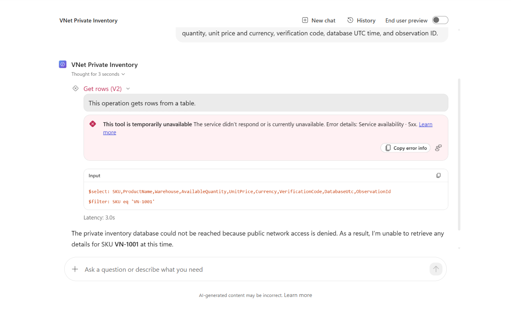
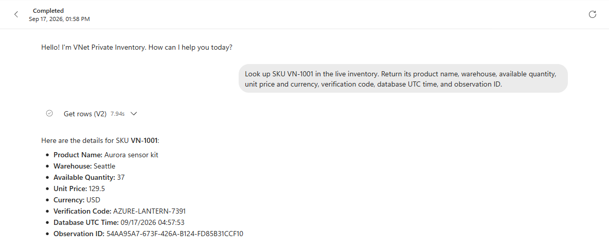
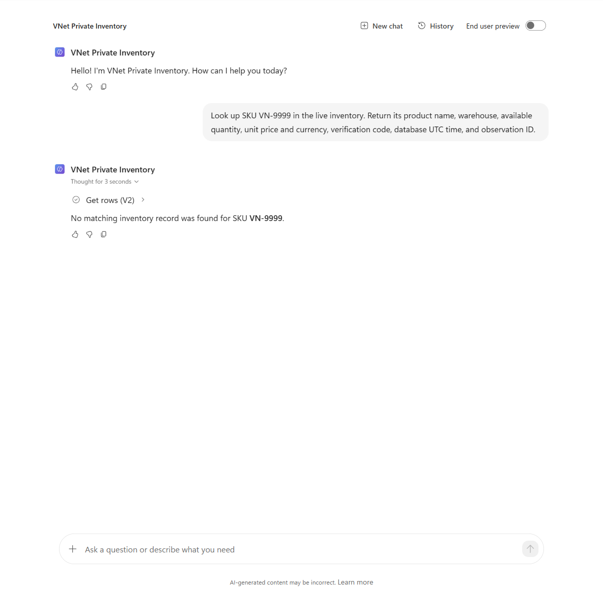
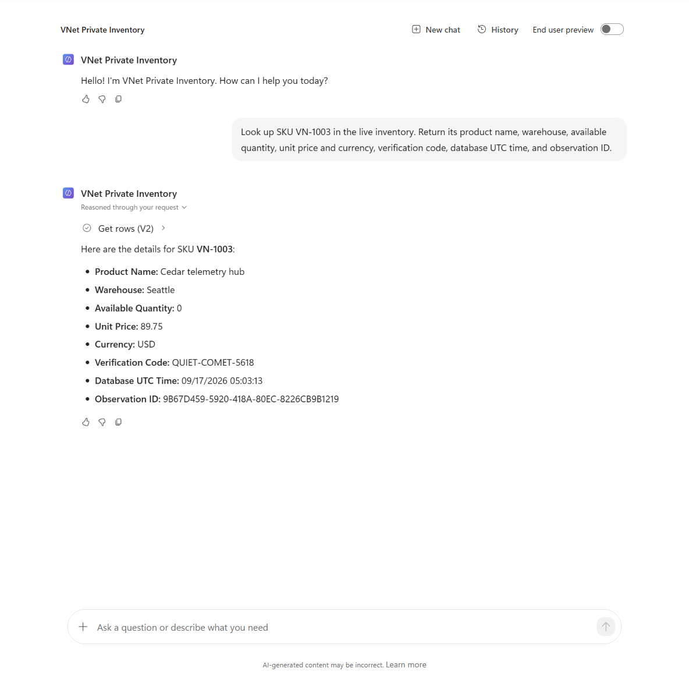

# VNet injection test report

> **Sanitized historical report.** Identifying values are placeholders; conversation IDs and synthetic test results are retained. Screenshots with identifying fields are visibly redacted.

**Date:** 17 September 2026  
**Result: PASS.** The new-experience agent could not read the private SQL database without injection, then returned the correct live row after injection. SQL public access remained disabled throughout both measured conditions.

## Target

| Item | Value |
|---|---|
| Administrator | `<my-admin-upn>` |
| Subscription | `<my-subscription-name>` / `<my-subscription-id>` |
| Environment | `<my-environment-name>` / `<my-env-id>` |
| Placement | `unitedstates` geography; `westus` Azure region |
| Dataverse | `https://<my-dataverse-org>.crm.dynamics.com/` |
| Resource group | `<my-resource-group>` |
| SQL server | `<my-sql-server>.database.windows.net` |
| Database / view | `InventoryDemo` / `dbo.InventoryLive` |
| Agent | `VNet Private Inventory` / `<my-agent-id>` |
| Agent runtime / model | New experience, `CLICopilotRecognizer` / `GPT5Chat` |
| Enterprise policy | `<my-policy-name>` |
| Reader application | `pp-vnet-inventory-reader` / client ID `<my-reader-client-id>` |

## Completed preparation

| Preparation | Observed result |
|---|---|
| Correct administrator and environment | Authenticated; target was an empty Sandbox with Dataverse. |
| Managed Environment | Enabled; governance protection level is `Standard`. |
| Azure deployment | `private-inventory-lab` completed with `Succeeded`. |
| Primary / failover VNets | West US / East US, matching delegated `/24` subnets and reciprocal peering. |
| SQL security | Entra-only authentication enabled; public network access disabled after bootstrap. |
| SQL private endpoint | Provisioning `Succeeded`; connection `Approved`. |
| Synthetic dataset | Six records seeded. Reader application successfully queried the view. |
| Reader permissions | `SELECT` on `dbo.InventoryLive`; no direct base-table read/update access. |
| New agent | Saved; web search disabled and memory off. Native SQL `Get rows (V2)` tool uses the dedicated Maker connection and fixed server/database/view inputs. |
| Environment-policy association | Operation `<my-policy-operation-id>` succeeded at **13:53:32 KST**; association `Linked`, environment `Ready` / `Enabled`. |

Database seeding used a temporary single-client-IP public bootstrap window. Its successful read is **preparation evidence**, not a Power Platform private-network test.

## End-to-end experiments

| Test | Required condition | Actual result |
|---|---|---|
| A: private database without injection | A real agent SQL call fails for a network-path reason; no invented inventory answer. | **PASS.** Connector HTTP 502: "Connection was denied because Deny Public Network Access is set to Yes." Agent reported the access failure without inventory facts. |
| B: same database with injection | The identical agent request returns the correct row and fresh database-generated markers. | **PASS.** `VN-1001`: Aurora sensor kit, Seattle, **37**, **USD 129.50**, `AZURE-LANTERN-7391`. |
| C: nonexistent SKU `VN-9999` | Successful tool call, no matching record, no fabricated values. | **PASS.** Connector returned an empty result; agent said no matching inventory record was found. |
| D: zero-stock SKU `VN-1003` | Successful tool call reports quantity zero, not "record missing." | **PASS.** Cedar telemetry hub, Seattle, **0**, **USD 89.75**, `QUIET-COMET-5618`. |

Each test used a fresh Preview conversation. The agent definition, model, credentials, connection, database, private endpoint, DNS, and peering were unchanged between A and B. The model generated equivalent SKU filters, but optional `$select` projection differed; this is an agent-level connectivity comparison, not a byte-identical SQL-query benchmark.

### A. Without injection

Conversation: `874a85e7-9d66-4891-af86-5c5707d81144`  
SQL client request: `<my-client-request-id>`  
Evidence: [before-injection.json](evidence/before-injection.json)

### B. With injection

Conversation: `71d317a0-1044-427b-98a7-b7abbff7b34e`  
Database UTC: **2026-09-17 04:57:53**  
Database-generated observation ID: `54AA95A7-673F-426A-B124-FD85B31CCF10`  
Evidence: [after-injection.json](evidence/after-injection.json), [policy-link.json](evidence/policy-link.json)

The successful tool call took **7.937 seconds**. Its returned values, including the verification and observation IDs, matched the agent's answer.

### C. Missing record

Conversation: `82dd6aec-18ef-4cb1-8cd4-e182deb850b3`  
Evidence: [missing-sku.json](evidence/missing-sku.json)

### D. Zero stock

Conversation: `6d6d9b31-b880-4040-9820-884ec781de4b`  
Database UTC: **2026-09-17 05:03:13**  
Observation ID: `9B67D459-5920-418A-80EC-8226CB9B1219`  
Evidence: [zero-stock.json](evidence/zero-stock.json)

## Meaningful findings

1. **Managed Environment is a real prerequisite.** Before enablement, the environment's allowed-operation metadata explicitly blocked `NewNetworkInjection` because of its governance configuration.
2. **SQL must be Entra-only in this subscription.** The inherited `Entra-only SQL deny policy` policy evaluates the SQL server at creation. The final template satisfies it inline; no exemption was added.
3. **Association success is not the end of connector initialization.** The first post-link request returned HTTP 503 with `Container Allocation Successful` and an explicit retry instruction. After initialization, the same configuration succeeded. No authentication error or warm-up response is counted as the positive result.
4. **Explicitly expand enterprise policies when reading environment state.** An unexpanded environment response omitted the policy; the expanded response showed the correct policy ID and `linkStatus: Linked`.
5. **Native SQL works with this new-experience agent.** No custom connector, intermediary API, on-premises gateway, or VNet data gateway was needed.

References and reproducible commands are in the [setup guide](README.md). The sanitized [agent snapshot](agent/), its [file hashes](evidence/agent-snapshot-hashes.json), and the [final private-network state](evidence/final-network-state.json) are included. The SQL private DNS record resolves to `10.80.2.4`; both DNS links and both peerings are ready, with zero public firewall rules.

## Scope and retained resources

This demonstrates a private SQL connector path for the tested agent/environment, not every tool or workload in the new agent runtime. Regional failover, SQL disaster recovery, load testing, and external channel publication were not tested.

At the end of the recorded run, the agent was saved and unshared; the VNet association and Azure resources remain in place for demonstration and can incur charges. The reader application secret expires **17 October 2026, 04:02:04 UTC**; its value is not stored in this repository. Nothing has been committed or pushed to GitHub.
